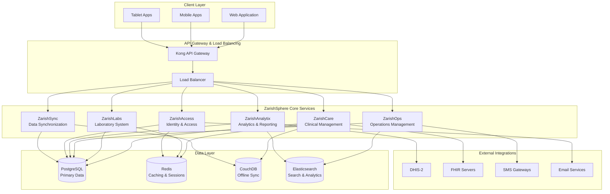

# ZarishHealthcare System - Unified Architecture

## Executive Summary

The ZarishHealthcare System represents a comprehensive merger of two powerful architectural approaches: a specialized humanitarian healthcare information system and the ZarishSphere digital platform. This unified architecture provides a robust, offline-first, microservices-based solution specifically designed for humanitarian healthcare operations in resource-constrained environments.

## 1. System Overview

### 1.1 Mission Statement
To deliver comprehensive, scalable, and resilient healthcare information systems that support humanitarian operations across multiple contexts while maintaining the highest standards of data security, user experience, and operational efficiency.

### 1.2 Key Capabilities
- **Humanitarian-Specific Healthcare Workflows**: NCD programs, MHPSS, maternal health, emergency response
- **Offline-First Operations**: Full functionality in low-connectivity environments
- **Multi-Organization Coordination**: Support for complex partner ecosystems
- **Comprehensive Clinical Management**: Patient care from registration to discharge
- **Real-time Analytics & Reporting**: 4W reporting, DHIS-2 integration, performance dashboards
- **Regulatory Compliance**: HIPAA, GDPR, and humanitarian standards compliance

## 2. Architectural Principles

### 2.1 Design Philosophy
1. **Humanitarian-First Design**: Every component optimized for field conditions
2. **Offline-Resilient Architecture**: Full functionality without internet connectivity
3. **Modular & Scalable**: Component-based architecture supporting growth
4. **Security by Design**: Multi-layered security appropriate for sensitive healthcare data
5. **Multi-Language & Cultural Sensitivity**: Support for diverse global contexts
6. **Performance Optimized**: Efficient operations on limited bandwidth and hardware

### 2.2 Technical Principles
- **Microservices Architecture**: Domain-driven service decomposition
- **Event-Driven Communication**: Asynchronous, reliable inter-service messaging
- **CQRS & Event Sourcing**: Optimized read/write patterns with complete audit trails
- **Container-First Deployment**: Docker/Kubernetes for consistent deployments
- **API-First Integration**: RESTful APIs with comprehensive documentation

## 3. System Architecture

### 3.1 High-Level Architecture



### 3.2 Component Architecture

#### 3.2.1 ZarishCare (Clinical Management)
**Purpose**: Core clinical workflows, patient management, consultation tracking
**Key Features**:
- Patient registration & demographics management
- Clinical consultations and visit tracking
- NCD program management (Hypertension, Diabetes)
- MHPSS workflow support
- Maternal health tracking
- Emergency case management
- Clinical decision support
- Prescription management

**Technology Stack**:
- **Runtime**: Node.js with TypeScript
- **Framework**: Express.js with comprehensive middleware
- **Database**: PostgreSQL for transactional data
- **Caching**: Redis for sessions and performance
- **Offline Sync**: CouchDB for field operations
- **Authentication**: JWT with Redis session management

#### 3.2.2 ZarishLabs (Laboratory System)
**Purpose**: Laboratory operations, test management, equipment tracking
**Key Features**:
- Lab order management and tracking
- RDT (Rapid Diagnostic Test) workflows
- Blood chemistry and hematology processing
- Microbiology test management
- Equipment maintenance and calibration
- Quality control and assurance
- Results reporting and integration

#### 3.2.3 ZarishOps (Operations Management)
**Purpose**: Humanitarian operations coordination and resource management
**Key Features**:
- Multi-organization coordination
- Resource and supply chain management
- Project and program oversight
- Staff and volunteer management
- Location and facility management
- Communication and notification systems
- Workflow automation

#### 3.2.4 ZarishAnalytix (Analytics & Reporting)
**Purpose**: Data analytics, reporting, and business intelligence
**Key Features**:
- Real-time operational dashboards
- 4W (Who, What, Where, When) reporting
- DHIS-2 integration and data exchange
- Performance indicator tracking
- Custom report generation
- Data visualization and insights
- Predictive analytics for resource planning

#### 3.2.5 ZarishAccess (Identity & Access Management)
**Purpose**: Authentication, authorization, and user management
**Key Features**:
- Multi-factor authentication
- Role-based access control (RBAC)
- Single sign-on (SSO) integration
- API key management
- Audit logging and compliance
- OAuth 2.0 and SAML support
- Session management

#### 3.2.6 ZarishSync (Data Synchronization)
**Purpose**: Offline-first data synchronization and conflict resolution
**Key Features**:
- Bidirectional data synchronization
- Conflict detection and resolution
- Device management and tracking
- Offline queue management
- Bandwidth optimization
- Sync monitoring and reporting

## 4. Data Architecture

### 4.1 Data Strategy
- **Primary Data Store**: PostgreSQL for ACID compliance and complex queries
- **Caching Layer**: Redis for session management and performance optimization
- **Offline Storage**: CouchDB for field operations and synchronization
- **Search & Analytics**: Elasticsearch for full-text search and analytics
- **Event Store**: PostgreSQL with event sourcing patterns for audit trails

### 4.2 Data Models

#### 4.2.1 Patient Domain
```typescript
// Comprehensive patient management
Patient {
  id: string
  mrn: string
  demographics: PatientDemographics
  contacts: ContactInformation[]
  identifiers: PatientIdentifier[]
  programs: ProgramEnrollment[]
  visits: Visit[]
  flags: PatientFlag[]
  status: PatientStatus
}

// NCD Program Support
NCDProgram {
  id: string
  type: 'hypertension' | 'diabetes' | 'mental_health'
  enrollment: ProgramEnrollment
  assessments: NCDAssessment[]
  medications: Medication[]
  monitoring: MonitoringSchedule
}
```

#### 4.2.2 Clinical Domain
```typescript
// Clinical consultation and care
Consultation {
  id: string
  patientId: string
  providerId: string
  type: ConsultationType
  chiefComplaint: string
  assessment: ClinicalAssessment
  diagnosis: Diagnosis[]
  treatment: TreatmentPlan
  vitals: VitalSigns
  notes: ClinicalNote[]
}

// Emergency and acute care
EmergencyCase {
  id: string
  patientId: string
  severity: EmergencySeverity
  triage: TriageAssessment
  interventions: EmergencyIntervention[]
  outcome: EmergencyOutcome
  timeline: EmergencyTimeline
}
```

#### 4.2.3 Operations Domain
```typescript
// Multi-organization operations
Organization {
  id: string
  name: string
  type: OrganizationType
  projects: Project[]
  locations: Location[]
  staff: Staff[]
  resources: Resource[]
}

// Project and program management
Project {
  id: string
  organizationId: string
  name: string
  description: string
  locations: Location[]
  activities: Activity[]
  beneficiaries: Beneficiary[]
  reporting: ProjectReporting
}
```

### 4.3 Synchronization Strategy

#### 4.3.1 Offline-First Design
- **Local-First Storage**: All operations work offline using CouchDB
- **Conflict-Free Replicated Data Types (CRDTs)**: For concurrent editing
- **Event Sourcing**: Complete audit trail and state reconstruction
- **Bi-directional Sync**: Field devices sync with central systems

#### 4.3.2 Conflict Resolution
```typescript
// Conflict resolution strategy
ConflictResolution {
  strategy: 'last-write-wins' | 'manual-review' | 'field-priority'
  timestamp: Date
  deviceId: string
  userId: string
  resolvedBy: string
  resolution: ConflictResolutionDetails
}
```

## 5. Security Architecture

### 5.1 Security Principles
- **Zero Trust Architecture**: Verify every transaction and user
- **Defense in Depth**: Multiple security layers
- **Least Privilege Access**: Minimal necessary permissions
- **Data Encryption**: At rest and in transit
- **Audit Everything**: Comprehensive logging and monitoring

### 5.2 Authentication & Authorization
```typescript
// Comprehensive RBAC system
Role {
  id: string
  name: string
  permissions: Permission[]
  hierarchyLevel: number
  contexts: SecurityContext[]
}

// Multi-context permissions
Permission {
  id: string
  resource: string
  action: string
  conditions: PermissionCondition[]
  scope: PermissionScope
}
```

### 5.3 Data Protection
- **Healthcare Data Compliance**: HIPAA, GDPR compliance
- **Field Data Security**: Device encryption and secure communication
- **PII Protection**: Advanced anonymization and pseudonymization
- **Backup & Recovery**: Encrypted backups with point-in-time recovery

## 6. Integration Architecture

### 6.1 External System Integration
```typescript
// DHIS-2 Integration
DHIS2Integration {
  endpoint: string
  dataElements: DHIS2DataElement[]
  indicators: DHIS2Indicator[]
  syncSchedule: SynchronizationSchedule
  mapping: FieldMapping[]
}

// FHIR Integration
FHIRIntegration {
  server: FHIRServer
  resources: FHIRResource[]
  profiles: FHIRProfile[]
  exchanges: DataExchange[]
}
```

### 6.2 API Gateway Configuration
- **Kong API Gateway**: Centralized API management
- **Rate Limiting**: Protecting against abuse
- **Authentication Enforcement**: Consistent security policies
- **Request/Response Transformation**: Data format standardization
- **Analytics**: API usage monitoring and reporting

## 7. Deployment Architecture

### 7.1 Container Strategy
```dockerfile
# Multi-stage Docker builds for optimization
FROM node:20-alpine AS base
# Optimized for humanitarian field deployments
# Minimal resource usage
# Security hardening
```

### 7.2 Orchestration
```yaml
# Kubernetes deployment strategy
apiVersion: apps/v1
kind: Deployment
metadata:
  name: zarish-care
spec:
  replicas: 3
  strategy:
    type: RollingUpdate
  template:
    spec:
      containers:
      - name: zarish-care
        resources:
          requests:
            memory: "256Mi"
            cpu: "250m"
          limits:
            memory: "512Mi"
            cpu: "500m"
```

### 7.3 Environment Strategy
- **Development**: Local Docker Compose for rapid development
- **Staging**: Kubernetes cluster mimicking production
- **Production**: Multi-region Kubernetes deployment
- **Field Operations**: Edge computing with sync capabilities

## 8. Operational Architecture

### 8.1 Monitoring & Observability
```typescript
// Comprehensive monitoring
HealthCheck {
  service: string
  status: 'healthy' | 'warning' | 'critical'
  checks: ComponentCheck[]
  responseTime: number
  uptime: number
  version: string
}

// Performance monitoring
Metrics {
  responseTime: number
  throughput: number
  errorRate: number
  resourceUtilization: ResourceMetrics
  customMetrics: CustomMetric[]
}
```

### 8.2 Logging Strategy
- **Structured Logging**: JSON format for machine parsing
- **Centralized Collection**: ELK stack or similar
- **Log Levels**: DEBUG, INFO, WARN, ERROR, FATAL
- **Correlation IDs**: Request tracing across services
- **Security Logs**: Authentication, authorization, data access

### 8.3 Disaster Recovery
- **Multi-Region Deployment**: Geographic redundancy
- **Automated Backups**: Daily encrypted backups
- **Point-in-Time Recovery**: Granular recovery options
- **Failover Procedures**: Automated and manual failover
- **Data Replication**: Real-time replication across regions

## 9. Performance Architecture

### 9.1 Performance Strategy
- **Horizontal Scaling**: Service-level scaling based on demand
- **Caching Strategy**: Multi-level caching (Redis, CDN, browser)
- **Database Optimization**: Indexing, partitioning, read replicas
- **CDN Integration**: Global content delivery
- **Connection Pooling**: Efficient database connections

### 9.2 Resource Optimization
```yaml
# Resource allocation for humanitarian contexts
resources:
  small_deployment:
    cpu: "1 CPU"
    memory: "2 GB"
    storage: "50 GB"
    max_users: 100
  
  medium_deployment:
    cpu: "4 CPU"
    memory: "8 GB"
    storage: "200 GB"
    max_users: 500
  
  large_deployment:
    cpu: "16 CPU"
    memory: "32 GB"
    storage: "1 TB"
    max_users: 2000
```

## 10. Quality Assurance Architecture

### 10.1 Testing Strategy
- **Unit Testing**: Component-level testing with >90% coverage
- **Integration Testing**: Service interaction testing
- **End-to-End Testing**: Complete user workflow testing
- **Performance Testing**: Load and stress testing
- **Security Testing**: Vulnerability and penetration testing
- **Accessibility Testing**: WCAG 2.1 compliance

### 10.2 CI/CD Pipeline
```yaml
# Continuous Integration/Deployment
stages:
  - lint_and_test
  - security_scan
  - build_containers
  - deploy_staging
  - integration_tests
  - deploy_production
  - smoke_tests
  - notify_teams
```

## 11. Future Architecture Considerations

### 11.1 Emerging Technologies
- **AI/ML Integration**: Clinical decision support, predictive analytics
- **Blockchain**: Supply chain transparency, credential verification
- **IoT Integration**: Medical device integration, environmental monitoring
- **Edge Computing**: Improved field operations, reduced latency

### 11.2 Scalability Roadmap
- **Geographic Expansion**: Multi-continent deployment
- **Service Mesh**: Advanced microservice communication
- **Event Streaming**: Real-time data processing with Kafka
- **GraphQL**: Flexible client-server communication
- **Serverless Integration**: Cost-effective scaling for specific workloads

## 12. Conclusion

The ZarishHealthcare System architecture represents a comprehensive solution that successfully merges specialized humanitarian healthcare requirements with modern, scalable platform capabilities. This unified approach delivers:

1. **Robust Clinical Operations**: Comprehensive patient care and clinical workflows
2. **Humanitarian-Specific Features**: NCD programs, MHPSS, multi-organization coordination
3. **Offline-First Reliability**: Full functionality in challenging field conditions
4. **Scalable Architecture**: Growth-ready microservices design
5. **Security & Compliance**: Healthcare data protection with audit capabilities
6. **Operational Excellence**: Monitoring, logging, and disaster recovery

This architecture provides a solid foundation for supporting humanitarian healthcare operations at scale while maintaining the flexibility to adapt to evolving requirements and emerging technologies.

---

**Document Version**: 1.0  
**Last Updated**: 2025-08-08  
**Next Review**: 2025-11-08  
**Authors**: ZarishHealthcare Architecture Team