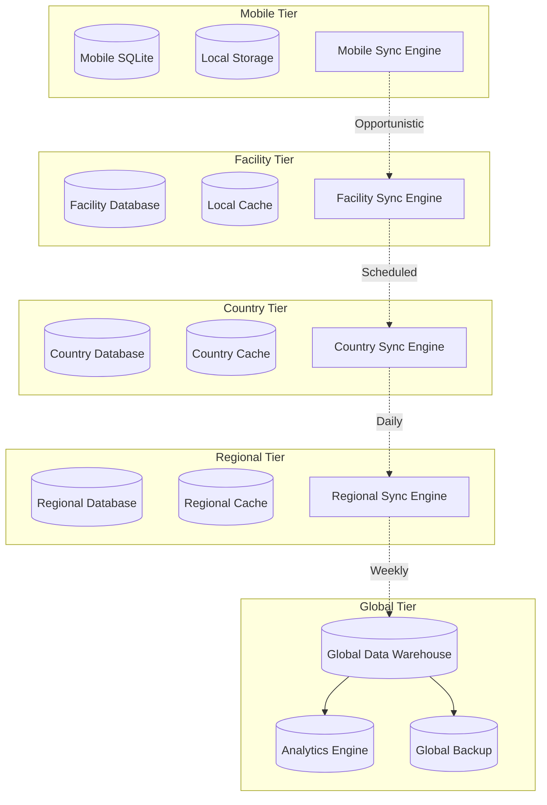

# ZarishHealthcare System - Data Synchronization Strategy

## Executive Summary

The ZarishHealthcare System Data Synchronization Strategy addresses the critical challenge of maintaining data consistency and availability across diverse humanitarian healthcare environments with varying connectivity conditions. This comprehensive strategy implements an intelligent, multi-tier synchronization architecture that ensures healthcare data integrity while optimizing for bandwidth-constrained, intermittent connectivity environments typical of humanitarian operations.

## 1. Synchronization Architecture Overview

### 1.1 Multi-Tier Synchronization Model



### 1.2 Synchronization Principles for Humanitarian Operations

```typescript
// Core synchronization principles for humanitarian healthcare
interface HumanitarianSyncPrinciples {
  // Offline-first operation
  offlineFirst: {
    principle: 'system-fully-functional-without-connectivity';
    implementation: 'local-data-storage-complete-workflow-support';
    priority: 'healthcare-delivery-never-interrupted-connectivity-issues';
    fallback: 'graceful-degradation-reduced-functionality-acceptable';
  };

  // Intelligent bandwidth utilization
  bandwidthOptimization: {
    principle: 'minimize-bandwidth-usage-maximum-data-value';
    implementation: 'differential-sync-compression-prioritization';
    priority: 'critical-healthcare-data-synchronized-first';
    adaptation: 'sync-strategy-adapts-available-bandwidth';
  };

  // Conflict resolution for humanitarian context
  conflictResolution: {
    principle: 'healthcare-data-integrity-paramount-automatic-resolution';
    implementation: 'humanitarian-specific-conflict-resolution-algorithms';
    priority: 'patient-safety-data-accuracy-over-convenience';
    escalation: 'manual-review-complex-clinical-data-conflicts';
  };

  // Security and privacy protection
  securityFirstSync: {
    principle: 'data-protection-during-transmission-storage';
    implementation: 'end-to-end-encryption-all-sync-operations';
    priority: 'beneficiary-privacy-protection-paramount';
    compliance: 'hipaa-gdpr-humanitarian-standards-synchronization';
  };

  // Resilience and reliability
  syncResilience: {
    principle: 'synchronization-resilient-network-failures';
    implementation: 'retry-mechanisms-incremental-sync-recovery';
    priority: 'data-eventually-consistent-across-all-tiers';
    reliability: 'sync-operations-idempotent-resumable';
  };
}
```

## 2. Multi-Tier Synchronization Framework

### 2.1 Mobile-to-Facility Synchronization

```typescript
// Mobile device to healthcare facility synchronization
class MobileFacilitySynchronization {
  
  async implementMobileSync(): Promise<MobileSyncFramework> {
    return {
      // Mobile data collection and storage
      mobileDataManagement: {
        localStorageStrategy: {
          primaryStorage: 'sqlite-embedded-database-structured-data';
          cacheStorage: 'indexeddb-browser-cache-forms-attachments';
          fileStorage: 'local-file-system-images-documents';
          encryptedStorage: 'encrypted-sqlite-sensitive-patient-data';
        },
        
        offlineCapabilities: {
          patientRegistration: 'complete-patient-registration-demographic-data';
          clinicalAssessment: 'clinical-assessment-forms-vital-signs';
          laboratoryOrders: 'laboratory-test-orders-sample-collection';
          medicationDispensing: 'medication-dispensing-adherence-tracking';
          healthEducation: 'health-education-session-attendance-tracking';
          communityFeedback: 'community-feedback-complaints-suggestions';
        }
      },

      // Synchronization triggers and scheduling
      syncTriggerMechanisms: {
        connectivityBased: {
          wifiConnection: 'immediate-sync-wifi-network-detection';
          cellularConnection: 'scheduled-sync-cellular-data-available';
          satelliteConnection: 'priority-sync-satellite-communication-windows';
          facilityProximity: 'automatic-sync-facility-bluetooth-wifi-range';
        },
        
        dataPriorityBased: {
          criticalPatientData: 'immediate-sync-critical-patient-information';
          routineHealthData: 'scheduled-sync-routine-clinical-data';
          administrativeData: 'low-priority-sync-administrative-information';
          bulkHistoricalData: 'background-sync-historical-data-transfer';
        }
      }
    };
  }
}
```

### 2.2 Facility-to-Country Synchronization

```typescript
// Healthcare facility to country-level synchronization
class FacilityCountrySynchronization {
  
  async implementFacilitySync(): Promise<FacilitySyncFramework> {
    return {
      // Facility data aggregation and preparation
      facilityDataPreparation: {
        dataAggregation: {
          patientDataAggregation: 'patient-record-consolidation-mobile-clinic-data';
          clinicalDataSummary: 'clinical-outcome-summary-statistical-aggregation';
          operationalMetrics: 'facility-performance-metrics-kpi-calculation';
          resourceUtilization: 'resource-usage-statistics-inventory-tracking';
        },
        
        privacyDataProtection: {
          dataDeidentification: 'patient-data-de-identification-privacy-protection';
          accessControlValidation: 'user-access-rights-validation-data-sharing';
          auditTrailGeneration: 'comprehensive-audit-trail-data-access-sharing';
          consentValidation: 'patient-consent-validation-data-sharing-research';
        }
      },

      // Scheduled synchronization processes
      scheduledSyncProcesses: {
        dailySynchronization: {
          schedule: 'end-of-day-scheduled-synchronization-country-level';
          dataScope: [
            'new-patient-registrations-demographic-updates',
            'clinical-encounter-data-diagnosis-treatment',
            'laboratory-results-diagnostic-information',
            'medication-dispensing-records-adherence-data',
            'operational-metrics-facility-performance-indicators'
          ],
          networkOptimization: 'scheduled-low-network-traffic-periods',
          retryMechanisms: 'automatic-retry-failed-synchronization-attempts';
        }
      }
    };
  }
}
```

## 3. Intelligent Synchronization Engine

### 3.1 Adaptive Synchronization Algorithms

```typescript
// Intelligent synchronization engine with adaptive algorithms
class IntelligentSynchronizationEngine {
  
  async implementAdaptiveSynchronization(): Promise<AdaptiveSyncFramework> {
    return {
      // Connectivity-aware synchronization
      connectivityAwareness: {
        networkConditionMonitoring: {
          bandwidthMeasurement: 'real-time-bandwidth-measurement-monitoring';
          latencyAssessment: 'network-latency-assessment-optimization';
          reliabilityTracking: 'connection-reliability-tracking-prediction';
          costAwareness: 'data-cost-awareness-cellular-satellite-connections';
        },
        
        adaptiveSyncStrategy: {
          highBandwidthStrategy: {
            syncFrequency: 'real-time-continuous-synchronization';
            dataScope: 'comprehensive-data-synchronization-all-types';
            mediaHandling: 'full-resolution-media-file-synchronization';
            backgroundSync: 'background-synchronization-user-activity';
          },
          
          lowBandwidthStrategy: {
            syncFrequency: 'manual-triggered-synchronization-user-initiated';
            dataScope: 'critical-data-only-patient-safety-focus';
            mediaHandling: 'text-only-media-sync-deferred';
            backgroundSync: 'disabled-background-sync-user-control-only';
          },
          
          offlineStrategy: {
            syncFrequency: 'opportunistic-sync-connectivity-available';
            dataScope: 'accumulated-offline-data-intelligent-prioritization';
            mediaHandling: 'media-sync-deferred-high-bandwidth-availability';
            backgroundSync: 'queue-based-sync-connectivity-restoration';
          }
        }
      },

      // Conflict resolution intelligence
      intelligentConflictResolution: {
        contextAwareResolution: {
          clinicalContextResolution: {
            patientSafetyPriority: 'patient-safety-highest-priority-conflict-resolution';
            clinicalUrgencyWeighting: 'clinical-urgency-based-resolution-weighting';
            protocolCompliancePriority: 'clinical-protocol-compliance-priority';
            outcomeBasedResolution: 'patient-outcome-based-resolution-strategy';
          },
          
          humanitarianContextResolution: {
            beneficiaryPriorityProtection: 'beneficiary-priority-protection-resolution';
            culturalSensitivityConsideration: 'cultural-sensitivity-resolution-strategy';
            doNoHarmPrinciple: 'do-no-harm-principle-conflict-resolution';
            vulnerabilityProtection: 'vulnerable-population-protection-priority';
          }
        }
      }
    };
  }
}
```

## 4. Security and Privacy in Synchronization

### 4.1 Secure Synchronization Framework

```typescript
// Comprehensive security framework for data synchronization
class SecureSynchronizationFramework {
  
  async implementSecureSync(): Promise<SecureSyncFramework> {
    return {
      // End-to-end encryption for synchronization
      encryptionInTransit: {
        transportLayerSecurity: {
          tlsVersion: 'tls-1.3-minimum-version-all-sync-communications';
          certificateManagement: 'automated-certificate-management-rotation';
          cipherSuiteConfiguration: 'strong-cipher-suite-configuration-security';
          perfectForwardSecrecy: 'perfect-forward-secrecy-session-key-protection';
        },
        
        applicationLayerEncryption: {
          endToEndEncryption: 'application-level-end-to-end-encryption';
          keyManagement: 'distributed-key-management-vault-integration';
          dataInTransitEncryption: 'all-sync-data-encrypted-in-transit';
          metadataProtection: 'metadata-encryption-communication-privacy';
        }
      },

      // Privacy protection in synchronization
      privacyProtectionSync: {
        dataMinimization: {
          syncScopeMinimization: 'sync-only-necessary-data-purpose-limitation';
          fieldLevelMinimization: 'field-level-data-minimization-privacy';
          temporalMinimization: 'time-limited-sync-data-retention-policies';
          recipientMinimization: 'sync-data-only-authorized-recipients';
        },
        
        anonymizationPseudonymization: {
          dynamicAnonymization: 'dynamic-data-anonymization-sync-transmission';
          pseudonymizationKeys: 'secure-pseudonymization-key-management';
          differentialPrivacy: 'differential-privacy-aggregated-data-sync';
          kAnonymity: 'k-anonymity-protection-individual-privacy';
        }
      }
    };
  }
}
```

## 5. Performance and Scalability Optimization

### 5.1 Scalable Synchronization Architecture

```typescript
// Scalable synchronization architecture for humanitarian operations
class ScalableSynchronizationArchitecture {
  
  async implementScalableSync(): Promise<ScalableSyncFramework> {
    return {
      // Horizontal scaling strategies
      horizontalScaling: {
        distributedSyncEngines: {
          geographicDistribution: 'geographically-distributed-sync-engines';
          loadBalancing: 'intelligent-load-balancing-sync-requests';
          failoverRedundancy: 'automatic-failover-redundant-sync-engines';
          capacityAutoScaling: 'automatic-capacity-scaling-demand-based';
        },
        
        queueBasedSynchronization: {
          asyncSyncQueues: 'asynchronous-sync-queue-processing';
          priorityQueues: 'priority-queue-critical-data-first';
          deadLetterQueues: 'dead-letter-queue-failed-sync-handling';
          queueMonitoring: 'queue-performance-monitoring-optimization';
        }
      },

      // Performance optimization strategies
      performanceOptimization: {
        cacheOptimization: {
          distributedCaching: 'distributed-caching-frequently-accessed-sync-data';
          intelligentCachePrefetching: 'predictive-cache-prefetching-sync-patterns';
          cacheInvalidation: 'intelligent-cache-invalidation-data-freshness';
          multiLevelCaching: 'multi-level-caching-memory-disk-network';
        },
        
        networkOptimization: {
          compressionOptimization: 'advanced-compression-algorithms-bandwidth-efficiency';
          batchProcessing: 'intelligent-batch-processing-sync-operations';
          deltaSync: 'delta-synchronization-minimal-data-transfer';
          prefetching: 'predictive-prefetching-sync-data-anticipation';
        }
      }
    };
  }
}
```

## 6. Humanitarian-Specific Synchronization Requirements

### 6.1 Emergency and Crisis Response Synchronization

```typescript
// Emergency response synchronization for humanitarian crises
class EmergencyResponseSynchronization {
  
  async implementEmergencySync(): Promise<EmergencySyncFramework> {
    return {
      // Crisis-responsive synchronization modes
      crisisResponseModes: {
        emergencyMode: {
          syncPriority: 'critical-life-safety-data-immediate-synchronization';
          dataScope: [
            'patient-emergency-medical-information',
            'critical-supply-shortage-alerts',
            'security-incident-safety-information',
            'evacuation-coordination-data',
            'emergency-contact-communication-data'
          ],
          networkOverride: 'emergency-network-resource-allocation-priority';
          bandwidthAllocation: 'maximum-bandwidth-allocation-emergency-sync';
          redundancy: 'multiple-communication-channel-redundancy';
        },
        
        disasterResponseMode: {
          syncPriority: 'disaster-response-coordination-data-priority';
          dataScope: [
            'affected-population-assessment-data',
            'resource-need-assessment-information',
            'coordination-meeting-decision-data',
            'volunteer-staff-deployment-information',
            'supply-distribution-tracking-data'
          ],
          adaptiveNetworking: 'adaptive-networking-disaster-damaged-infrastructure';
          meshNetworking: 'mesh-networking-communication-continuity';
          satelliteCommunication: 'satellite-communication-backup-primary';
        }
      },

      // Rapid deployment synchronization
      rapidDeploymentSync: {
        emergencyKitSync: {
          preloadedCriticalData: 'preloaded-critical-reference-data-emergency-kits';
          rapidConfigurationSync: 'rapid-configuration-synchronization-deployment';
          essentialProtocolSync: 'essential-clinical-protocol-synchronization';
          emergencyContactSync: 'emergency-contact-information-synchronization';
        },
        
        interAgencyCoordination: {
          jointOperationsSync: 'joint-operations-data-synchronization';
          sharedResourceTracking: 'shared-resource-tracking-synchronization';
          coordinatedDecisionMaking: 'coordinated-decision-making-data-sharing';
          situationalAwarenessSync: 'real-time-situational-awareness-synchronization';
        }
      }
    };
  }
}
```

## 7. Implementation and Deployment Strategy

### 7.1 Synchronization Implementation Roadmap

```typescript
// Phased implementation approach for synchronization strategy
class SynchronizationImplementationRoadmap {
  
  async implementSyncRoadmap(): Promise<SyncImplementationPlan> {
    return {
      // Phase 1: Foundation synchronization (Months 1-6)
      phase1Foundation: {
        objectives: [
          'implement-basic-mobile-facility-synchronization',
          'establish-facility-country-sync-mechanisms',
          'develop-core-conflict-resolution-algorithms',
          'implement-basic-security-encryption-sync'
        ],
        
        deliverables: [
          'mobile-app-offline-sync-capabilities',
          'facility-database-sync-engine',
          'basic-conflict-resolution-system',
          'encrypted-sync-communications'
        ],
        
        successCriteria: [
          'mobile-devices-sync-successfully-facilities',
          'facilities-sync-country-level-daily',
          'conflict-resolution-95-percent-automatic',
          'all-sync-communications-encrypted'
        ]
      },

      // Phase 2: Intelligent synchronization (Months 7-12)
      phase2Intelligence: {
        objectives: [
          'implement-adaptive-bandwidth-synchronization',
          'deploy-intelligent-conflict-resolution',
          'establish-regional-global-sync-tiers',
          'implement-emergency-response-sync-modes'
        ],
        
        deliverables: [
          'adaptive-sync-engine-bandwidth-optimization',
          'ai-powered-conflict-resolution-system',
          'multi-tier-sync-architecture-operational',
          'emergency-sync-protocols-tested-validated'
        ],
        
        successCriteria: [
          'sync-performance-optimized-available-bandwidth',
          'conflict-resolution-99-percent-automatic',
          'multi-tier-sync-latency-under-defined-sla',
          'emergency-sync-activation-under-60-seconds'
        ]
      },

      // Phase 3: Scale and optimization (Months 13-18)
      phase3Scaling: {
        objectives: [
          'scale-sync-architecture-200-facilities',
          'implement-predictive-sync-optimization',
          'deploy-comprehensive-sync-monitoring',
          'establish-cross-organization-sync-protocols'
        ],
        
        deliverables: [
          'horizontally-scalable-sync-infrastructure',
          'predictive-analytics-sync-optimization',
          'comprehensive-sync-monitoring-dashboards',
          'inter-organization-sync-agreements-operational'
        ],
        
        successCriteria: [
          'sync-infrastructure-supports-target-scale',
          'predictive-optimization-improves-efficiency-20-percent',
          'sync-monitoring-provides-real-time-visibility',
          'cross-organization-sync-successful-pilot'
        ]
      }
    };
  }
}
```

### 7.2 Success Metrics and KPIs

```typescript
// Comprehensive success metrics for synchronization strategy
interface SynchronizationSuccessMetrics {
  // Technical performance metrics
  technicalPerformance: {
    syncReliability: {
      metric: 'synchronization-success-rate-percentage';
      target: '99.5-percent-successful-sync-operations';
      measurement: 'automated-sync-outcome-tracking';
      reporting: 'real-time-dashboards-weekly-reports';
    };
    
    syncLatency: {
      metric: 'end-to-end-synchronization-latency';
      target: 'mobile-facility-under-5-minutes-facility-country-under-30-minutes';
      measurement: 'timestamp-based-latency-calculation';
      reporting: 'latency-distribution-analysis-percentiles';
    };
    
    bandwidthEfficiency: {
      metric: 'data-transfer-efficiency-ratio';
      target: '80-percent-reduction-raw-data-size-through-optimization';
      measurement: 'before-after-compression-delta-sync-analysis';
      reporting: 'bandwidth-savings-cost-impact-reports';
    };
    
    conflictResolution: {
      metric: 'automatic-conflict-resolution-rate';
      target: '95-percent-conflicts-resolved-automatically';
      measurement: 'conflict-detection-resolution-outcome-tracking';
      reporting: 'conflict-pattern-analysis-resolution-effectiveness';
    };
  };

  // Operational effectiveness metrics
  operationalEffectiveness: {
    dataFreshness: {
      metric: 'data-freshness-average-age';
      target: 'critical-data-under-1-hour-routine-data-under-24-hours';
      measurement: 'timestamp-based-data-age-calculation';
      reporting: 'data-freshness-distribution-stakeholder-dashboards';
    };
    
    offlineCapability: {
      metric: 'offline-operation-duration';
      target: '72-hour-minimum-offline-operation-full-functionality';
      measurement: 'offline-testing-simulated-connectivity-loss';
      reporting: 'offline-capability-resilience-testing-reports';
    };
    
    userProductivity: {
      metric: 'sync-related-user-wait-time';
      target: '90-percent-user-operations-no-sync-waiting';
      measurement: 'user-interaction-timing-analysis';
      reporting: 'user-experience-productivity-impact-analysis';
    };
  };

  // Healthcare impact metrics
  healthcareImpact: {
    clinicalWorkflowEfficiency: {
      metric: 'clinical-workflow-completion-time';
      target: '30-percent-improvement-workflow-completion-time';
      measurement: 'before-after-workflow-timing-analysis';
      reporting: 'clinical-efficiency-impact-assessment';
    };
    
    dataQualityImprovement: {
      metric: 'healthcare-data-completeness-accuracy';
      target: '95-percent-data-completeness-99-percent-accuracy';
      measurement: 'automated-data-quality-assessment';
      reporting: 'data-quality-improvement-trending-analysis';
    };
    
    coordinationEffectiveness: {
      metric: 'multi-organization-coordination-response-time';
      target: '50-percent-improvement-coordination-response-time';
      measurement: 'coordination-workflow-timing-analysis';
      reporting: 'coordination-effectiveness-impact-measurement';
    };
  };

  // Humanitarian-specific metrics
  humanitarianImpact: {
    emergencyResponseTime: {
      metric: 'emergency-data-synchronization-time';
      target: 'critical-emergency-data-synchronized-under-2-minutes';
      measurement: 'emergency-sync-activation-completion-timing';
      reporting: 'emergency-response-effectiveness-analysis';
    };
    
    beneficiaryPrivacyProtection: {
      metric: 'privacy-protection-compliance-rate';
      target: '100-percent-sync-operations-privacy-compliant';
      measurement: 'automated-privacy-compliance-validation';
      reporting: 'privacy-protection-assurance-reporting';
    };
    
    fieldOperationsSupport: {
      metric: 'field-operations-sync-support-effectiveness';
      target: '95-percent-field-operations-sync-support-satisfaction';
      measurement: 'field-staff-feedback-surveys-usage-analytics';
      reporting: 'field-operations-support-effectiveness-assessment';
    };
  };
}
```

## 8. Monitoring and Troubleshooting

### 8.1 Synchronization Monitoring Framework

```typescript
// Comprehensive monitoring framework for synchronization operations
class SynchronizationMonitoringFramework {
  
  async implementSyncMonitoring(): Promise<SyncMonitoringSystem> {
    return {
      // Real-time monitoring capabilities
      realTimeMonitoring: {
        syncStatusDashboards: {
          globalSyncOverview: 'global-synchronization-status-executive-dashboard';
          regionalSyncStatus: 'regional-sync-health-operational-dashboards';
          facilitySyncMetrics: 'individual-facility-sync-performance-metrics';
          mobileSyncTracking: 'mobile-device-sync-status-real-time-tracking';
        },
        
        performanceMetrics: {
          throughputMonitoring: 'sync-throughput-real-time-monitoring-alerts';
          latencyTracking: 'end-to-end-sync-latency-percentile-tracking';
          errorRateMonitoring: 'sync-error-rate-threshold-alerting';
          resourceUtilization: 'sync-infrastructure-resource-utilization-monitoring';
        },
        
        alertingSystem: {
          criticalAlerts: 'critical-sync-failure-immediate-escalation';
          performanceAlerts: 'performance-degradation-threshold-alerting';
          securityAlerts: 'sync-security-incident-automated-alerting';
          capacityAlerts: 'sync-capacity-threshold-proactive-alerting';
        }
      },

      // Troubleshooting and diagnostics
      troubleshootingDiagnostics: {
        automaticDiagnostics: {
          syncFailureAnalysis: 'automatic-sync-failure-root-cause-analysis';
          networkDiagnostics: 'network-connectivity-quality-diagnostics';
          conflictAnalysis: 'automatic-conflict-pattern-analysis-recommendations';
          performanceBottleneckDetection: 'performance-bottleneck-automatic-detection';
        },
        
        manualDiagnosticTools: {
          syncTraceAnalysis: 'detailed-sync-operation-trace-analysis-tools';
          dataIntegrityValidation: 'data-integrity-validation-diagnostic-tools';
          connectivityTesting: 'network-connectivity-testing-diagnostic-suite';
          conflictResolutionAnalysis: 'conflict-resolution-decision-analysis-tools';
        },
        
        proactiveMonitoring: {
          predictiveFailureDetection: 'predictive-sync-failure-detection-prevention';
          capacityPlanningMonitoring: 'sync-capacity-planning-trend-analysis';
          performanceOptimizationRecommendations: 'ai-powered-performance-optimization-recommendations';
          healthScoreCalculation: 'sync-system-health-score-calculation-trending';
        }
      }
    };
  }
}
```

## 9. Conclusion and Future Evolution

### 9.1 Strategic Benefits

The ZarishHealthcare System Data Synchronization Strategy delivers transformative capabilities for humanitarian healthcare operations:

**Operational Excellence**:
- Seamless offline-to-online operation ensuring uninterrupted healthcare delivery
- Intelligent bandwidth utilization optimizing connectivity costs and performance
- Automated conflict resolution maintaining data integrity with minimal manual intervention

**Healthcare Impact**:
- Real-time access to critical patient information improving clinical decision-making
- Enhanced coordination between healthcare providers and organizations
- Improved data quality and completeness supporting evidence-based care

**Humanitarian Effectiveness**:
- Emergency response capabilities enabling rapid coordination during crises
- Cultural sensitivity and privacy protection respecting beneficiary dignity
- Scalable architecture supporting growth from pilot to global operations

### 9.2 Future Evolution Roadmap

```typescript
// Future evolution strategy for synchronization capabilities
interface FutureEvolutionRoadmap {
  // Next 12 months: Enhanced intelligence
  enhancedIntelligence: [
    'machine-learning-powered-sync-optimization',
    'predictive-conflict-prevention-algorithms',
    'ai-driven-bandwidth-allocation-optimization',
    'intelligent-emergency-response-automation'
  ];

  // Next 24 months: Advanced integration
  advancedIntegration: [
    'blockchain-based-sync-integrity-verification',
    'iot-device-integration-medical-equipment',
    'voice-recognition-sync-trigger-activation',
    'augmented-reality-sync-status-visualization'
  ];

  // Next 36 months: Autonomous operation
  autonomousOperation: [
    'fully-autonomous-sync-decision-making',
    'self-healing-sync-infrastructure',
    'predictive-maintenance-sync-systems',
    'autonomous-scaling-global-operations'
  ];
}
```

### 9.3 Success Foundation

The successful implementation of this Data Synchronization Strategy establishes the foundation for:

- **Resilient Healthcare Information Systems** that function effectively regardless of connectivity conditions
- **Intelligent Data Management** that optimizes for humanitarian operational contexts
- **Scalable Architecture** supporting growth from pilot implementations to global humanitarian operations
- **Evidence-Based Decision Making** through timely, accurate, and comprehensive data availability
- **Enhanced Coordination** between humanitarian organizations and healthcare providers
- **Improved Patient Outcomes** through better information continuity and clinical decision support

This comprehensive Data Synchronization Strategy ensures that the ZarishHealthcare System delivers on its promise of transforming humanitarian healthcare through innovative, appropriate, and sustainable technology solutions that truly serve the needs of vulnerable populations worldwide while respecting their privacy, dignity, and cultural contexts.

The strategy's emphasis on offline-first operation, intelligent adaptation to network conditions, and humanitarian-specific requirements positions it as a model for healthcare information systems in resource-constrained, challenging operational environments. Through careful implementation and continuous optimization, this synchronization framework will enable unprecedented levels of healthcare data availability, coordination, and impact in humanitarian operations globally.