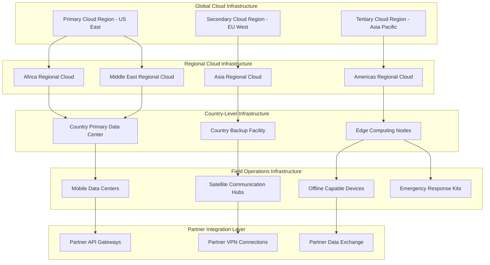

# ZarishHealthcare System - Deployment Strategy for Hybrid Hosting Environments

## Executive Summary

The ZarishHealthcare System Deployment Strategy is specifically designed for humanitarian healthcare operations requiring flexible, resilient, and cost-effective hosting solutions across diverse operational environments. This comprehensive strategy addresses the unique challenges of deploying healthcare information systems in humanitarian contexts, from stable headquarters environments to resource-constrained field operations, while maintaining security, compliance, and operational continuity.

## 1. Deployment Architecture Overview

### 1.1 Hybrid Cloud Architecture for Humanitarian Operations



### 1.2 Deployment Environment Categories

```typescript
// Comprehensive deployment environment classification for humanitarian operations
interface HumanitarianDeploymentEnvironments {
  // Global headquarters and coordination centers
  globalHeadquarters: {
    characteristics: {
      connectivity: 'high-speed-reliable-internet-multiple-providers';
      power: 'stable-power-grid-ups-backup-generators';
      security: 'physical-security-access-controls-monitoring';
      compliance: 'full-regulatory-compliance-all-jurisdictions';
      staff: 'technical-staff-24-7-support-available';
    };
    deployment: {
      type: 'enterprise-cloud-multi-region-active-active';
      infrastructure: 'kubernetes-clusters-auto-scaling-load-balancing';
      dataStorage: 'distributed-databases-real-time-replication';
      monitoring: 'comprehensive-monitoring-alerting-dashboards';
      backup: 'continuous-backup-multiple-geographic-regions';
    };
  };

  // Regional offices and coordination hubs
  regionalOffices: {
    characteristics: {
      connectivity: 'reliable-internet-occasional-outages-possible';
      power: 'mostly-stable-power-ups-backup-recommended';
      security: 'moderate-physical-security-basic-access-controls';
      compliance: 'regional-compliance-requirements-focus';
      staff: 'limited-technical-staff-remote-support-primary';
    };
    deployment: {
      type: 'hybrid-cloud-regional-failover-capabilities';
      infrastructure: 'managed-kubernetes-services-regional-providers';
      dataStorage: 'regional-databases-scheduled-replication';
      monitoring: 'essential-monitoring-remote-management';
      backup: 'daily-backup-offsite-cloud-storage';
    };
  };

  // Country offices and stable field locations
  countryOffices: {
    characteristics: {
      connectivity: 'variable-internet-quality-bandwidth-limitations';
      power: 'intermittent-power-solar-battery-backup-required';
      security: 'basic-physical-security-community-based-protection';
      compliance: 'local-regulatory-requirements-cultural-considerations';
      staff: 'minimal-technical-staff-community-health-workers-primary';
    };
    deployment: {
      type: 'edge-computing-offline-first-capabilities';
      infrastructure: 'containerized-applications-edge-devices';
      dataStorage: 'local-databases-offline-sync-capabilities';
      monitoring: 'basic-health-monitoring-satellite-communication';
      backup: 'local-backup-periodic-satellite-upload';
    };
  };

  // Mobile and temporary field operations
  mobileOperations: {
    characteristics: {
      connectivity: 'satellite-radio-intermittent-cellular';
      power: 'portable-generators-solar-panels-batteries';
      security: 'physical-security-challenging-environmental-hazards';
      compliance: 'emergency-response-relaxed-compliance-temporary';
      staff: 'emergency-responders-minimal-technical-background';
    };
    deployment: {
      type: 'portable-ruggedized-offline-capable-systems';
      infrastructure: 'single-node-containers-embedded-systems';
      dataStorage: 'local-sqlite-periodic-sync-when-connected';
      monitoring: 'basic-system-health-manual-reporting';
      backup: 'local-storage-manual-data-export-procedures';
    };
  };

  // Emergency response and crisis situations
  emergencyResponse: {
    characteristics: {
      connectivity: 'no-connectivity-assumed-satellite-emergency-only';
      power: 'battery-powered-devices-hand-crank-generators';
      security: 'minimal-physical-security-focus-data-protection';
      compliance: 'emergency-override-procedures-post-crisis-compliance';
      staff: 'first-responders-volunteers-minimal-training';
    };
    deployment: {
      type: 'standalone-devices-paper-backup-systems';
      infrastructure: 'embedded-applications-no-network-dependencies';
      dataStorage: 'local-storage-encrypted-manual-transcription';
      monitoring: 'basic-device-status-manual-check-procedures';
      backup: 'multiple-device-redundancy-manual-data-consolidation';
    };
  };
}
```

## 2. Cloud Infrastructure Strategy

### 2.1 Multi-Cloud Deployment Architecture

```typescript
// Multi-cloud deployment strategy for humanitarian healthcare
class MultiCloudDeploymentStrategy {
  
  // Primary cloud provider strategy
  async implementPrimaryCloudStrategy(): Promise<CloudDeploymentFramework> {
    return {
      // Primary cloud providers by region
      cloudProviders: {
        globalPrimary: {
          provider: 'amazon-web-services-aws',
          regions: [
            'us-east-1-virginia-primary-headquarters',
            'us-west-2-oregon-disaster-recovery',
            'eu-west-1-ireland-european-operations'
          ],
          services: {
            compute: 'amazon-eks-kubernetes-managed-service',
            storage: 'amazon-s3-object-storage-glacier-archive',
            database: 'amazon-rds-postgresql-aurora-serverless',
            networking: 'amazon-vpc-private-subnets-nat-gateways',
            monitoring: 'amazon-cloudwatch-x-ray-distributed-tracing',
            security: 'amazon-iam-kms-key-management-waf'
          },
          compliance: [
            'hipaa-eligible-services-business-associate-agreement',
            'gdpr-compliance-data-residency-requirements',
            'soc-2-type-ii-compliance-annual-audits',
            'iso-27001-certification-security-controls'
          ]
        },

        globalSecondary: {
          provider: 'microsoft-azure',
          regions: [
            'east-us-2-disaster-recovery-primary',
            'west-europe-gdpr-compliance-eu-operations',
            'southeast-asia-asia-pacific-operations'
          ],
          services: {
            compute: 'azure-kubernetes-service-aks-managed',
            storage: 'azure-blob-storage-cool-archive-tiers',
            database: 'azure-database-postgresql-flexible-server',
            networking: 'azure-virtual-network-private-endpoints',
            monitoring: 'azure-monitor-application-insights',
            security: 'azure-active-directory-key-vault-sentinel'
          },
          specializations: [
            'azure-health-data-services-fhir-compliance',
            'azure-confidential-computing-sensitive-data',
            'azure-government-cloud-compliance-requirements'
          ]
        }
      },

      // Regional cloud strategy
      regionalCloudStrategy: {
        africaRegion: {
          providers: [
            'aws-africa-cape-town-region',
            'azure-south-africa-north-region',
            'local-african-cloud-providers-partnership'
          ],
          considerations: [
            'data-sovereignty-requirements-african-union',
            'limited-cloud-service-availability-regions',
            'higher-latency-global-cloud-connections',
            'cost-optimization-local-currency-pricing'
          ]
        }
      }
    };
  }
}
```

## 3. Edge Computing Strategy for Field Operations

### 3.1 Field Edge Computing Architecture

```typescript
// Edge computing deployment for humanitarian field operations
class EdgeComputingDeployment {
  
  // Field edge computing architecture
  async implementFieldEdgeComputing(): Promise<EdgeComputingFramework> {
    return {
      // Edge device categories
      edgeDeviceCategories: {
        // High-capacity edge servers for regional hubs
        regionalEdgeServers: {
          specifications: {
            computing: 'intel-xeon-processors-64gb-ram-1tb-ssd',
            connectivity: 'dual-wan-connections-4g-5g-satellite',
            power: 'ups-backup-solar-capability-generator-ready',
            environment: 'ruggedized-chassis-temperature-humidity-resistant',
            storage: 'redundant-storage-raid-configuration-hot-swap'
          },
          deployment: {
            locations: 'regional-coordination-centers-country-offices',
            capacity: 'support-100-concurrent-users-multiple-applications',
            applications: [
              'zarish-care-clinical-management-full-featured',
              'zarish-labs-laboratory-information-system',
              'zarish-ops-operations-coordination-platform',
              'zarish-analytix-regional-analytics-dashboards'
            ],
            dataSync: 'real-time-synchronization-cloud-when-available'
          }
        },

        // Mid-capacity edge devices for field clinics
        clinicEdgeDevices: {
          specifications: {
            computing: 'intel-nuc-industrial-16gb-ram-512gb-ssd',
            connectivity: 'wifi-cellular-modem-satellite-capable',
            power: 'internal-battery-solar-charging-12v-input',
            environment: 'fanless-design-dust-moisture-resistant',
            portability: 'compact-form-factor-mounting-options'
          },
          deployment: {
            locations: 'health-clinics-mobile-units-temporary-facilities',
            capacity: 'support-20-concurrent-users-essential-applications',
            applications: [
              'zarish-care-patient-registration-clinical-records',
              'zarish-labs-point-of-care-testing-results',
              'zarish-sync-offline-synchronization-manager'
            ],
            dataSync: 'scheduled-synchronization-bandwidth-optimized'
          }
        }
      }
    };
  }
}
```

## 4. Containerization and Orchestration Strategy

### 4.1 Kubernetes Deployment Across Environments

```typescript
// Kubernetes deployment strategy for different humanitarian environments
class KubernetesDeploymentStrategy {
  
  // Multi-tier Kubernetes architecture
  async implementKubernetesArchitecture(): Promise<KubernetesArchitectureFramework> {
    return {
      // Kubernetes deployment tiers
      deploymentTiers: {
        // Tier 1: Enterprise cloud environments
        enterpriseCloud: {
          platform: 'managed-kubernetes-services-eks-aks-gke',
          configuration: {
            nodeGroups: [
              'system-nodes-cluster-management-monitoring-logging',
              'application-nodes-zarish-microservices',
              'data-nodes-databases-persistent-storage',
              'gpu-nodes-machine-learning-analytics-optional'
            ],
            scaling: 'horizontal-pod-autoscaler-cluster-autoscaler',
            networking: 'calico-cni-network-policies-microsegmentation',
            storage: 'persistent-volumes-ssd-storage-classes',
            monitoring: 'prometheus-grafana-alertmanager-jaeger-tracing'
          },
          applications: [
            'full-zarish-microservices-suite',
            'comprehensive-monitoring-logging-stack',
            'backup-disaster-recovery-solutions',
            'development-testing-environments'
          ]
        },

        // Tier 2: Regional and country-level deployments
        regionalDeployments: {
          platform: 'lightweight-kubernetes-k3s-minimal-overhead',
          configuration: {
            nodeGroups: [
              'master-nodes-control-plane-ha-configuration',
              'worker-nodes-application-workloads',
              'edge-nodes-local-data-processing'
            ],
            scaling: 'vertical-pod-autoscaler-resource-optimization',
            networking: 'flannel-cni-simple-overlay-network',
            storage: 'local-storage-persistent-volumes-nfs-shared',
            monitoring: 'lightweight-prometheus-grafana-essential-metrics'
          },
          applications: [
            'essential-zarish-services-patient-management',
            'local-data-synchronization-services',
            'basic-monitoring-health-checks',
            'offline-capable-applications'
          ]
        }
      }
    };
  }
}
```

## 5. Database Deployment and Data Management

### 5.1 Multi-Tier Database Architecture

```typescript
// Database deployment strategy for humanitarian healthcare systems
class DatabaseDeploymentStrategy {
  
  // Hierarchical database architecture
  async implementHierarchicalDatabaseArchitecture(): Promise<DatabaseArchitectureFramework> {
    return {
      // Database deployment tiers
      databaseTiers: {
        // Tier 1: Global data warehouses and analytics
        globalDataWarehouses: {
          technology: 'postgresql-with-timescaledb-time-series-data',
          deployment: 'managed-cloud-services-amazon-rds-azure-database',
          configuration: {
            highAvailability: 'multi-az-deployment-automatic-failover',
            performance: 'read-replicas-global-distribution-query-optimization',
            storage: 'ssd-storage-automated-backup-point-in-time-recovery',
            security: 'encryption-at-rest-in-transit-transparent-data-encryption'
          },
          purpose: [
            'global-health-analytics-population-health-trends',
            'donor-reporting-comprehensive-dashboards',
            'research-data-repository-anonymized-datasets',
            'compliance-audit-trails-regulatory-reporting'
          ]
        },

        // Tier 2: Regional operational databases
        regionalOperationalDatabases: {
          technology: 'postgresql-clustered-high-availability',
          deployment: 'regional-cloud-managed-services-or-self-hosted',
          configuration: {
            highAvailability: 'master-slave-replication-automatic-failover',
            performance: 'connection-pooling-query-optimization-indexing',
            storage: 'ssd-local-storage-daily-backup-cloud-storage',
            security: 'database-firewall-role-based-access-control'
          },
          purpose: [
            'regional-program-management-patient-demographics',
            'healthcare-provider-coordination-referral-tracking',
            'supply-chain-management-inventory-distribution',
            'staff-management-scheduling-performance-tracking'
          ]
        }
      }
    };
  }
}
```

## 6. Security and Compliance in Deployment

### 6.1 Security-First Deployment Practices

```typescript
// Security-integrated deployment strategy
class SecureDeploymentStrategy {
  
  // Security integration in deployment pipeline
  async implementSecureDeploymentPipeline(): Promise<SecureDeploymentFramework> {
    return {
      // Secure CI/CD pipeline
      secureCICDPipeline: {
        sourceCodeSecurity: {
          repositorySecurity: [
            'git-repository-access-controls-two-factor-authentication',
            'branch-protection-rules-required-reviews',
            'secrets-scanning-automatic-credential-detection',
            'dependency-vulnerability-scanning-automated-updates'
          ],
          codeQuality: [
            'static-code-analysis-security-vulnerability-detection',
            'code-review-requirements-security-focused',
            'automated-testing-security-test-cases',
            'compliance-checking-regulatory-requirements'
          ]
        },

        buildSecurity: {
          buildEnvironment: [
            'isolated-build-environments-container-sandboxing',
            'build-agent-security-hardening-monitoring',
            'secure-dependency-management-private-registries',
            'build-artifact-signing-supply-chain-security'
          ],
          imageScanning: [
            'container-image-vulnerability-scanning-trivy-clair',
            'base-image-security-assessment-distroless-images',
            'runtime-security-scanning-behavioral-analysis',
            'license-compliance-checking-open-source-dependencies'
          ]
        }
      }
    };
  }
}
```

## 7. Cost Optimization and Resource Management

### 7.1 Cost-Effective Deployment Strategy

```typescript
// Cost optimization strategy for humanitarian healthcare deployments
class CostOptimizationStrategy {
  
  // Multi-tier cost optimization
  async implementCostOptimization(): Promise<CostOptimizationFramework> {
    return {
      // Cost optimization by environment
      environmentCostOptimization: {
        cloudEnvironments: {
          instanceOptimization: [
            'right-sizing-instances-actual-usage-monitoring',
            'spot-instances-non-critical-workloads-cost-reduction',
            'reserved-instances-predictable-workloads-long-term',
            'auto-scaling-demand-based-resource-allocation'
          ],
          storageOptimization: [
            'tiered-storage-hot-warm-cold-archive',
            'data-lifecycle-policies-automatic-archival',
            'compression-deduplication-storage-efficiency',
            'backup-optimization-incremental-differential'
          ]
        }
      },

      // Open source and cost-effective technology choices
      openSourceStrategy: {
        coreTechnologies: [
          'kubernetes-open-source-orchestration-no-licensing',
          'postgresql-open-source-database-enterprise-features',
          'redis-open-source-caching-high-performance',
          'nginx-open-source-load-balancing-web-server'
        ]
      }
    };
  }
}
```

## 8. Monitoring and Observability

### 8.1 Multi-Tier Monitoring Strategy

```typescript
// Comprehensive monitoring and observability strategy
class MonitoringObservabilityStrategy {
  
  // Hierarchical monitoring architecture
  async implementHierarchicalMonitoring(): Promise<MonitoringArchitectureFramework> {
    return {
      // Monitoring tier architecture
      monitoringTiers: {
        globalMonitoring: {
          scope: 'global-operations-all-regions-countries-facilities',
          platform: 'enterprise-monitoring-solutions-datadog-new-relic',
          metrics: [
            'global-system-health-availability-performance',
            'cross-regional-data-synchronization-status',
            'compliance-metrics-hipaa-gdpr-humanitarian-standards',
            'security-incidents-threat-detection-response'
          ],
          dashboards: [
            'executive-dashboard-high-level-kpis',
            'operations-dashboard-system-health-alerts',
            'compliance-dashboard-regulatory-status',
            'security-dashboard-threat-landscape'
          ],
          alerting: [
            'critical-system-outages-immediate-escalation',
            'security-incidents-automated-response',
            'compliance-violations-regulatory-notification',
            'performance-degradation-capacity-planning'
          ]
        },

        regionalMonitoring: {
          scope: 'regional-operations-country-level-coordination',
          platform: 'prometheus-grafana-open-source-stack',
          metrics: [
            'regional-system-performance-availability',
            'field-connectivity-communication-status',
            'healthcare-delivery-metrics-patient-outcomes',
            'operational-efficiency-resource-utilization'
          ],
          dashboards: [
            'regional-operations-dashboard-field-status',
            'healthcare-delivery-dashboard-clinical-metrics',
            'resource-management-dashboard-supply-inventory',
            'staff-performance-dashboard-training-compliance'
          ]
        },

        facilityMonitoring: {
          scope: 'individual-healthcare-facilities-clinics',
          platform: 'lightweight-monitoring-prometheus-node-exporter',
          metrics: [
            'facility-system-health-hardware-performance',
            'clinical-workflow-efficiency-patient-throughput',
            'data-quality-completeness-accuracy',
            'staff-productivity-patient-satisfaction'
          ],
          dashboards: [
            'facility-operations-dashboard-daily-activities',
            'clinical-performance-dashboard-patient-care',
            'system-health-dashboard-technical-status',
            'staff-dashboard-workload-performance'
          ]
        }
      },

      // Observability integration
      observabilityIntegration: {
        distributedTracing: {
          platform: 'jaeger-open-source-distributed-tracing',
          implementation: [
            'microservices-request-flow-tracking',
            'cross-service-dependency-mapping',
            'performance-bottleneck-identification',
            'error-propagation-root-cause-analysis'
          ]
        },

        logAggregation: {
          platform: 'elasticsearch-logstash-kibana-elk-stack',
          implementation: [
            'centralized-log-collection-all-components',
            'structured-logging-json-format-consistency',
            'log-correlation-distributed-request-tracking',
            'automated-log-analysis-anomaly-detection'
          ]
        }
      }
    };
  }
}
```

## 9. Implementation Timeline and Phases

### 9.1 Phased Deployment Approach

The ZarishHealthcare System deployment follows a carefully structured, risk-managed approach across multiple phases:

#### Phase 1: Foundation Infrastructure (Months 1-4)
**Objective**: Establish core infrastructure and basic services

**Global Infrastructure Setup**:
- Deploy primary cloud infrastructure (AWS/Azure multi-region)
- Establish global container registry and CI/CD pipelines
- Implement basic monitoring and logging infrastructure
- Set up initial security controls and compliance framework

**Regional Infrastructure Preparation**:
- Deploy regional Kubernetes clusters (K3s lightweight)
- Establish regional data synchronization capabilities
- Set up basic edge computing infrastructure for pilot locations
- Implement regional monitoring and alerting systems

**Key Deliverables**:
- Operational global cloud infrastructure with 99.9% availability
- Functional CI/CD pipelines with automated testing and deployment
- Basic monitoring dashboards showing system health
- Security baseline with encryption and access controls
- Documentation and initial staff training programs

#### Phase 2: Core Application Deployment (Months 5-8)
**Objective**: Deploy and validate core ZarishSphere applications

**Application Deployment**:
- Deploy ZarishCare patient management system to pilot facilities
- Roll out ZarishLabs laboratory information system
- Implement ZarishAccess identity and access management
- Deploy ZarishSync offline synchronization capabilities

**Data Management**:
- Establish hierarchical database architecture
- Implement data synchronization between tiers
- Set up backup and disaster recovery procedures
- Deploy data encryption and protection measures

**Key Deliverables**:
- Functional patient management system in 3-5 pilot facilities
- Laboratory information system processing 100+ tests daily
- Identity management system supporting 200+ users
- Offline synchronization working in resource-constrained environments
- Data backup and recovery procedures tested and validated

#### Phase 3: Field Operations Scaling (Months 9-12)
**Objective**: Scale deployment to field operations and mobile environments

**Field Infrastructure Deployment**:
- Deploy edge computing devices to 20+ field locations
- Establish satellite and cellular connectivity solutions
- Implement mobile and ruggedized device management
- Set up field-specific monitoring and support procedures

**Application Optimization**:
- Optimize applications for low-bandwidth environments
- Implement advanced offline capabilities
- Deploy mobile-optimized user interfaces
- Establish field user training and support programs

**Key Deliverables**:
- 20+ field locations with functional healthcare information systems
- Mobile devices supporting community health workers
- Offline operation capability for up to 30 days
- Field staff trained and using systems effectively
- Regional coordination dashboards showing real-time operations

#### Phase 4: Advanced Features and Integration (Months 13-16)
**Objective**: Implement advanced features and partner integrations

**Advanced Capabilities**:
- Deploy ZarishAnalytix population health analytics
- Implement ZarishOps operations coordination platform
- Add advanced clinical decision support systems
- Deploy predictive analytics and machine learning capabilities

**Partner Integration**:
- Establish API gateways for partner organization integration
- Implement data sharing agreements and technical connections
- Set up interoperability with existing health systems
- Deploy donor reporting and compliance dashboards

**Key Deliverables**:
- Population health analytics generating actionable insights
- Partner organizations successfully integrated and sharing data
- Advanced clinical protocols supporting healthcare delivery
- Donor reporting systems providing real-time program metrics
- Interoperability with national health information systems

### 9.2 Risk Management and Mitigation

```typescript
// Deployment risk management framework
class DeploymentRiskManagement {
  
  async implementRiskManagement(): Promise<RiskManagementFramework> {
    return {
      // Identified deployment risks
      deploymentRisks: {
        technicalRisks: {
          infrastructureFailure: {
            probability: 'medium-infrastructure-complexity-humanitarian-environments',
            impact: 'high-service-disruption-patient-care-impact',
            mitigation: [
              'redundant-infrastructure-multiple-cloud-providers',
              'automated-failover-disaster-recovery-procedures',
              'regular-backup-testing-restoration-procedures',
              'infrastructure-monitoring-proactive-issue-detection'
            ],
            contingency: 'manual-paper-based-backup-systems-critical-functions'
          },

          connectivityChallenges: {
            probability: 'high-field-operations-connectivity-limitations',
            impact: 'medium-offline-operation-capabilities-mitigate',
            mitigation: [
              'offline-first-application-design-local-operation',
              'multiple-connectivity-options-satellite-cellular-wifi',
              'intelligent-synchronization-bandwidth-optimization',
              'local-caching-essential-data-services'
            ],
            contingency: 'store-and-forward-data-synchronization-when-connected'
          }
        },

        operationalRisks: {
          staffCapacity: {
            probability: 'medium-technical-staff-limitations-field-locations',
            impact: 'medium-system-maintenance-user-support-challenges',
            mitigation: [
              'comprehensive-training-programs-local-capacity-building',
              'remote-support-capabilities-technical-assistance',
              'simplified-user-interfaces-minimal-technical-requirements',
              'community-health-worker-peer-support-networks'
            ],
            contingency: 'remote-technical-support-emergency-response-teams'
          }
        },

        complianceRisks: {
          regulatoryCompliance: {
            probability: 'low-comprehensive-compliance-framework-implemented',
            impact: 'high-regulatory-violations-operational-disruption',
            mitigation: [
              'automated-compliance-monitoring-real-time-assessment',
              'legal-consultation-regulatory-requirements-understanding',
              'staff-training-compliance-awareness-procedures',
              'regular-compliance-audits-third-party-assessments'
            ],
            contingency: 'rapid-compliance-remediation-procedures-regulatory-engagement'
          }
        }
      }
    };
  }
}
```

## 10. Success Metrics and KPIs

### 10.1 Deployment Success Criteria

```typescript
// Comprehensive success metrics for deployment phases
interface DeploymentSuccessMetrics {
  // Technical performance metrics
  technicalMetrics: {
    systemAvailability: {
      target: '99.5%-uptime-global-infrastructure-99%-field-operations';
      measurement: 'automated-monitoring-monthly-availability-reporting';
      benchmark: 'industry-standard-healthcare-information-systems';
    };
    
    performanceMetrics: {
      responseTime: 'sub-2-second-response-times-95%-transactions';
      throughput: 'support-1000-concurrent-users-peak-operations';
      dataSync: 'data-synchronization-completion-4-hours-connectivity';
    };
    
    securityMetrics: {
      vulnerabilities: 'zero-critical-vulnerabilities-production-systems';
      incidents: 'sub-4-hour-incident-response-resolution-times';
      compliance: '100%-compliance-hipaa-gdpr-requirements';
    };
  };

  // Operational effectiveness metrics
  operationalMetrics: {
    userAdoption: {
      target: '90%-user-adoption-rate-deployed-systems';
      measurement: 'monthly-user-activity-analytics-surveys';
      benchmark: 'healthcare-information-system-adoption-rates';
    };
    
    dataQuality: {
      completeness: '95%-data-completeness-critical-healthcare-fields';
      accuracy: '99%-data-accuracy-verification-validation';
      timeliness: 'real-time-data-entry-same-day-synchronization';
    };
    
    workflowEfficiency: {
      patientProcessing: '50%-reduction-patient-registration-time';
      clinicalWorkflow: '30%-improvement-clinical-workflow-efficiency';
      reporting: '80%-reduction-manual-report-generation-time';
    };
  };

  // Business impact metrics
  businessImpactMetrics: {
    healthcareDelivery: {
      patientOutcomes: 'measurable-improvement-patient-health-outcomes';
      serviceDelivery: 'increased-healthcare-service-capacity-quality';
      coordination: 'improved-coordination-humanitarian-healthcare-partners';
    };
    
    operationalEfficiency: {
      costReduction: '25%-reduction-administrative-operational-costs';
      resourceUtilization: 'optimized-resource-allocation-evidence-based';
      scalability: 'successful-scaling-additional-field-locations';
    };
    
    complianceAchievement: {
      regulatoryCompliance: '100%-compliance-applicable-regulations';
      donorReporting: 'timely-accurate-donor-reporting-requirements';
      auditReadiness: 'successful-external-audit-assessments';
    };
  };

  // Humanitarian-specific metrics
  humanitarianImpactMetrics: {
    beneficiaryOutcomes: {
      accessImprovement: 'increased-healthcare-access-vulnerable-populations';
      qualityImprovement: 'measurable-healthcare-quality-improvements';
      satisfactionRates: 'high-beneficiary-satisfaction-healthcare-services';
    };
    
    programEffectiveness: {
      coverageExpansion: 'expanded-healthcare-program-coverage';
      responseTime: 'improved-emergency-response-times';
      coordinationEffectiveness: 'enhanced-multi-organization-coordination';
    };
    
    capacityBuilding: {
      staffCapacity: 'increased-local-technical-capacity-skills';
      systemSustainability: 'sustainable-system-operation-local-ownership';
      knowledgeTransfer: 'effective-knowledge-transfer-local-organizations';
    };
  };
}
```

### 10.2 Monitoring and Evaluation Framework

```typescript
// Continuous monitoring and evaluation of deployment success
class DeploymentMonitoringEvaluation {
  
  async implementMonitoringFramework(): Promise<MonitoringEvaluationFramework> {
    return {
      // Continuous monitoring processes
      continuousMonitoring: {
        realTimeMetrics: {
          technicalMetrics: 'real-time-system-performance-availability-monitoring',
          userActivity: 'continuous-user-activity-engagement-tracking',
          errorTracking: 'automatic-error-detection-performance-issue-identification',
          securityMonitoring: 'continuous-security-threat-vulnerability-monitoring'
        },
        
        periodicAssessments: {
          weekly: [
            'system-performance-review-optimization-opportunities',
            'user-feedback-analysis-improvement-recommendations',
            'security-incident-review-lessons-learned'
          ],
          monthly: [
            'comprehensive-performance-metrics-analysis',
            'user-adoption-analytics-training-needs-assessment',
            'operational-efficiency-impact-measurement'
          ],
          quarterly: [
            'business-impact-assessment-roi-analysis',
            'compliance-audit-regulatory-requirement-review',
            'strategic-planning-future-development-priorities'
          ]
        }
      },

      // Evaluation methodology
      evaluationMethodology: {
        quantitativeAnalysis: {
          dataCollection: 'automated-system-metrics-user-analytics-performance-data',
          analysis: 'statistical-analysis-trend-identification-predictive-modeling',
          reporting: 'automated-dashboard-generation-executive-reporting'
        },
        
        qualitativeAssessment: {
          userInterviews: 'structured-interviews-healthcare-staff-beneficiaries',
          focusGroups: 'focus-groups-key-stakeholders-improvement-insights',
          caseStudies: 'detailed-case-studies-successful-implementations'
        },
        
        impactEvaluation: {
          baselineEstablishment: 'pre-implementation-baseline-metrics-establishment',
          impactMeasurement: 'before-after-comparison-impact-quantification',
          attributionAnalysis: 'causal-analysis-system-impact-attribution'
        }
      },

      // Feedback and improvement loops
      continuousImprovement: {
        feedbackChannels: [
          'user-feedback-forms-integrated-system-interfaces',
          'helpdesk-support-ticket-analysis-common-issues',
          'stakeholder-surveys-satisfaction-improvement-suggestions',
          'partner-organization-feedback-collaboration-effectiveness'
        ],
        
        improvementProcess: {
          issueIdentification: 'systematic-issue-identification-root-cause-analysis',
          prioritization: 'impact-effort-matrix-improvement-prioritization',
          implementation: 'agile-development-rapid-improvement-deployment',
          validation: 'a-b-testing-improvement-effectiveness-validation'
        },
        
        knowledgeManagement: {
          lessonsCaptured: 'systematic-lessons-learned-documentation',
          bestPractices: 'best-practice-identification-standardization',
          knowledgeSharing: 'cross-site-knowledge-sharing-peer-learning',
          systemEvolution: 'evidence-based-system-evolution-enhancement'
        }
      }
    };
  }
}
```

## 11. Conclusion

The ZarishHealthcare System Deployment Strategy provides a comprehensive framework for implementing healthcare information systems across diverse humanitarian environments. This strategy successfully balances the need for robust, scalable technology infrastructure with the practical realities of humanitarian operations, including resource constraints, connectivity challenges, and compliance requirements.

### Key Strategic Principles

1. **Environment-Appropriate Deployment**: Tailored deployment approaches for different operational contexts, from enterprise cloud environments to ruggedized field devices
2. **Offline-First Architecture**: Ensuring system functionality regardless of connectivity status, with intelligent synchronization when connections are available
3. **Security and Compliance Integration**: Built-in security measures and compliance frameworks that adapt to local regulatory requirements while maintaining global standards
4. **Cost-Effective Resource Utilization**: Strategic use of open-source technologies, shared infrastructure, and economies of scale to maximize impact per dollar invested
5. **Scalable and Sustainable Operations**: Deployment patterns that support growth from pilot implementations to large-scale operations while building local technical capacity

### Expected Outcomes

Successful implementation of this deployment strategy will result in:

- **Improved Healthcare Delivery**: Enhanced efficiency and quality of healthcare services in humanitarian contexts
- **Operational Excellence**: Streamlined operations with better coordination between humanitarian organizations
- **Regulatory Compliance**: Full compliance with healthcare data protection regulations across all operational jurisdictions
- **Sustainable Technology Solutions**: Self-sustaining technology infrastructure with local ownership and capacity
- **Measurable Impact**: Quantifiable improvements in health outcomes, operational efficiency, and beneficiary satisfaction

This deployment strategy serves as the foundation for transforming humanitarian healthcare delivery through innovative, appropriate, and sustainable technology solutions that truly serve the needs of vulnerable populations worldwide.