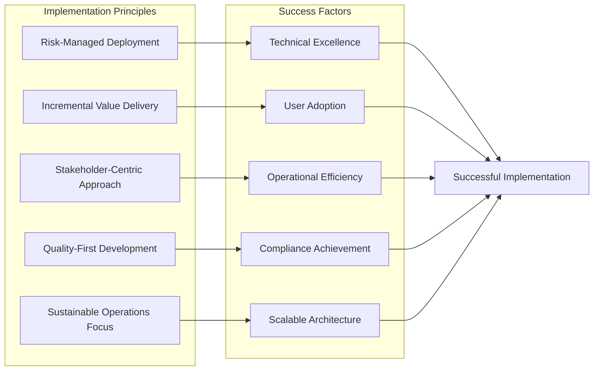
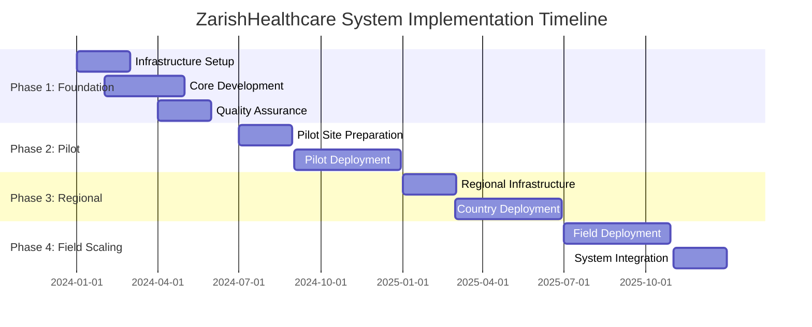

# ZarishHealthcare System - Implementation Roadmap

## Executive Summary

The ZarishHealthcare System Implementation Roadmap provides a comprehensive, phased approach to deploying a complete humanitarian healthcare information system from conception to full operational capacity. This roadmap integrates architectural design, technology implementation, staff training, and operational deployment across diverse humanitarian environments, ensuring successful delivery of a robust, compliant, and scalable healthcare information system.

## 1. Implementation Overview

### 1.1 Implementation Philosophy



### 1.2 Implementation Timeline Overview



## 2. Phase 1: Foundation and Architecture (Months 1-6)

### 2.1 Infrastructure Foundation (Months 1-2)

**Objectives:**
- Establish core technical infrastructure
- Implement security baseline
- Set up development and deployment pipelines
- Create foundational monitoring and logging

**Key Activities:**

```typescript
// Phase 1 infrastructure implementation activities
class Phase1Infrastructure {
  
  async implementFoundationalInfrastructure(): Promise<Phase1Activities> {
    return {
      // Cloud infrastructure setup
      cloudInfrastructureSetup: {
        awsPrimarySetup: [
          'create-aws-organization-account-structure',
          'establish-vpc-network-architecture-security-groups',
          'deploy-eks-kubernetes-clusters-multi-az',
          'configure-rds-postgresql-multi-az-encryption',
          'setup-s3-buckets-data-storage-backup',
          'implement-iam-roles-policies-least-privilege'
        ],
        azureSecondarySetup: [
          'create-azure-subscription-resource-groups',
          'deploy-aks-kubernetes-clusters-availability-zones',
          'configure-azure-database-postgresql-ha',
          'setup-blob-storage-backup-disaster-recovery',
          'implement-azure-ad-rbac-integration'
        ]
      },

      // Security baseline implementation
      securityBaseline: {
        encryptionImplementation: [
          'implement-tls-certificates-ssl-termination',
          'configure-database-encryption-at-rest',
          'setup-key-management-service-vault',
          'implement-secrets-management-rotation'
        ],
        complianceFramework: [
          'implement-hipaa-technical-safeguards',
          'configure-gdpr-data-protection-controls',
          'setup-audit-trails-compliance-monitoring',
          'implement-data-loss-prevention-policies'
        ]
      }
    };
  }
}
```

### 2.2 Core Application Development (Months 3-4)

**Objectives:**
- Develop foundational ZarishSphere microservices
- Implement shared libraries and common components
- Create initial user interfaces and API structures
- Establish data models and database schemas

### 2.3 Quality Assurance and Testing (Months 5-6)

**Objectives:**
- Establish comprehensive testing frameworks
- Implement automated quality assurance processes
- Conduct security and compliance testing
- Prepare for pilot deployment validation

## 3. Phase 2: Pilot Implementation (Months 7-12)

### 3.1 Pilot Site Selection and Preparation (Months 7-8)

**Selected Pilot Sites:**

```typescript
// Pilot site configuration and requirements
interface PilotSiteConfiguration {
  pilotSite1: {
    location: 'cox-bazar-bangladesh-rohingya-refugee-response';
    context: 'refugee-camp-healthcare-complex-multi-partner-operation';
    infrastructure: 'moderate-connectivity-solar-power-basic-it-support';
    organizations: ['unhcr', 'msf', 'iom', 'government-health-department'];
    users: '50-healthcare-workers-10-data-managers-5-coordinators';
    timeline: 'months-9-12-full-implementation-validation';
  };
  
  pilotSite2: {
    location: 'nairobi-kenya-urban-primary-healthcare';
    context: 'urban-primary-healthcare-stable-infrastructure';
    infrastructure: 'reliable-connectivity-stable-power-technical-support';
    organizations: ['local-ngo', 'ministry-of-health', 'donor-agencies'];
    users: '30-healthcare-workers-5-data-managers-3-coordinators';
    timeline: 'months-9-11-rapid-deployment-lessons-learned';
  };
  
  pilotSite3: {
    location: 'syria-turkey-border-mobile-health-units';
    context: 'mobile-health-units-conflict-affected-populations';
    infrastructure: 'intermittent-connectivity-generator-power-remote-support';
    organizations: ['international-ngo', 'local-partners', 'who'];
    users: '20-mobile-health-workers-3-data-managers-2-coordinators';
    timeline: 'months-10-12-challenging-environment-resilience-testing';
  };
}
```

### 3.2 Pilot Deployment and Validation (Months 9-12)

**Progressive Deployment Approach:**

- **Month 9**: Deploy core services (ZarishCare, ZarishAccess, ZarishSync)
- **Month 10**: Add advanced features (ZarishLabs, clinical workflows)
- **Month 11**: Deploy full capabilities (ZarishOps, ZarishAnalytix)
- **Month 12**: Comprehensive validation and lessons learned

## 4. Phase 3: Regional Scaling (Months 13-18)

### 4.1 Regional Infrastructure Deployment (Months 13-14)

**Regional Hub Establishment:**

```typescript
// Regional infrastructure deployment strategy
class RegionalInfrastructureDeployment {
  
  async deployRegionalHubs(): Promise<RegionalHubConfiguration> {
    return {
      africaRegionalHub: {
        location: 'nairobi-kenya-regional-coordination-center',
        capacity: 'support-15-countries-500-facilities-10000-users',
        infrastructure: [
          'deploy-regional-cloud-infrastructure-aws-africa-region',
          'establish-regional-kubernetes-clusters-k3s-lightweight',
          'implement-regional-database-postgresql-replication',
          'deploy-regional-monitoring-prometheus-grafana-stack'
        ]
      },
      
      asiaRegionalHub: {
        location: 'bangkok-thailand-regional-coordination-center',
        capacity: 'support-12-countries-400-facilities-8000-users',
        specialConsiderations: [
          'data-localization-requirements-china-india-regulations',
          'language-localization-chinese-hindi-thai-burmese',
          'cultural-adaptation-healthcare-workflows'
        ]
      },
      
      middleEastRegionalHub: {
        location: 'amman-jordan-regional-coordination-center',
        capacity: 'support-8-countries-200-facilities-5000-users',
        securityConsiderations: [
          'enhanced-encryption-conflict-zone-operations',
          'secure-communication-channels-hostile-environments',
          'data-sovereignty-compliance-local-regulations'
        ]
      }
    };
  }
}
```

### 4.2 Country-Level Deployment (Months 15-18)

**Priority Country Deployments:**

- **Bangladesh**: Rohingya refugee response (Months 15-16)
- **Kenya**: Urban-rural primary healthcare (Months 16-17)
- **Lebanon**: Syrian refugee health integration (Months 17-18)

## 5. Phase 4: Field Operations Scaling (Months 19-24)

### 5.1 Mass Field Deployment (Months 19-22)

**Deployment Waves Strategy:**

```typescript
// Field deployment wave configuration
interface FieldDeploymentWaves {
  wave1_months19_20: {
    locations: '50-high-priority-field-locations';
    criteria: [
      'stable-operational-context-minimal-deployment-risk',
      'adequate-local-technical-capacity-support',
      'reliable-connectivity-infrastructure-available'
    ];
    deployment: [
      'deploy-clinic-edge-devices-mid-capacity-systems',
      'implement-satellite-cellular-connectivity-backup',
      'train-local-staff-system-operation-maintenance'
    ];
  };
  
  wave2_months20_21: {
    locations: '75-medium-priority-field-locations';
    criteria: [
      'moderate-operational-complexity-manageable-risk',
      'basic-local-technical-capacity-remote-support',
      'intermittent-connectivity-offline-capabilities-required'
    ];
  };
  
  wave3_months21_22: {
    locations: '75-challenging-field-locations';
    criteria: [
      'challenging-operational-context-high-risk-environment',
      'minimal-local-technical-capacity-full-remote-support',
      'unstable-connectivity-offline-first-operations'
    ];
  };
}
```

### 5.2 System Integration and Optimization (Months 23-24)

**Comprehensive Integration:**
- End-to-end system integration across all operational levels
- Performance optimization based on operational data
- Establishment of comprehensive monitoring and support systems
- Preparation for long-term sustainable operations

## 6. Implementation Success Metrics and KPIs

### 6.1 Technical Performance Metrics

```typescript
// Comprehensive success metrics framework
interface ImplementationSuccessMetrics {
  technicalMetrics: {
    systemAvailability: {
      target: '99.5%-uptime-global-infrastructure-99%-field-operations';
      measurement: 'automated-monitoring-monthly-availability-reporting';
      benchmark: 'industry-standard-healthcare-information-systems';
    };
    
    performanceMetrics: {
      responseTime: 'sub-2-second-response-times-95%-transactions';
      throughput: 'support-1000-concurrent-users-peak-operations';
      dataSync: 'data-synchronization-completion-4-hours-connectivity';
    };
    
    securityMetrics: {
      vulnerabilities: 'zero-critical-vulnerabilities-production-systems';
      incidents: 'sub-4-hour-incident-response-resolution-times';
      compliance: '100%-compliance-hipaa-gdpr-requirements';
    };
  };

  operationalMetrics: {
    userAdoption: {
      target: '90%-user-adoption-rate-deployed-systems';
      measurement: 'monthly-user-activity-analytics-surveys';
    };
    
    workflowEfficiency: {
      patientProcessing: '50%-reduction-patient-registration-time';
      clinicalWorkflow: '30%-improvement-clinical-workflow-efficiency';
      reporting: '80%-reduction-manual-report-generation-time';
    };
  };

  humanitarianImpactMetrics: {
    healthcareDelivery: {
      patientOutcomes: 'measurable-improvement-patient-health-outcomes';
      serviceDelivery: 'increased-healthcare-service-capacity-quality';
      coordination: 'improved-coordination-humanitarian-healthcare-partners';
    };
    
    operationalEfficiency: {
      costReduction: '25%-reduction-administrative-operational-costs';
      resourceUtilization: 'optimized-resource-allocation-evidence-based';
      scalability: 'successful-scaling-additional-field-locations';
    };
  };
}
```

## 7. Risk Management and Mitigation Strategies

### 7.1 Implementation Risk Framework

```typescript
// Comprehensive risk management for implementation
class ImplementationRiskManagement {
  
  async assessImplementationRisks(): Promise<RiskAssessmentFramework> {
    return {
      technicalRisks: {
        infrastructureComplexity: {
          probability: 'medium-complex-multi-cloud-humanitarian-environments';
          impact: 'high-service-disruption-deployment-delays';
          mitigation: [
            'phased-deployment-approach-incremental-complexity',
            'comprehensive-testing-staging-environments',
            'redundant-systems-automated-failover-procedures',
            'expert-technical-team-experienced-humanitarian-technology'
          ];
          contingency: 'simplified-deployment-approach-reduced-complexity';
        };
        
        connectivityChallenges: {
          probability: 'high-field-operations-connectivity-limitations';
          impact: 'medium-offline-operation-capabilities-mitigate';
          mitigation: [
            'offline-first-design-local-operation-capabilities',
            'multiple-connectivity-options-redundant-communications',
            'intelligent-synchronization-bandwidth-optimization',
            'local-technical-capacity-building-support'
          ];
        };
      };

      operationalRisks: {
        userAdoption: {
          probability: 'medium-change-management-user-resistance';
          impact: 'high-system-success-dependent-user-adoption';
          mitigation: [
            'comprehensive-user-engagement-early-involvement',
            'extensive-training-programs-ongoing-support',
            'workflow-optimization-user-centric-design',
            'champion-user-program-peer-support-networks'
          ];
        };
        
        partnerCoordination: {
          probability: 'medium-multiple-organizations-coordination-complexity';
          impact: 'medium-deployment-delays-reduced-effectiveness';
          mitigation: [
            'early-stakeholder-engagement-agreement-protocols',
            'clear-governance-structures-decision-making',
            'regular-coordination-meetings-progress-tracking',
            'flexible-deployment-approach-partner-requirements'
          ];
        };
      };

      complianceRisks: {
        regulatoryCompliance: {
          probability: 'low-comprehensive-compliance-framework';
          impact: 'critical-regulatory-violations-operational-shutdown';
          mitigation: [
            'early-regulatory-consultation-compliance-validation',
            'comprehensive-compliance-framework-implementation',
            'regular-compliance-audits-third-party-validation',
            'legal-expertise-regulatory-requirements-guidance'
          ];
        };
      };
    };
  }
}
```

### 7.2 Change Management Strategy

```typescript
// Comprehensive change management approach
class ChangeManagementStrategy {
  
  async implementChangeManagement(): Promise<ChangeManagementFramework> {
    return {
      stakeholderEngagement: {
        executiveSponsorship: [
          'secure-executive-sponsorship-organizational-leadership',
          'establish-steering-committee-strategic-oversight',
          'regular-executive-briefings-progress-reporting',
          'executive-communication-organizational-commitment'
        ];
        
        userEngagement: [
          'early-user-involvement-requirements-gathering',
          'user-feedback-integration-iterative-development',
          'user-champion-program-peer-influence-support',
          'regular-user-communication-progress-updates'
        ];
        
        partnerAlignment: [
          'partner-organization-alignment-shared-vision',
          'collaborative-planning-joint-implementation-approach',
          'regular-partner-coordination-progress-sharing',
          'flexible-approach-partner-specific-requirements'
        ];
      };

      communicationStrategy: {
        multiChannelCommunication: [
          'regular-newsletters-progress-updates-achievements',
          'town-hall-meetings-open-communication-feedback',
          'social-media-communication-broader-awareness',
          'conference-presentations-knowledge-sharing'
        ];
        
        culturalAdaptation: [
          'culturally-appropriate-communication-local-contexts',
          'multilingual-communication-materials-accessibility',
          'local-communication-channels-trusted-sources',
          'cultural-sensitivity-training-implementation-teams'
        ];
      };

      trainingAndSupport: {
        comprehensiveTraining: [
          'role-based-training-programs-specific-needs',
          'hands-on-training-practical-experience',
          'ongoing-training-continuous-learning',
          'train-the-trainer-local-capacity-building'
        ];
        
        ongoingSupport: [
          'help-desk-support-user-assistance',
          'user-documentation-quick-reference-guides',
          'video-tutorials-visual-learning-materials',
          'peer-support-networks-user-communities'
        ];
      };
    };
  }
}
```

## 8. Quality Assurance and Validation Framework

### 8.1 Continuous Quality Assurance

```typescript
// Comprehensive quality assurance throughout implementation
class ContinuousQualityAssurance {
  
  async implementQualityFramework(): Promise<QualityAssuranceFramework> {
    return {
      developmentQuality: {
        codeQuality: [
          'static-code-analysis-automated-quality-checking',
          'code-review-processes-peer-validation',
          'automated-testing-comprehensive-coverage',
          'continuous-integration-quality-gates'
        ];
        
        architecturalQuality: [
          'architectural-review-design-validation',
          'performance-testing-scalability-validation',
          'security-testing-vulnerability-assessment',
          'compliance-testing-regulatory-validation'
        ];
      };

      deploymentQuality: {
        environmentValidation: [
          'infrastructure-validation-deployment-readiness',
          'configuration-validation-environment-consistency',
          'integration-testing-end-to-end-validation',
          'user-acceptance-testing-stakeholder-validation'
        ];
        
        operationalValidation: [
          'operational-readiness-assessment-support-capability',
          'disaster-recovery-testing-business-continuity',
          'performance-validation-production-load-testing',
          'security-validation-penetration-testing'
        ];
      };

      continuousImprovement: {
        feedbackIntegration: [
          'user-feedback-collection-systematic-analysis',
          'performance-monitoring-optimization-identification',
          'incident-analysis-root-cause-improvement',
          'lessons-learned-knowledge-management'
        ];
        
        iterativeEnhancement: [
          'regular-system-updates-feature-enhancements',
          'performance-optimization-ongoing-improvement',
          'user-experience-enhancement-interface-optimization',
          'workflow-optimization-efficiency-improvements'
        ];
      };
    };
  }
}
```

## 9. Sustainability and Long-term Operations

### 9.1 Sustainability Framework

```typescript
// Long-term sustainability planning
class SustainabilityFramework {
  
  async implementSustainabilityStrategy(): Promise<SustainabilityPlan> {
    return {
      technicalSustainability: {
        systemMaintenance: [
          'automated-system-maintenance-minimal-intervention',
          'predictive-maintenance-proactive-issue-resolution',
          'modular-architecture-easy-component-updates',
          'comprehensive-documentation-knowledge-preservation'
        ];
        
        technologyEvolution: [
          'technology-roadmap-future-enhancement-planning',
          'vendor-independence-open-source-technology-foundation',
          'standards-compliance-interoperability-future-systems',
          'scalability-design-growth-accommodation'
        ];
      };

      operationalSustainability: {
        localCapacityBuilding: [
          'local-technical-capacity-development-ownership',
          'train-the-trainer-programs-knowledge-transfer',
          'local-support-networks-community-expertise',
          'gradual-responsibility-transfer-local-teams'
        ];
        
        organisationalIntegration: [
          'system-integration-organizational-processes',
          'policy-integration-organizational-governance',
          'workflow-integration-operational-procedures',
          'culture-integration-organizational-change'
        ];
      };

      financialSustainability: {
        costOptimization: [
          'operational-cost-reduction-efficiency-improvements',
          'shared-services-economies-scale',
          'open-source-technology-licensing-cost-reduction',
          'predictive-maintenance-reduced-emergency-costs'
        ];
        
        fundingDiversification: [
          'multiple-funding-sources-risk-reduction',
          'cost-sharing-partnership-agreements',
          'revenue-generation-fee-for-service-models',
          'long-term-funding-commitments-sustainability-planning'
        ];
      };
    };
  }
}
```

## 10. Success Measurement and Evaluation

### 10.1 Impact Assessment Framework

```typescript
// Comprehensive impact assessment methodology
class ImpactAssessmentFramework {
  
  async implementImpactAssessment(): Promise<ImpactMeasurementPlan> {
    return {
      healthcareImpactMeasurement: {
        patientOutcomes: [
          'patient-health-outcomes-improvement-measurement',
          'clinical-quality-indicators-improvement-tracking',
          'patient-satisfaction-healthcare-services-assessment',
          'health-system-strengthening-capacity-improvement'
        ];
        
        serviceDelivery: [
          'healthcare-service-efficiency-improvement-measurement',
          'service-accessibility-improvement-vulnerable-populations',
          'service-quality-standardization-consistency-improvement',
          'coordination-effectiveness-multi-organization-collaboration'
        ];
      };

      operationalImpactMeasurement: {
        efficiencyGains: [
          'administrative-efficiency-time-cost-reduction',
          'workflow-optimization-process-improvement',
          'resource-utilization-optimization-waste-reduction',
          'decision-making-improvement-data-driven-insights'
        ];
        
        capacityImprovement: [
          'staff-capacity-improvement-skills-development',
          'organizational-capacity-system-management-capability',
          'technical-capacity-local-ownership-development',
          'coordination-capacity-partnership-effectiveness'
        ];
      };

      strategicImpactMeasurement: {
        systemicChange: [
          'health-system-strengthening-sustainable-improvement',
          'policy-influence-evidence-based-decision-making',
          'standards-improvement-quality-healthcare-delivery',
          'innovation-adoption-technology-healthcare-integration'
        ];
        
        scalabilityReplication: [
          'successful-scaling-additional-contexts-locations',
          'replication-success-other-organizations-adoption',
          'knowledge-transfer-lessons-learned-sharing',
          'model-adaptation-diverse-humanitarian-contexts'
        ];
      };
    };
  }
}
```

## 11. Conclusion and Next Steps

### 11.1 Implementation Success Factors

The successful implementation of the ZarishHealthcare System depends on several critical success factors:

1. **Strong Leadership and Governance**: Executive sponsorship and clear governance structures
2. **Stakeholder Engagement**: Early and continuous engagement with all stakeholders
3. **Phased Approach**: Risk-managed, incremental deployment with continuous validation
4. **Quality Focus**: Comprehensive quality assurance and testing throughout implementation
5. **Change Management**: Effective change management and user adoption strategies
6. **Technical Excellence**: Robust, scalable, and secure technical implementation
7. **Sustainability Planning**: Long-term sustainability and local ownership development

### 11.2 Expected Outcomes and Benefits

Upon successful completion of this implementation roadmap, the ZarishHealthcare System will deliver:

**Immediate Benefits (Months 1-12)**:
- Robust, secure healthcare information system infrastructure
- Improved efficiency in pilot healthcare facilities
- Enhanced data quality and clinical documentation
- Streamlined reporting and compliance procedures

**Medium-term Benefits (Months 13-18)**:
- Regional coordination and collaboration improvement
- Standardized healthcare workflows across operations
- Enhanced population health monitoring and analytics
- Improved resource allocation and operational efficiency

**Long-term Benefits (Months 19-24+)**:
- Comprehensive healthcare information system across all operations
- Significant improvements in healthcare delivery quality and efficiency
- Enhanced coordination and collaboration among humanitarian partners
- Sustainable, locally-owned technology capabilities
- Evidence-based decision making and policy influence
- Model for humanitarian healthcare technology implementation

### 11.3 Post-Implementation Continuous Improvement

The implementation roadmap establishes the foundation for continuous improvement and evolution:

- **Regular System Updates**: Quarterly system updates with new features and optimizations
- **User Feedback Integration**: Continuous user feedback collection and system enhancement
- **Performance Optimization**: Ongoing performance monitoring and optimization
- **Technology Evolution**: Regular technology stack updates and modernization
- **Capacity Building**: Continuous local capacity building and knowledge transfer
- **Best Practice Sharing**: Knowledge sharing and best practice dissemination across humanitarian sector

This comprehensive implementation roadmap provides a structured, risk-managed approach to deploying a transformative healthcare information system that will significantly improve humanitarian healthcare delivery while building sustainable local capacity and establishing a model for sector-wide adoption.