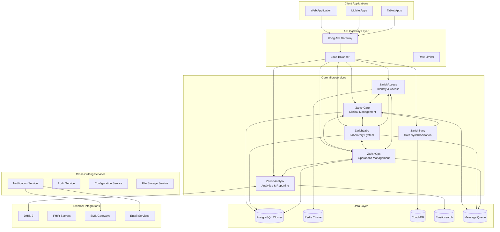

# ZarishHealthcare System - Microservices Integration Strategy

## Executive Summary

The ZarishHealthcare System's microservices integration strategy is specifically designed for humanitarian healthcare operations, emphasizing resilience, offline-first capabilities, and seamless coordination between ZarishSphere components. This document outlines the comprehensive integration architecture that enables the six core services (ZarishCare, ZarishLabs, ZarishOps, ZarishAnalytix, ZarishAccess, ZarishSync) to work cohesively in challenging humanitarian environments.

## 1. Microservices Architecture Overview

### 1.1 ZarishSphere Service Ecosystem


### 1.2 Service Interaction Patterns
```typescript
// Service interaction patterns for humanitarian healthcare
interface ServiceInteractionPatterns {
  // Synchronous communication for real-time operations
  synchronous: {
    patterns: ['request-response', 'circuit-breaker', 'timeout-with-retry'];
    use_cases: [
      'patient-authentication',
      'critical-clinical-data-retrieval', 
      'emergency-response-coordination',
      'real-time-decision-support'
    ];
    protocols: ['HTTP/REST', 'gRPC'];
  };

  // Asynchronous communication for non-critical operations  
  asynchronous: {
    patterns: ['publish-subscribe', 'event-sourcing', 'saga-orchestration'];
    use_cases: [
      'patient-registration-workflow',
      'lab-result-notifications',
      'reporting-data-aggregation',
      'audit-trail-logging'
    ];
    protocols: ['RabbitMQ', 'Apache Kafka', 'Redis Pub/Sub'];
  };

  // Offline-first patterns for humanitarian field operations
  offline_first: {
    patterns: ['event-log-replication', 'conflict-free-replicated-data-types', 'eventual-consistency'];
    use_cases: [
      'field-clinic-operations',
      'mobile-health-worker-data-collection',
      'emergency-response-coordination',
      'supply-chain-tracking'
    ];
    protocols: ['CouchDB Replication', 'Custom Event Log'];
  };
}
```

## 2. Service-to-Service Communication Architecture

### 2.1 Communication Matrix
```typescript
// Comprehensive service communication matrix
interface ServiceCommunicationMatrix {
  zarishCare: {
    inbound: [
      {
        from: 'zarishAccess',
        type: 'synchronous',
        purpose: 'authentication-authorization',
        frequency: 'per-request',
        criticality: 'high'
      },
      {
        from: 'zarishLabs',
        type: 'asynchronous',
        purpose: 'lab-results-delivery',
        frequency: 'per-result',
        criticality: 'medium'
      },
      {
        from: 'zarishSync',
        type: 'asynchronous',
        purpose: 'offline-data-synchronization',
        frequency: 'continuous',
        criticality: 'high'
      }
    ];
    
    outbound: [
      {
        to: 'zarishLabs',
        type: 'synchronous',
        purpose: 'lab-order-creation',
        frequency: 'per-order',
        criticality: 'medium'
      },
      {
        to: 'zarishOps',
        type: 'asynchronous',
        purpose: 'resource-utilization-reporting',
        frequency: 'hourly',
        criticality: 'low'
      },
      {
        to: 'zarishAnalytix',
        type: 'asynchronous',
        purpose: 'clinical-data-for-analytics',
        frequency: 'real-time',
        criticality: 'medium'
      }
    ];
  };

  zarishLabs: {
    inbound: [
      {
        from: 'zarishCare',
        type: 'synchronous',
        purpose: 'lab-order-reception',
        frequency: 'per-order',
        criticality: 'medium'
      },
      {
        from: 'zarishOps',
        type: 'asynchronous',
        purpose: 'supply-level-updates',
        frequency: 'daily',
        criticality: 'medium'
      }
    ];
    
    outbound: [
      {
        to: 'zarishCare',
        type: 'asynchronous',
        purpose: 'lab-result-delivery',
        frequency: 'per-result',
        criticality: 'high'
      },
      {
        to: 'zarishAnalytix',
        type: 'asynchronous',
        purpose: 'laboratory-analytics-data',
        frequency: 'real-time',
        criticality: 'medium'
      }
    ];
  };

  zarishOps: {
    inbound: [
      {
        from: 'zarishCare',
        type: 'asynchronous', 
        purpose: 'resource-utilization-data',
        frequency: 'hourly',
        criticality: 'low'
      },
      {
        from: 'zarishLabs',
        type: 'asynchronous',
        purpose: 'supply-consumption-data',
        frequency: 'daily',
        criticality: 'medium'
      }
    ];
    
    outbound: [
      {
        to: 'zarishLabs',
        type: 'asynchronous',
        purpose: 'supply-level-notifications',
        frequency: 'daily',
        criticality: 'medium'
      },
      {
        to: 'zarishAnalytix',
        type: 'asynchronous',
        purpose: 'operations-data-for-reporting',
        frequency: 'real-time',
        criticality: 'medium'
      },
      {
        to: 'external-systems',
        type: 'synchronous',
        purpose: 'dhis2-data-submission',
        frequency: 'scheduled',
        criticality: 'high'
      }
    ];
  };
}
```

### 2.2 API Integration Patterns
```typescript
// API integration patterns for humanitarian healthcare
class HumanitarianAPIIntegration {
  
  // Patient care coordination pattern
  async coordinatePatientCare(patientId: string): Promise<PatientCareCoordination> {
    const coordination: PatientCareCoordination = {
      patient: await this.zarishCare.getPatient(patientId),
      activeOrders: await this.zarishLabs.getActiveOrders(patientId),
      programs: await this.zarishOps.getPatientPrograms(patientId),
      flags: await this.zarishCare.getPatientFlags(patientId)
    };

    // Trigger care coordination workflow
    await this.publishEvent('patient.care.coordination', {
      patientId,
      coordination,
      timestamp: new Date()
    });

    return coordination;
  }

  // Emergency response coordination pattern
  async triggerEmergencyResponse(emergencyEvent: EmergencyEvent): Promise<EmergencyResponse> {
    // Parallel service coordination for emergency response
    const [
      clinicalCapacity,
      labCapacity, 
      operationalResources,
      escalationContacts
    ] = await Promise.all([
      this.zarishCare.getEmergencyCapacity(),
      this.zarishLabs.getEmergencyCapacity(),
      this.zarishOps.getAvailableResources(),
      this.zarishAccess.getEmergencyContacts()
    ]);

    const response: EmergencyResponse = {
      event: emergencyEvent,
      capacity: { clinical: clinicalCapacity, lab: labCapacity },
      resources: operationalResources,
      contacts: escalationContacts,
      coordinationPlan: await this.generateCoordinationPlan(emergencyEvent)
    };

    // Broadcast emergency response coordination
    await this.publishEvent('emergency.response.activated', response);
    
    // Trigger real-time notifications
    await this.notificationService.sendEmergencyAlert(response);

    return response;
  }

  // Humanitarian reporting aggregation pattern
  async generateHumanitarianReport(reportRequest: ReportRequest): Promise<HumanitarianReport> {
    // Aggregate data from multiple services
    const reportData = await this.aggregateReportingData(reportRequest);
    
    // Apply humanitarian-specific calculations and indicators
    const processedData = await this.zarishAnalytix.processHumanitarianIndicators(reportData);
    
    // Format for external reporting systems
    const reports = await Promise.all([
      this.format4WReport(processedData),
      this.formatDHIS2Report(processedData),
      this.formatSphereComplianceReport(processedData)
    ]);

    return {
      period: reportRequest.period,
      reports,
      metadata: {
        generatedAt: new Date(),
        servicesIncluded: ['zarishCare', 'zarishLabs', 'zarishOps'],
        dataSources: reportData.sources
      }
    };
  }

  // Offline synchronization coordination pattern
  async coordinateOfflineSync(deviceId: string): Promise<SyncCoordination> {
    // Check device sync status across all services
    const syncStatuses = await Promise.all([
      this.zarishCare.getSyncStatus(deviceId),
      this.zarishLabs.getSyncStatus(deviceId), 
      this.zarishOps.getSyncStatus(deviceId),
      this.zarishAccess.getSyncStatus(deviceId)
    ]);

    // Determine sync priorities based on humanitarian context
    const syncPlan = await this.zarishSync.generateSyncPlan(deviceId, syncStatuses);
    
    // Execute coordinated synchronization
    const syncResults = await this.zarishSync.executeSyncPlan(syncPlan);

    return {
      deviceId,
      syncPlan,
      results: syncResults,
      nextSyncWindow: this.calculateNextSyncWindow(deviceId)
    };
  }
}
```

## 3. Event-Driven Architecture for Humanitarian Operations

### 3.1 Event-Driven Communication Patterns
```typescript
// Event-driven architecture for humanitarian healthcare
interface HumanitarianEventArchitecture {
  // Core event categories for humanitarian operations
  eventCategories: {
    clinical: {
      events: [
        'patient.registered',
        'consultation.completed', 
        'emergency.case.created',
        'ncd.screening.completed',
        'referral.initiated'
      ];
      priority: 'high';
      retention: '7-years';
    };

    laboratory: {
      events: [
        'lab.order.created',
        'lab.result.available',
        'equipment.maintenance.due',
        'reagent.stock.low'
      ];
      priority: 'medium';
      retention: '3-years';
    };

    operations: {
      events: [
        'supply.delivery.received',
        'staff.deployment.updated',
        'facility.capacity.changed',
        'partner.coordination.meeting'
      ];
      priority: 'medium';
      retention: '5-years';
    };

    emergency: {
      events: [
        'mass.casualty.declared',
        'outbreak.suspected',
        'facility.evacuation.ordered',
        'supply.emergency.requested'
      ];
      priority: 'critical';
      retention: '10-years';
    };

    security: {
      events: [
        'unauthorized.access.attempted',
        'data.breach.suspected',
        'system.compromise.detected',
        'privacy.violation.reported'
      ];
      priority: 'critical';
      retention: 'permanent';
    };
  };

  // Event processing patterns
  processingPatterns: {
    real_time: {
      events: ['emergency.*', 'security.*'];
      processing: 'immediate';
      guarantees: 'at-least-once';
    };

    near_real_time: {
      events: ['clinical.*', 'laboratory.result.*'];
      processing: 'within-5-minutes';
      guarantees: 'exactly-once';
    };

    batch: {
      events: ['operations.*', 'analytics.*'];
      processing: 'hourly-or-daily';
      guarantees: 'at-least-once';
    };
  };
}
```

### 3.2 Event Processing Implementation
```typescript
// Event processing system for humanitarian healthcare
class HumanitarianEventProcessor {
  private eventBus: EventBus;
  private eventStore: EventStore;
  private sagaOrchestrator: SagaOrchestrator;

  // Patient care workflow event processing
  @EventHandler('patient.registered')
  async handlePatientRegistration(event: PatientRegisteredEvent): Promise<void> {
    try {
      // Trigger cross-service patient setup workflow
      const saga = new PatientSetupSaga(event.patientId);
      
      await Promise.all([
        // Setup patient in all relevant services
        this.zarishLabs.createPatientProfile(event.patientId, event.demographics),
        this.zarishOps.recordBeneficiaryRegistration(event.patientId, event.location),
        this.zarishAnalytix.initializePatientMetrics(event.patientId),
        
        // Trigger humanitarian-specific workflows
        this.assessVulnerabilityFlags(event.patientId, event.demographics),
        this.checkProgramEligibility(event.patientId, event.demographics),
        this.initializeCarePlan(event.patientId, event.demographics)
      ]);

      // Publish patient setup completion event
      await this.publishEvent('patient.setup.completed', {
        patientId: event.patientId,
        services: ['zarishCare', 'zarishLabs', 'zarishOps', 'zarishAnalytix'],
        timestamp: new Date()
      });

    } catch (error) {
      // Handle partial failure and trigger compensation
      await this.handlePatientSetupFailure(event.patientId, error);
    }
  }

  // Emergency response coordination event processing
  @EventHandler('emergency.case.created')
  async handleEmergencyCase(event: EmergencyCaseEvent): Promise<void> {
    // Immediate emergency response coordination
    const emergencyResponse = await this.coordinateEmergencyResponse(event);
    
    // Parallel emergency workflows
    await Promise.all([
      // Clinical response
      this.zarishCare.activateEmergencyProtocol(event.caseId),
      
      // Laboratory expedited processing
      this.zarishLabs.activateEmergencyMode(event.patientId),
      
      // Operations resource mobilization
      this.zarishOps.mobilizeEmergencyResources(event.location),
      
      // Analytics real-time monitoring
      this.zarishAnalytix.activateEmergencyDashboard(event.caseId),
      
      // Communication and notifications
      this.notificationService.sendEmergencyAlerts(emergencyResponse.contacts),
      
      // External system notifications
      this.externalIntegrations.notifyReferralHospital(event.severity)
    ]);

    // Track emergency response metrics
    await this.publishEvent('emergency.response.initiated', {
      caseId: event.caseId,
      responseTime: Date.now() - event.timestamp.getTime(),
      servicesActivated: ['zarishCare', 'zarishLabs', 'zarishOps', 'zarishAnalytix']
    });
  }

  // Laboratory workflow event processing
  @EventHandler('lab.result.available')
  async handleLabResult(event: LabResultEvent): Promise<void> {
    // Clinical workflow integration
    await this.zarishCare.updatePatientWithLabResult(event.patientId, event.result);
    
    // Check for critical values requiring immediate action
    if (event.result.criticalFlags?.length > 0) {
      await this.triggerCriticalValueAlert(event);
    }
    
    // NCD program integration for relevant tests
    if (this.isNCDRelevantTest(event.result)) {
      await this.zarishCare.updateNCDProgram(event.patientId, event.result);
    }
    
    // Analytics and reporting integration
    await this.zarishAnalytix.recordLabResult(event.result);
    
    // Quality assurance workflow
    if (event.result.requiresQualityReview) {
      await this.publishEvent('lab.result.quality_review_required', {
        resultId: event.result.id,
        patientId: event.patientId,
        testType: event.result.testType
      });
    }
  }

  // Humanitarian reporting aggregation event processing
  @EventHandler('reporting.cycle.triggered')
  async handleReportingCycle(event: ReportingCycleEvent): Promise<void> {
    // Coordinate cross-service data aggregation
    const aggregationTasks = [
      this.zarishCare.generateClinicalMetrics(event.period),
      this.zarishLabs.generateLabMetrics(event.period),
      this.zarishOps.generateOperationalMetrics(event.period)
    ];

    const [clinicalMetrics, labMetrics, operationalMetrics] = 
      await Promise.allSettled(aggregationTasks);

    // Process and format for humanitarian reporting standards
    const reports = await Promise.all([
      this.generate4WReport(event.period, { clinicalMetrics, labMetrics, operationalMetrics }),
      this.generateDHIS2Report(event.period, { clinicalMetrics, labMetrics, operationalMetrics }),
      this.generateSphereComplianceReport(event.period, { clinicalMetrics, labMetrics, operationalMetrics })
    ]);

    // Publish completed reports
    await this.publishEvent('reporting.cycle.completed', {
      period: event.period,
      reports: reports.map(r => ({ type: r.type, status: 'completed', url: r.url })),
      generatedAt: new Date()
    });
  }

  // Offline synchronization event processing
  @EventHandler('device.connected')
  async handleDeviceReconnection(event: DeviceConnectedEvent): Promise<void> {
    // Coordinate cross-service synchronization
    const syncTasks = [
      this.zarishCare.syncDeviceData(event.deviceId),
      this.zarishLabs.syncDeviceData(event.deviceId),
      this.zarishOps.syncDeviceData(event.deviceId),
      this.zarishAccess.syncDeviceData(event.deviceId)
    ];

    // Execute synchronization with conflict resolution
    const syncResults = await Promise.allSettled(syncTasks);
    
    // Handle any synchronization conflicts
    const conflicts = syncResults
      .filter(result => result.status === 'fulfilled' && result.value.conflicts?.length > 0)
      .flatMap(result => (result as PromiseFulfilledResult<SyncResult>).value.conflicts);

    if (conflicts.length > 0) {
      await this.zarishSync.resolveConflicts(event.deviceId, conflicts);
    }

    // Update synchronization status
    await this.publishEvent('device.sync.completed', {
      deviceId: event.deviceId,
      syncResults: syncResults.map(r => ({
        service: r.status === 'fulfilled' ? r.value.service : 'unknown',
        status: r.status,
        recordsSynced: r.status === 'fulfilled' ? r.value.recordsSynced : 0,
        conflicts: r.status === 'fulfilled' ? r.value.conflicts?.length || 0 : 0
      })),
      completedAt: new Date()
    });
  }
}
```

## 4. Data Flow and Integration Patterns

### 4.1 Cross-Service Data Flow Architecture
```typescript
// Data flow patterns for humanitarian healthcare operations
interface HumanitarianDataFlow {
  // Patient journey data flow
  patientJourney: {
    registration: {
      initiator: 'zarishCare',
      flow: [
        { service: 'zarishCare', action: 'create_patient_record' },
        { service: 'zarishAccess', action: 'setup_patient_permissions' },
        { service: 'zarishOps', action: 'record_beneficiary' },
        { service: 'zarishAnalytix', action: 'initialize_metrics' },
        { service: 'zarishSync', action: 'prepare_offline_sync' }
      ],
      data_shared: ['demographics', 'identifiers', 'contact_info', 'vulnerability_flags']
    };

    consultation: {
      initiator: 'zarishCare',
      flow: [
        { service: 'zarishCare', action: 'record_consultation' },
        { service: 'zarishLabs', action: 'process_lab_orders' },
        { service: 'zarishOps', action: 'update_resource_utilization' },
        { service: 'zarishAnalytix', action: 'update_clinical_indicators' }
      ],
      data_shared: ['consultation_data', 'diagnoses', 'treatments', 'lab_orders']
    };

    referral: {
      initiator: 'zarishCare',
      flow: [
        { service: 'zarishCare', action: 'create_referral' },
        { service: 'zarishOps', action: 'coordinate_transport' },
        { service: 'zarishAccess', action: 'share_access_permissions' },
        { service: 'external_facility', action: 'receive_patient_data' }
      ],
      data_shared: ['clinical_summary', 'referral_reason', 'transport_details']
    };
  };

  // Laboratory workflow data flow
  laboratoryWorkflow: {
    order_processing: {
      initiator: 'zarishCare',
      flow: [
        { service: 'zarishCare', action: 'create_lab_order' },
        { service: 'zarishLabs', action: 'receive_and_process_order' },
        { service: 'zarishOps', action: 'track_specimen_logistics' },
        { service: 'zarishLabs', action: 'generate_result' },
        { service: 'zarishCare', action: 'integrate_result_with_care' },
        { service: 'zarishAnalytix', action: 'update_lab_indicators' }
      ],
      data_shared: ['order_details', 'specimen_info', 'results', 'quality_metrics']
    };
  };

  // Emergency response data flow
  emergencyResponse: {
    mass_casualty: {
      initiator: 'zarishCare',
      flow: [
        { service: 'zarishCare', action: 'declare_emergency' },
        { service: 'zarishOps', action: 'activate_emergency_resources' },
        { service: 'zarishLabs', action: 'prioritize_emergency_tests' },
        { service: 'zarishAnalytix', action: 'activate_real_time_monitoring' },
        { service: 'external_systems', action: 'notify_referral_facilities' }
      ],
      data_shared: ['emergency_details', 'casualty_count', 'resource_needs', 'coordination_plan']
    };
  };
}
```

### 4.2 Data Synchronization Patterns
```typescript
// Cross-service data synchronization for humanitarian operations
class HumanitarianDataSynchronization {
  
  // Patient data consistency across services
  async maintainPatientDataConsistency(patientId: string): Promise<void> {
    // Get patient data from each service
    const patientDataSources = await Promise.all([
      this.zarishCare.getPatientData(patientId),
      this.zarishLabs.getPatientData(patientId),
      this.zarishOps.getBeneficiaryData(patientId)
    ]);

    // Detect inconsistencies
    const inconsistencies = this.detectDataInconsistencies(patientDataSources);
    
    if (inconsistencies.length > 0) {
      // Apply conflict resolution rules
      const resolvedData = await this.resolveDataInconsistencies(inconsistencies);
      
      // Propagate corrections across services
      await this.propagateDataCorrections(patientId, resolvedData);
      
      // Log data synchronization event
      await this.auditService.logDataSynchronization({
        patientId,
        inconsistencies: inconsistencies.length,
        resolution: 'automated',
        timestamp: new Date()
      });
    }
  }

  // Clinical workflow data propagation
  async propagateClinicalWorkflowData(workflowEvent: ClinicalWorkflowEvent): Promise<void> {
    switch (workflowEvent.type) {
      case 'consultation_completed':
        await this.handleConsultationCompletion(workflowEvent);
        break;
      case 'diagnosis_updated':
        await this.handleDiagnosisUpdate(workflowEvent);
        break;
      case 'treatment_prescribed':
        await this.handleTreatmentPrescription(workflowEvent);
        break;
      case 'referral_initiated':
        await this.handleReferralInitiation(workflowEvent);
        break;
    }
  }

  // Humanitarian reporting data aggregation
  async aggregateHumanitarianReportingData(period: ReportingPeriod): Promise<AggregatedReportingData> {
    // Parallel data collection from all services
    const dataCollectionTasks = [
      this.zarishCare.getClinicalReportingData(period),
      this.zarishLabs.getLabReportingData(period),
      this.zarishOps.getOperationalReportingData(period),
      this.zarishAnalytix.getAnalyticsReportingData(period)
    ];

    const [clinicalData, labData, operationalData, analyticsData] = 
      await Promise.allSettled(dataCollectionTasks);

    // Apply humanitarian-specific aggregation rules
    const aggregatedData = this.applyHumanitarianAggregationRules({
      clinical: this.extractSuccessfulResult(clinicalData),
      laboratory: this.extractSuccessfulResult(labData),
      operational: this.extractSuccessfulResult(operationalData),
      analytics: this.extractSuccessfulResult(analyticsData)
    });

    // Validate data completeness and quality
    await this.validateReportingDataQuality(aggregatedData);

    return aggregatedData;
  }

  // Offline data reconciliation
  async reconcileOfflineData(deviceId: string, offlineChanges: OfflineChange[]): Promise<ReconciliationResult> {
    // Group changes by service and entity
    const changesByService = this.groupChangesByService(offlineChanges);
    
    // Apply changes to each service with conflict detection
    const reconciliationResults = await Promise.all(
      Object.entries(changesByService).map(async ([serviceName, changes]) => {
        const service = this.getServiceInstance(serviceName);
        return await service.applyOfflineChanges(deviceId, changes);
      })
    );

    // Resolve cross-service conflicts
    const conflicts = reconciliationResults.flatMap(result => result.conflicts || []);
    const resolvedConflicts = await this.resolveCrossServiceConflicts(conflicts);

    // Generate reconciliation report
    const reconciliationReport = {
      deviceId,
      changesProcessed: offlineChanges.length,
      conflictsDetected: conflicts.length,
      conflictsResolved: resolvedConflicts.length,
      servicesAffected: Object.keys(changesByService),
      reconciliationTime: new Date()
    };

    // Log reconciliation event
    await this.auditService.logOfflineReconciliation(reconciliationReport);

    return reconciliationReport;
  }
}
```

## 5. API Gateway and Service Mesh Integration

### 5.1 Kong API Gateway Configuration
```yaml
# Kong API Gateway configuration for humanitarian healthcare
apiVersion: configuration.konghq.com/v1
kind: KongClusterPlugin
metadata:
  name: humanitarian-healthcare-gateway
  labels:
    global: "true"
spec:
  plugin: rate-limiting
  config:
    minute: 1000
    hour: 10000
    day: 50000
    policy: redis
    redis_host: redis-cluster.zarishhealthcare.svc.cluster.local
    redis_port: 6379
    redis_database: 1
    
---
apiVersion: configuration.konghq.com/v1
kind: KongPlugin
metadata:
  name: humanitarian-auth
plugin: oauth2
config:
  scopes:
    - patient:read
    - patient:write
    - clinical:read
    - clinical:write
    - lab:read
    - lab:write
    - operations:read
    - operations:write
    - analytics:read
    - admin:all
  global_credentials: true
  enable_client_credentials: true
  token_expiration: 28800 # 8 hours for humanitarian work shifts

---
apiVersion: configuration.konghq.com/v1  
kind: KongPlugin
metadata:
  name: humanitarian-cors
plugin: cors
config:
  origins:
    - "https://*.zarishhealthcare.org"
    - "https://field-clinic-*.local"
    - "http://localhost:3000"
  methods:
    - GET
    - POST
    - PUT
    - PATCH
    - DELETE
    - OPTIONS
  headers:
    - Accept
    - Accept-Version
    - Content-Length
    - Content-MD5
    - Content-Type
    - Date
    - X-Auth-Token
    - X-Request-ID
    - X-Organization-ID
    - X-Project-ID
    - X-Device-ID
    - X-Sync-Version
  exposed_headers:
    - X-Auth-Token
    - X-RateLimit-Limit
    - X-RateLimit-Remaining
    - X-RateLimit-Reset
  max_age: 3600
  credentials: true

---
# Service-specific routing configuration
apiVersion: configuration.konghq.com/v1
kind: KongIngress
metadata:
  name: zarish-care-ingress
route:
  methods:
    - GET
    - POST
    - PUT
    - PATCH
    - DELETE
  regex_priority: 100
  strip_path: false
  preserve_host: true
proxy:
  protocol: http
  path: /
  connect_timeout: 10000
  write_timeout: 60000
  read_timeout: 60000
upstream:
  algorithm: round-robin
  hash_on: none
  hash_fallback: none
  healthchecks:
    active:
      concurrency: 10
      healthy:
        http_statuses:
          - 200
          - 302
        interval: 10
        successes: 2
      http_path: "/health"
      timeout: 3
      unhealthy:
        http_failures: 3
        http_statuses:
          - 429
          - 404
          - 500
          - 501
          - 502
          - 503
          - 504
          - 505
        interval: 10
        timeouts: 3
```

### 5.2 Service Mesh Integration (Istio)
```yaml
# Istio service mesh configuration for microservices
apiVersion: networking.istio.io/v1beta1
kind: VirtualService
metadata:
  name: humanitarian-healthcare-routing
  namespace: zarishhealthcare
spec:
  hosts:
  - api.zarishhealthcare.org
  gateways:
  - humanitarian-gateway
  http:
  # ZarishCare routing with circuit breaker
  - match:
    - uri:
        prefix: "/api/v1/patients"
    - uri:
        prefix: "/api/v1/consultations"
    - uri:
        prefix: "/api/v1/programs"
    route:
    - destination:
        host: zarish-care.zarishhealthcare.svc.cluster.local
        port:
          number: 3000
    fault:
      abort:
        percentage:
          value: 0.1
        httpStatus: 503
    retries:
      attempts: 3
      perTryTimeout: 10s
      retryOn: gateway-error,connect-failure,refused-stream

  # ZarishLabs routing with load balancing
  - match:
    - uri:
        prefix: "/api/v1/lab"
    route:
    - destination:
        host: zarish-labs.zarishhealthcare.svc.cluster.local
        port:
          number: 3001
    timeout: 30s
    retries:
      attempts: 2
      perTryTimeout: 15s

  # ZarishOps routing with priority-based routing
  - match:
    - uri:
        prefix: "/api/v1/operations"
    route:
    - destination:
        host: zarish-ops.zarishhealthcare.svc.cluster.local
        port:
          number: 3002
    headers:
      request:
        set:
          x-service-priority: "high"

---
apiVersion: networking.istio.io/v1beta1
kind: DestinationRule  
metadata:
  name: humanitarian-services-circuit-breaker
  namespace: zarishhealthcare
spec:
  host: "*.zarishhealthcare.svc.cluster.local"
  trafficPolicy:
    connectionPool:
      tcp:
        maxConnections: 100
      http:
        http1MaxPendingRequests: 50
        http2MaxRequests: 100
        maxRequestsPerConnection: 10
        maxRetries: 3
        consecutiveGatewayErrors: 3
        interval: 30s
        baseEjectionTime: 30s
        maxEjectionPercent: 50
    outlierDetection:
      consecutiveGatewayErrors: 3
      consecutive5xxErrors: 5
      interval: 30s
      baseEjectionTime: 30s
      maxEjectionPercent: 50
      minHealthPercent: 30

---
apiVersion: security.istio.io/v1beta1
kind: PeerAuthentication
metadata:
  name: humanitarian-mtls
  namespace: zarishhealthcare
spec:
  mtls:
    mode: STRICT

---
apiVersion: security.istio.io/v1beta1  
kind: AuthorizationPolicy
metadata:
  name: humanitarian-authorization
  namespace: zarishhealthcare
spec:
  selector:
    matchLabels:
      app: zarish-care
  rules:
  - from:
    - source:
        principals: ["cluster.local/ns/zarishhealthcare/sa/zarish-labs"]
        namespaces: ["zarishhealthcare"]
    to:
    - operation:
        methods: ["GET", "POST"]
        paths: ["/api/v1/patients/*"]
  - from:
    - source:
        principals: ["cluster.local/ns/zarishhealthcare/sa/zarish-ops"]
    to:  
    - operation:
        methods: ["GET"]
        paths: ["/api/v1/patients/statistics/*"]
```

## 6. Cross-Cutting Concerns Integration

### 6.1 Logging and Monitoring Integration
```typescript
// Integrated logging and monitoring for humanitarian healthcare
class HumanitarianObservability {
  private logger: winston.Logger;
  private metrics: prometheus.Registry;
  private tracer: opentelemetry.Tracer;

  // Correlation ID propagation across services
  async propagateCorrelationContext(request: Request): Promise<CorrelationContext> {
    const correlationId = request.headers['x-correlation-id'] || this.generateCorrelationId();
    const userContext = await this.extractUserContext(request);
    const organizationContext = await this.extractOrganizationContext(request);
    
    const context: CorrelationContext = {
      correlationId,
      userId: userContext?.id,
      organizationId: organizationContext?.id,
      projectId: request.headers['x-project-id'] as string,
      deviceId: request.headers['x-device-id'] as string,
      timestamp: new Date(),
      
      // Humanitarian-specific context
      humanitarian: {
        operationType: organizationContext?.operationType,
        location: request.headers['x-location'] as string,
        emergencyStatus: request.headers['x-emergency'] as string
      }
    };

    // Set context in async local storage for automatic propagation
    this.asyncLocalStorage.run(context, () => {
      // Context automatically available in all downstream calls
    });

    return context;
  }

  // Cross-service transaction tracing
  async traceHumanitarianWorkflow(workflowName: string, operation: () => Promise<any>): Promise<any> {
    const span = this.tracer.startSpan(`humanitarian.workflow.${workflowName}`);
    const context = this.getCurrentContext();
    
    span.setAttributes({
      'humanitarian.workflow.name': workflowName,
      'humanitarian.correlation.id': context.correlationId,
      'humanitarian.user.id': context.userId,
      'humanitarian.organization.id': context.organizationId,
      'humanitarian.operation.type': context.humanitarian.operationType
    });

    try {
      const result = await operation();
      
      span.setStatus({ code: SpanStatusCode.OK });
      span.setAttributes({
        'humanitarian.workflow.success': true,
        'humanitarian.workflow.duration': span.duration
      });
      
      return result;
    } catch (error) {
      span.setStatus({ 
        code: SpanStatusCode.ERROR, 
        message: error.message 
      });
      
      span.setAttributes({
        'humanitarian.workflow.error': error.message,
        'humanitarian.workflow.error.type': error.constructor.name
      });
      
      // Log error with full humanitarian context
      this.logger.error('Humanitarian workflow error', {
        workflowName,
        error: error.message,
        stack: error.stack,
        context: this.sanitizeContext(context)
      });
      
      throw error;
    } finally {
      span.end();
    }
  }

  // Humanitarian-specific metrics collection
  collectHumanitarianMetrics(): void {
    // Patient care metrics
    const patientConsultations = new prometheus.Counter({
      name: 'humanitarian_patient_consultations_total',
      help: 'Total number of patient consultations',
      labelNames: ['project', 'organization', 'facility', 'provider_type']
    });

    const emergencyCases = new prometheus.Counter({
      name: 'humanitarian_emergency_cases_total', 
      help: 'Total number of emergency cases',
      labelNames: ['project', 'severity', 'outcome']
    });

    // Laboratory metrics
    const labTests = new prometheus.Counter({
      name: 'humanitarian_lab_tests_total',
      help: 'Total number of laboratory tests',
      labelNames: ['project', 'test_type', 'result_status']
    });

    // Operations metrics  
    const supplyConsumption = new prometheus.Gauge({
      name: 'humanitarian_supply_stock_level',
      help: 'Current stock levels of medical supplies',
      labelNames: ['project', 'facility', 'supply_category']
    });

    // Performance metrics
    const serviceResponseTime = new prometheus.Histogram({
      name: 'humanitarian_service_response_duration_seconds',
      help: 'Service response time in seconds',
      labelNames: ['service', 'method', 'endpoint', 'status_code'],
      buckets: [0.1, 0.3, 0.5, 0.7, 1, 3, 5, 7, 10]
    });

    // Register metrics
    this.metrics.registerMetric(patientConsultations);
    this.metrics.registerMetric(emergencyCases);
    this.metrics.registerMetric(labTests);
    this.metrics.registerMetric(supplyConsumption);
    this.metrics.registerMetric(serviceResponseTime);
  }

  // Humanitarian alert management
  async processHumanitarianAlert(alert: HumanitarianAlert): Promise<void> {
    // Determine alert severity and routing
    const severity = this.determineAlertSeverity(alert);
    const recipients = await this.getAlertRecipients(alert, severity);
    
    // Cross-service alert coordination
    const alertCoordination = {
      alert,
      severity,
      recipients,
      services: await this.determineAffectedServices(alert),
      actions: await this.generateAlertActions(alert)
    };

    // Process alert through multiple channels
    await Promise.all([
      this.sendEmailAlerts(alertCoordination),
      this.sendSMSAlerts(alertCoordination),
      this.updateDashboards(alertCoordination),
      this.logAlertEvent(alertCoordination)
    ]);

    // Track alert response metrics
    this.metrics.getMetric('humanitarian_alerts_total').inc({
      type: alert.type,
      severity: severity.toString(),
      project: alert.context.projectId
    });
  }
}
```

### 6.2 Security Integration Across Services
```typescript
// Cross-service security integration for humanitarian healthcare
class HumanitarianSecurityIntegration {
  
  // Distributed authentication coordination
  async coordinateAuthentication(authRequest: AuthenticationRequest): Promise<AuthenticationResult> {
    // Multi-factor authentication for humanitarian contexts
    const mfaRequired = await this.determineMFARequirement(authRequest);
    
    if (mfaRequired) {
      const mfaChallenge = await this.zarishAccess.initiateMFAChallenge(authRequest.userId);
      return {
        status: 'mfa_required',
        challenge: mfaChallenge,
        allowedMethods: ['sms', 'totp', 'biometric']
      };
    }

    // Authenticate user across all services
    const authResults = await Promise.all([
      this.zarishAccess.authenticateUser(authRequest),
      this.validateUserPermissions(authRequest.userId),
      this.checkAccountStatus(authRequest.userId),
      this.recordAuthenticationEvent(authRequest)
    ]);

    // Generate cross-service authentication token
    const authToken = await this.generateCrossServiceToken(authRequest.userId, authResults);
    
    // Propagate authentication state to all services
    await this.propagateAuthenticationState(authToken);
    
    return {
      status: 'authenticated',
      token: authToken,
      user: authResults[0].user,
      permissions: authResults[1],
      expiresAt: new Date(Date.now() + 8 * 60 * 60 * 1000) // 8 hours
    };
  }

  // Cross-service authorization enforcement
  async enforceAuthorization(request: AuthorizedRequest): Promise<AuthorizationResult> {
    const authContext = await this.extractAuthorizationContext(request);
    
    // Check permissions across relevant services
    const permissionChecks = await Promise.all([
      this.checkClinicalPermissions(authContext, request),
      this.checkOperationalPermissions(authContext, request),
      this.checkDataAccessPermissions(authContext, request),
      this.checkEmergencyOverrides(authContext, request)
    ]);

    // Apply humanitarian-specific authorization rules
    const humanitarianAuthorization = await this.applyHumanitarianAuthorizationRules(
      authContext, 
      request,
      permissionChecks
    );

    // Log authorization decision
    await this.auditService.logAuthorizationDecision({
      userId: authContext.userId,
      resource: request.resource,
      action: request.action,
      decision: humanitarianAuthorization.allowed,
      reason: humanitarianAuthorization.reason,
      context: authContext
    });

    return humanitarianAuthorization;
  }

  // Data protection coordination across services
  async coordinateDataProtection(dataRequest: DataRequest): Promise<DataProtectionResult> {
    // Classify data sensitivity
    const dataSensitivity = await this.classifyDataSensitivity(dataRequest.data);
    
    // Apply protection measures based on classification
    const protectionMeasures = await Promise.all([
      this.applyEncryption(dataRequest.data, dataSensitivity),
      this.applyAccessControls(dataRequest.data, dataSensitivity),
      this.applyAuditLogging(dataRequest.data, dataSensitivity),
      this.applyDataMinimization(dataRequest.data, dataSensitivity)
    ]);

    // Coordinate consent management across services
    if (dataSensitivity.requiresConsent) {
      const consentStatus = await this.checkConsentStatus(dataRequest.subjectId, dataRequest.purpose);
      if (!consentStatus.valid) {
        return {
          allowed: false,
          reason: 'consent_required',
          consentRequest: await this.generateConsentRequest(dataRequest)
        };
      }
    }

    return {
      allowed: true,
      protectionMeasures,
      accessConditions: await this.generateAccessConditions(dataSensitivity)
    };
  }

  // Security incident response coordination
  async coordinateSecurityIncident(incident: SecurityIncident): Promise<IncidentResponse> {
    // Immediate containment across all services
    const containmentActions = await Promise.all([
      this.zarishAccess.lockAffectedAccounts(incident.affectedUsers),
      this.zarishCare.suspendClinicalAccess(incident.affectedSessions),
      this.zarishLabs.quarantineLabData(incident.affectedData),
      this.zarishOps.isolateAffectedSystems(incident.affectedSystems)
    ]);

    // Security team notification
    await this.notificationService.sendSecurityAlert({
      incident,
      severity: incident.severity,
      containmentActions,
      recipients: await this.getSecurityTeamContacts()
    });

    // Evidence collection across services
    const evidence = await this.collectIncidentEvidence(incident);
    
    // Generate incident response plan
    const responsePlan = await this.generateIncidentResponsePlan(incident, evidence);
    
    return {
      incidentId: incident.id,
      containmentActions,
      evidence,
      responsePlan,
      status: 'contained'
    };
  }
}
```

## 7. Disaster Recovery and Failover Integration

### 7.1 Multi-Service Disaster Recovery Strategy
```typescript
// Disaster recovery coordination for humanitarian healthcare microservices
class HumanitarianDisasterRecovery {
  
  // Cross-service health monitoring
  async monitorServiceHealth(): Promise<ServiceHealthStatus> {
    const healthChecks = await Promise.all([
      this.checkZarishCareHealth(),
      this.checkZarishLabsHealth(),
      this.checkZarishOpsHealth(),
      this.checkZarishAnalytixHealth(),
      this.checkZarishAccessHealth(),
      this.checkZarishSyncHealth(),
      this.checkDatabaseHealth(),
      this.checkMessageQueueHealth()
    ]);

    const overallHealth = this.calculateOverallHealth(healthChecks);
    
    // Trigger disaster recovery if critical services are down
    if (overallHealth.criticalServicesDown > 0) {
      await this.initiateDisasterRecovery(overallHealth);
    }

    return overallHealth;
  }

  // Coordinated failover across services
  async executeCoordinatedFailover(failoverPlan: FailoverPlan): Promise<FailoverResult> {
    // Pre-failover preparations
    await this.prepareFailover(failoverPlan);
    
    // Execute failover in dependency order
    const failoverResults = [];
    
    // 1. Failover data layer first
    const dataFailover = await this.failoverDataLayer(failoverPlan.dataServices);
    failoverResults.push(dataFailover);
    
    // 2. Failover core services
    const coreFailover = await Promise.all([
      this.failoverZarishAccess(failoverPlan.services.zarishAccess),
      this.failoverZarishSync(failoverPlan.services.zarishSync)
    ]);
    failoverResults.push(...coreFailover);
    
    // 3. Failover application services
    const appFailover = await Promise.all([
      this.failoverZarishCare(failoverPlan.services.zarishCare),
      this.failoverZarishLabs(failoverPlan.services.zarishLabs),
      this.failoverZarishOps(failoverPlan.services.zarishOps),
      this.failoverZarishAnalytix(failoverPlan.services.zarishAnalytix)
    ]);
    failoverResults.push(...appFailover);
    
    // 4. Update routing and load balancing
    await this.updateRoutingConfiguration(failoverPlan.targetSite);
    
    // 5. Validate failover success
    const validationResult = await this.validateFailoverSuccess(failoverPlan);
    
    return {
      plan: failoverPlan,
      results: failoverResults,
      validation: validationResult,
      completedAt: new Date(),
      estimatedRTO: failoverPlan.estimatedRTO,
      actualRTO: Date.now() - failoverPlan.initiatedAt.getTime()
    };
  }

  // Data synchronization during disaster recovery
  async synchronizeDisasterRecoveryData(recoveryContext: DisasterRecoveryContext): Promise<DataSyncResult> {
    // Determine data synchronization strategy
    const syncStrategy = await this.determineSyncStrategy(recoveryContext);
    
    // Parallel data synchronization across services
    const syncTasks = [
      this.syncClinicalData(recoveryContext, syncStrategy),
      this.syncLaboratoryData(recoveryContext, syncStrategy),
      this.syncOperationalData(recoveryContext, syncStrategy),
      this.syncUserAccessData(recoveryContext, syncStrategy),
      this.syncConfigurationData(recoveryContext, syncStrategy)
    ];

    const syncResults = await Promise.allSettled(syncTasks);
    
    // Handle any failed synchronizations
    const failedSyncs = syncResults
      .filter(result => result.status === 'rejected')
      .map((result, index) => ({
        service: ['clinical', 'laboratory', 'operational', 'access', 'configuration'][index],
        error: (result as PromiseRejectedResult).reason
      }));

    if (failedSyncs.length > 0) {
      await this.handleFailedSynchronizations(failedSyncs, recoveryContext);
    }

    return {
      strategy: syncStrategy,
      results: syncResults.map((result, index) => ({
        service: ['clinical', 'laboratory', 'operational', 'access', 'configuration'][index],
        status: result.status,
        data: result.status === 'fulfilled' ? result.value : null,
        error: result.status === 'rejected' ? result.reason : null
      })),
      completedAt: new Date(),
      dataIntegrityVerified: await this.verifyDataIntegrity(recoveryContext)
    };
  }

  // Service recovery coordination
  async coordinateServiceRecovery(recoveryPlan: ServiceRecoveryPlan): Promise<ServiceRecoveryResult> {
    // Recovery phases coordination
    const recoveryPhases = [
      {
        phase: 'infrastructure',
        services: ['database', 'message-queue', 'cache'],
        executor: () => this.recoverInfrastructure(recoveryPlan.infrastructure)
      },
      {
        phase: 'core-services',
        services: ['zarish-access', 'zarish-sync'],
        executor: () => this.recoverCoreServices(recoveryPlan.coreServices)
      },
      {
        phase: 'application-services',
        services: ['zarish-care', 'zarish-labs', 'zarish-ops', 'zarish-analytix'],
        executor: () => this.recoverApplicationServices(recoveryPlan.applicationServices)
      },
      {
        phase: 'validation',
        services: ['health-checks', 'smoke-tests'],
        executor: () => this.validateSystemRecovery(recoveryPlan)
      }
    ];

    const recoveryResults = [];
    
    for (const phase of recoveryPhases) {
      try {
        const phaseResult = await phase.executor();
        recoveryResults.push({
          phase: phase.phase,
          status: 'success',
          services: phase.services,
          result: phaseResult,
          completedAt: new Date()
        });
        
        // Brief pause between phases for system stabilization
        await this.waitForStabilization(30000); // 30 seconds
        
      } catch (error) {
        recoveryResults.push({
          phase: phase.phase,
          status: 'failed',
          services: phase.services,
          error: error.message,
          failedAt: new Date()
        });
        
        // Decide whether to continue or abort recovery
        if (phase.phase === 'infrastructure' || phase.phase === 'core-services') {
          throw new Error(`Critical phase ${phase.phase} failed: ${error.message}`);
        }
      }
    }

    return {
      plan: recoveryPlan,
      phases: recoveryResults,
      overallStatus: recoveryResults.every(r => r.status === 'success') ? 'success' : 'partial',
      totalRecoveryTime: Date.now() - recoveryPlan.startTime.getTime(),
      nextSteps: await this.generatePostRecoveryActions(recoveryResults)
    };
  }
}
```

## 8. Performance Optimization Strategies

### 8.1 Cross-Service Performance Optimization
```typescript
// Performance optimization for humanitarian healthcare microservices
class HumanitarianPerformanceOptimization {
  
  // Service-level caching coordination
  async optimizeCacheStrategy(): Promise<CacheOptimizationResult> {
    // Analyze cross-service data access patterns
    const accessPatterns = await this.analyzeDataAccessPatterns();
    
    // Optimize caching strategy based on humanitarian workflows
    const cacheOptimizations = {
      // Patient data caching across services
      patientData: {
        strategy: 'write-through',
        ttl: 1800, // 30 minutes
        invalidation: 'event-driven',
        services: ['zarishCare', 'zarishLabs', 'zarishOps']
      },
      
      // Clinical protocols caching
      clinicalProtocols: {
        strategy: 'cache-aside',
        ttl: 86400, // 24 hours
        invalidation: 'manual-on-update',
        services: ['zarishCare']
      },
      
      // Operational data caching
      operationalData: {
        strategy: 'refresh-ahead',
        ttl: 3600, // 1 hour
        invalidation: 'time-based',
        services: ['zarishOps', 'zarishAnalytix']
      },
      
      // User session caching
      userSessions: {
        strategy: 'write-through',
        ttl: 28800, // 8 hours
        invalidation: 'event-driven',
        services: ['zarishAccess']
      }
    };

    // Implement cache optimizations across services
    const implementationResults = await Promise.all([
      this.implementPatientDataCaching(cacheOptimizations.patientData),
      this.implementClinicalProtocolsCaching(cacheOptimizations.clinicalProtocols),
      this.implementOperationalDataCaching(cacheOptimizations.operationalData),
      this.implementUserSessionCaching(cacheOptimizations.userSessions)
    ]);

    return {
      optimizations: cacheOptimizations,
      implementations: implementationResults,
      expectedPerformanceGain: await this.calculatePerformanceGain(cacheOptimizations)
    };
  }

  // Database query optimization across services
  async optimizeDatabaseQueries(): Promise<QueryOptimizationResult> {
    // Analyze slow queries across all services
    const slowQueries = await Promise.all([
      this.analyzeZarishCareQueries(),
      this.analyzeZarishLabsQueries(),
      this.analyzeZarishOpsQueries(),
      this.analyzeZarishAnalytixQueries()
    ]);

    // Generate optimization recommendations
    const optimizations = await this.generateQueryOptimizations(slowQueries);
    
    // Apply optimizations
    const optimizationResults = await Promise.all([
      this.applyIndexOptimizations(optimizations.indexes),
      this.applyQueryRewriting(optimizations.queries),
      this.applyConnectionPooling(optimizations.connectionPools),
      this.applyReadReplicas(optimizations.readReplicas)
    ]);

    return {
      slowQueriesFound: slowQueries.length,
      optimizationsApplied: optimizationResults.length,
      expectedImprovements: optimizations.expectedImprovements
    };
  }

  // Network optimization for humanitarian field operations
  async optimizeNetworkPerformance(): Promise<NetworkOptimizationResult> {
    // Implement compression strategies
    const compressionOptimizations = {
      http: {
        enabled: true,
        algorithms: ['gzip', 'br'],
        threshold: 1024,
        exclude: ['/api/v1/files/*', '/api/v1/images/*']
      },
      
      graphql: {
        enabled: true,
        queryComplexityLimit: 1000,
        depthLimit: 10,
        introspectionCaching: true
      },
      
      websocket: {
        compression: 'permessage-deflate',
        threshold: 1024
      }
    };

    // Implement CDN strategy for static resources
    const cdnStrategy = {
      staticAssets: ['images', 'css', 'js', 'fonts'],
      apiResponses: ['reference-data', 'configuration'],
      geographicDistribution: ['asia-pacific', 'europe', 'africa']
    };

    // Apply network optimizations
    const optimizationResults = await Promise.all([
      this.implementCompression(compressionOptimizations),
      this.setupCDN(cdnStrategy),
      this.optimizeAPIResponseSizes(),
      this.implementRequestBatching()
    ]);

    return {
      compressionEnabled: compressionOptimizations,
      cdnConfigured: cdnStrategy,
      bandwidthSavingsEstimate: await this.calculateBandwidthSavings(optimizationResults)
    };
  }

  // Load balancing optimization for humanitarian operations
  async optimizeLoadBalancing(): Promise<LoadBalancingResult> {
    // Analyze service load patterns
    const loadPatterns = await this.analyzeServiceLoadPatterns();
    
    // Implement humanitarian-specific load balancing
    const loadBalancingStrategy = {
      algorithm: 'weighted-round-robin',
      
      services: {
        zarishCare: {
          weight: 40, // High weight for clinical services
          healthCheck: '/health',
          failover: 'immediate'
        },
        zarishLabs: {
          weight: 20,
          healthCheck: '/health',
          failover: 'gradual'
        },
        zarishOps: {
          weight: 30,
          healthCheck: '/health',
          failover: 'immediate'
        },
        zarishAnalytix: {
          weight: 10,
          healthCheck: '/health',
          failover: 'delayed'
        }
      },
      
      // Geographic load balancing for field operations
      geographic: {
        enabled: true,
        regions: {
          'field-operations': { weight: 60, latencyThreshold: 500 },
          'central-office': { weight: 40, latencyThreshold: 200 }
        }
      },
      
      // Time-based load balancing for clinic hours
      timeBased: {
        enabled: true,
        schedules: {
          'clinic-hours': { weight: 80, hours: '08:00-17:00' },
          'emergency-hours': { weight: 100
'emergency-hours': { weight: 100, hours: '17:00-08:00' }
        }
      }
    };

    // Apply load balancing optimizations
    const optimizationResults = await Promise.all([
      this.updateLoadBalancerConfiguration(loadBalancingStrategy),
      this.implementHealthCheckOptimizations(),
      this.configureAutoScaling(loadPatterns),
      this.setupGeographicRouting(loadBalancingStrategy.geographic)
    ]);

    return {
      strategy: loadBalancingStrategy,
      loadPatterns,
      optimizations: optimizationResults,
      expectedImprovements: await this.calculateLoadBalancingImprovements(loadBalancingStrategy)
    };
  }
}
```

## 9. Testing Strategy for Microservices Integration

### 9.1 Cross-Service Testing Framework
```typescript
// Comprehensive testing strategy for humanitarian healthcare microservices
interface HumanitarianTestingStrategy {
  // Unit testing for individual services
  unitTesting: {
    framework: 'Jest';
    coverage: {
      minimum: 90;
      critical_paths: 95;
    };
    
    services: {
      zarishCare: ['patient-management', 'clinical-workflows', 'ncd-programs'];
      zarishLabs: ['order-processing', 'result-management', 'equipment-tracking'];
      zarishOps: ['resource-management', 'supply-chain', 'coordination'];
      zarishAnalytix: ['data-aggregation', 'reporting', 'dashboards'];
      zarishAccess: ['authentication', 'authorization', 'audit'];
      zarishSync: ['conflict-resolution', 'offline-operations', 'data-sync'];
    };
  };

  // Integration testing across services
  integrationTesting: {
    framework: 'Jest + Supertest';
    patterns: [
      'service-to-service-communication',
      'event-driven-workflows',
      'data-consistency-checks',
      'error-propagation-handling'
    ];
    
    scenarios: [
      {
        name: 'patient-registration-workflow';
        services: ['zarishCare', 'zarishOps', 'zarishAccess', 'zarishSync'];
        steps: [
          'authenticate-user',
          'create-patient-record',
          'setup-beneficiary-profile',
          'initialize-sync-profile',
          'verify-cross-service-consistency'
        ];
      },
      {
        name: 'emergency-response-coordination';
        services: ['zarishCare', 'zarishLabs', 'zarishOps', 'zarishAnalytix'];
        steps: [
          'trigger-emergency-alert',
          'coordinate-resource-mobilization',
          'expedite-lab-processing',
          'activate-real-time-monitoring'
        ];
      }
    ];
  };

  // End-to-end testing for complete workflows
  e2eTesting: {
    framework: 'Playwright';
    environments: ['staging', 'production-like'];
    
    workflows: [
      'complete-patient-journey',
      'emergency-mass-casualty-response',
      'routine-healthcare-delivery',
      'humanitarian-reporting-cycle',
      'offline-field-operations'
    ];
  };

  // Performance testing for humanitarian load patterns
  performanceTesting: {
    framework: 'Artillery.js + K6';
    
    scenarios: [
      {
        name: 'clinic-opening-rush';
        pattern: 'gradual-ramp-up';
        duration: '30-minutes';
        peak_users: 200;
      },
      {
        name: 'emergency-response-load';
        pattern: 'spike-test';
        duration: '15-minutes';
        peak_users: 500;
      },
      {
        name: 'reporting-cycle-batch-processing';
        pattern: 'sustained-load';
        duration: '2-hours';
        concurrent_users: 50;
      }
    ];
  };

  // Chaos engineering for resilience testing
  chaosEngineering: {
    framework: 'Chaos Monkey + Litmus';
    
    experiments: [
      'service-failure-simulation',
      'network-partition-testing',
      'database-connection-failures',
      'message-queue-disruptions',
      'high-latency-conditions'
    ];
  };
}
```

### 9.2 Contract Testing Implementation
```typescript
// Contract testing for service-to-service communication
class HumanitarianContractTesting {
  
  // Define service contracts for humanitarian healthcare
  async defineServiceContracts(): Promise<ServiceContracts> {
    return {
      zarishCare: {
        provides: [
          {
            service: 'patient-data',
            version: '1.0',
            contract: {
              endpoint: '/api/v1/patients/{id}',
              method: 'GET',
              response: {
                schema: 'PatientResponse',
                examples: ['basic-patient', 'ncd-patient', 'emergency-patient']
              }
            }
          },
          {
            service: 'consultation-events',
            version: '1.0',
            contract: {
              event: 'consultation.completed',
              schema: 'ConsultationCompletedEvent',
              triggers: ['patient-update', 'metrics-update']
            }
          }
        ],
        
        consumes: [
          {
            service: 'lab-results',
            provider: 'zarishLabs',
            version: '1.0',
            contract: {
              event: 'lab.result.available',
              schema: 'LabResultEvent',
              required_fields: ['patientId', 'testType', 'result', 'timestamp']
            }
          }
        ]
      },

      zarishLabs: {
        provides: [
          {
            service: 'lab-results',
            version: '1.0',
            contract: {
              event: 'lab.result.available',
              schema: 'LabResultEvent',
              delivery_guarantee: 'at-least-once'
            }
          }
        ],
        
        consumes: [
          {
            service: 'lab-orders',
            provider: 'zarishCare',
            version: '1.0',
            contract: {
              endpoint: '/api/v1/lab/orders',
              method: 'POST',
              schema: 'LabOrderRequest'
            }
          }
        ]
      }
    };
  }

  // Verify contract compliance across services
  async verifyContractCompliance(contracts: ServiceContracts): Promise<ComplianceReport> {
    const verificationResults = await Promise.all([
      this.verifyZarishCareContracts(contracts.zarishCare),
      this.verifyZarishLabsContracts(contracts.zarishLabs),
      this.verifyZarishOpsContracts(contracts.zarishOps),
      this.verifyZarishAnalytixContracts(contracts.zarishAnalytix)
    ]);

    const overallCompliance = {
      totalContracts: verificationResults.reduce((sum, result) => sum + result.totalContracts, 0),
      passedContracts: verificationResults.reduce((sum, result) => sum + result.passedContracts, 0),
      failedContracts: verificationResults.reduce((sum, result) => sum + result.failedContracts, 0),
      compliancePercentage: 0
    };

    overallCompliance.compliancePercentage = 
      (overallCompliance.passedContracts / overallCompliance.totalContracts) * 100;

    return {
      overallCompliance,
      serviceResults: verificationResults,
      recommendations: await this.generateComplianceRecommendations(verificationResults)
    };
  }
}
```

## 10. Monitoring and Observability Integration

### 10.1 Distributed Tracing for Humanitarian Workflows
```typescript
// Distributed tracing for humanitarian healthcare microservices
class HumanitarianDistributedTracing {
  private tracer: Tracer;
  private spanProcessor: SpanProcessor;

  // Trace humanitarian patient care workflow
  async tracePatientCareWorkflow(patientId: string, workflowType: string): Promise<TraceResult> {
    const rootSpan = this.tracer.startSpan(`humanitarian.patient-care.${workflowType}`, {
      attributes: {
        'humanitarian.patient.id': patientId,
        'humanitarian.workflow.type': workflowType,
        'humanitarian.context.emergency': await this.isEmergencyContext(patientId)
      }
    });

    try {
      // Trace patient data retrieval across services
      const patientDataSpan = this.tracer.startSpan('patient.data.retrieval', { parent: rootSpan });
      const patientData = await this.getPatientDataWithTracing(patientId, patientDataSpan);
      patientDataSpan.end();

      // Trace clinical assessment
      const assessmentSpan = this.tracer.startSpan('clinical.assessment', { parent: rootSpan });
      const assessment = await this.performClinicalAssessmentWithTracing(patientData, assessmentSpan);
      assessmentSpan.end();

      // Trace lab order processing if needed
      if (assessment.requiresLabWork) {
        const labSpan = this.tracer.startSpan('laboratory.order.processing', { parent: rootSpan });
        await this.processLabOrdersWithTracing(assessment.labOrders, labSpan);
        labSpan.end();
      }

      // Trace care coordination
      const coordinationSpan = this.tracer.startSpan('care.coordination', { parent: rootSpan });
      await this.coordinateCareWithTracing(patientId, assessment, coordinationSpan);
      coordinationSpan.end();

      rootSpan.setStatus({ code: SpanStatusCode.OK });
      
      return {
        traceId: rootSpan.spanContext().traceId,
        workflowCompleted: true,
        duration: rootSpan.duration,
        servicesInvolved: await this.getServicesFromTrace(rootSpan)
      };
      
    } catch (error) {
      rootSpan.recordException(error);
      rootSpan.setStatus({
        code: SpanStatusCode.ERROR,
        message: error.message
      });
      throw error;
    } finally {
      rootSpan.end();
    }
  }

  // Trace emergency response coordination
  async traceEmergencyResponse(emergencyId: string): Promise<EmergencyTraceResult> {
    const emergencySpan = this.tracer.startSpan('humanitarian.emergency.response', {
      attributes: {
        'humanitarian.emergency.id': emergencyId,
        'humanitarian.emergency.timestamp': Date.now()
      }
    });

    const childSpans = await Promise.all([
      this.traceEmergencyTriage(emergencyId, emergencySpan),
      this.traceResourceMobilization(emergencyId, emergencySpan),
      this.traceLabExpediting(emergencyId, emergencySpan),
      this.traceRealTimeMonitoring(emergencyId, emergencySpan)
    ]);

    emergencySpan.setAttributes({
      'humanitarian.emergency.services.count': childSpans.length,
      'humanitarian.emergency.total.duration': emergencySpan.duration
    });

    emergencySpan.end();

    return {
      emergencyId,
      traceId: emergencySpan.spanContext().traceId,
      responseTime: emergencySpan.duration,
      servicesCoordinated: childSpans.length,
      criticalPath: await this.identifyCriticalPath(childSpans)
    };
  }
}
```

### 10.2 Metrics Collection and Alerting
```typescript
// Comprehensive metrics collection for humanitarian healthcare
class HumanitarianMetricsCollection {
  private metricsRegistry: MetricsRegistry;
  private alertManager: AlertManager;

  // Define humanitarian-specific metrics
  initializeHumanitarianMetrics(): void {
    // Clinical care metrics
    this.metricsRegistry.counter('humanitarian_consultations_total', {
      help: 'Total consultations across humanitarian operations',
      labelNames: ['project', 'facility', 'provider_type', 'consultation_type']
    });

    this.metricsRegistry.histogram('humanitarian_consultation_duration_seconds', {
      help: 'Duration of clinical consultations',
      labelNames: ['project', 'provider_type'],
      buckets: [300, 600, 900, 1200, 1800, 3600] // 5m to 1h
    });

    this.metricsRegistry.counter('humanitarian_emergency_cases_total', {
      help: 'Total emergency cases handled',
      labelNames: ['project', 'severity', 'outcome']
    });

    // Laboratory metrics
    this.metricsRegistry.counter('humanitarian_lab_tests_total', {
      help: 'Total laboratory tests processed',
      labelNames: ['project', 'test_type', 'result_status']
    });

    this.metricsRegistry.histogram('humanitarian_lab_turnaround_time_seconds', {
      help: 'Laboratory test turnaround time',
      labelNames: ['project', 'test_type', 'priority'],
      buckets: [3600, 7200, 14400, 28800, 86400] // 1h to 24h
    });

    // Operational metrics
    this.metricsRegistry.gauge('humanitarian_supply_stock_level', {
      help: 'Current stock levels of medical supplies',
      labelNames: ['project', 'facility', 'supply_category', 'supply_item']
    });

    this.metricsRegistry.counter('humanitarian_referrals_total', {
      help: 'Total patient referrals',
      labelNames: ['project', 'source_facility', 'target_facility', 'urgency']
    });

    // System performance metrics
    this.metricsRegistry.histogram('humanitarian_service_response_duration_seconds', {
      help: 'Service response time',
      labelNames: ['service', 'method', 'endpoint', 'status_code'],
      buckets: [0.1, 0.3, 0.5, 0.7, 1, 3, 5, 7, 10]
    });

    this.metricsRegistry.gauge('humanitarian_service_availability', {
      help: 'Service availability percentage',
      labelNames: ['service', 'deployment_environment']
    });

    // Humanitarian-specific alerts
    this.setupHumanitarianAlerts();
  }

  // Setup humanitarian-specific alerting rules
  private setupHumanitarianAlerts(): void {
    // Critical clinical alerts
    this.alertManager.addRule({
      name: 'high_emergency_case_volume',
      condition: 'rate(humanitarian_emergency_cases_total[5m]) > 10',
      severity: 'critical',
      description: 'High volume of emergency cases detected',
      actions: ['notify_medical_coordinator', 'activate_emergency_protocol']
    });

    this.alertManager.addRule({
      name: 'lab_turnaround_time_high',
      condition: 'humanitarian_lab_turnaround_time_seconds{quantile="0.95"} > 28800', // > 8 hours
      severity: 'warning',
      description: 'Laboratory turnaround times are high',
      actions: ['notify_lab_manager', 'check_lab_capacity']
    });

    // Supply chain alerts
    this.alertManager.addRule({
      name: 'critical_supply_low_stock',
      condition: 'humanitarian_supply_stock_level{supply_category="critical"} < 30',
      severity: 'critical',
      description: 'Critical medical supplies running low',
      actions: ['notify_supply_manager', 'trigger_emergency_procurement']
    });

    // System performance alerts
    this.alertManager.addRule({
      name: 'service_response_time_high',
      condition: 'humanitarian_service_response_duration_seconds{quantile="0.95"} > 5',
      severity: 'warning',
      description: 'Service response times are degraded',
      actions: ['notify_ops_team', 'investigate_performance']
    });

    this.alertManager.addRule({
      name: 'service_availability_low',
      condition: 'humanitarian_service_availability < 0.99',
      severity: 'critical',
      description: 'Service availability below SLA',
      actions: ['notify_ops_team', 'activate_incident_response']
    });
  }

  // Collect and aggregate cross-service metrics
  async collectCrossServiceMetrics(): Promise<MetricsSnapshot> {
    const metrics = await Promise.all([
      this.collectClinicalMetrics(),
      this.collectLaboratoryMetrics(),
      this.collectOperationalMetrics(),
      this.collectSystemMetrics()
    ]);

    const aggregatedMetrics = {
      clinical: metrics[0],
      laboratory: metrics[1],
      operational: metrics[2],
      system: metrics[3],
      timestamp: new Date(),
      
      // Calculated humanitarian indicators
      indicators: {
        consultationsPerBeneficiary: this.calculateConsultationsPerBeneficiary(metrics[0], metrics[2]),
        averageEmergencyResponseTime: this.calculateAverageEmergencyResponseTime(metrics[0]),
        labTestUtilization: this.calculateLabTestUtilization(metrics[1]),
        supplyChainEfficiency: this.calculateSupplyChainEfficiency(metrics[2])
      }
    };

    // Store metrics for historical analysis
    await this.storeMetricsSnapshot(aggregatedMetrics);

    return aggregatedMetrics;
  }
}
```

## 11. Implementation Roadmap

### 11.1 Microservices Integration Implementation Phases

#### Phase 1: Foundation Services (Months 1-3)
**Priority: Critical**
- **ZarishAccess Implementation**
  - Authentication and authorization service
  - User management and RBAC
  - Session management with Redis
  - Multi-factor authentication

- **ZarishSync Implementation** 
  - Offline synchronization engine
  - Conflict resolution mechanisms
  - Device management
  - Event sourcing for audit trails

- **API Gateway Setup**
  - Kong API Gateway configuration
  - Rate limiting and security policies
  - Service discovery and routing
  - Load balancing configuration

- **Core Infrastructure**
  - PostgreSQL cluster setup
  - Redis cluster configuration
  - Message queue implementation (RabbitMQ)
  - Monitoring and logging infrastructure

#### Phase 2: Clinical Services (Months 4-6)
**Priority: High**
- **ZarishCare Implementation**
  - Patient management workflows
  - Clinical consultation tracking
  - NCD program management
  - Emergency case management
  - MHPSS workflow integration

- **ZarishLabs Integration**
  - Laboratory order management
  - Result processing and delivery
  - Equipment tracking
  - Quality assurance workflows

- **Cross-Service Integration**
  - Event-driven communication patterns
  - Service-to-service authentication
  - Data consistency mechanisms
  - Error handling and recovery

#### Phase 3: Operations and Analytics (Months 7-9)
**Priority: Medium-High**
- **ZarishOps Implementation**
  - Resource and supply management
  - Multi-organization coordination
  - Staff and volunteer management
  - Communication systems

- **ZarishAnalytix Implementation**
  - Real-time analytics engine
  - Humanitarian reporting (4W, DHIS-2)
  - Dashboard and visualization
  - Predictive analytics

- **Advanced Integration**
  - Complex workflow orchestration
  - Cross-service analytics aggregation
  - External system integrations
  - Performance optimization

#### Phase 4: Advanced Features (Months 10-12)
**Priority: Medium**
- **Advanced Security Features**
  - Advanced threat detection
  - Data loss prevention
  - Compliance automation
  - Security incident response

- **Performance Optimization**
  - Advanced caching strategies
  - Database optimization
  - Network performance tuning
  - Auto-scaling implementation

- **Disaster Recovery**
  - Multi-site disaster recovery
  - Automated failover systems
  - Data backup and recovery
  - Business continuity planning

### 11.2 Service Integration Testing Strategy
```typescript
// Progressive integration testing approach
interface IntegrationTestingRoadmap {
  phase1: {
    scope: 'foundation-services';
    tests: [
      'zarish-access-authentication',
      'zarish-sync-basic-sync',
      'api-gateway-routing',
      'database-connectivity'
    ];
    success_criteria: {
      authentication_success_rate: 99.9;
      sync_reliability: 99.5;
      gateway_latency: '<100ms';
      database_uptime: 99.9;
    };
  };

  phase2: {
    scope: 'clinical-services-integration';
    tests: [
      'patient-registration-workflow',
      'consultation-lab-order-integration',
      'emergency-response-coordination',
      'cross-service-data-consistency'
    ];
    success_criteria: {
      workflow_completion_rate: 99;
      data_consistency_check: 100;
      emergency_response_time: '<5min';
      integration_error_rate: '<0.1%';
    };
  };

  phase3: {
    scope: 'full-system-integration';
    tests: [
      'end-to-end-patient-journey',
      'complex-workflow-orchestration',
      'multi-service-reporting',
      'disaster-recovery-scenarios'
    ];
    success_criteria: {
      e2e_success_rate: 98;
      reporting_accuracy: 99.9;
      recovery_time_objective: '<4hrs';
      system_availability: 99.9;
    };
  };
}
```

## 12. Conclusion

The ZarishHealthcare System's microservices integration strategy provides a comprehensive framework for delivering robust, scalable, and resilient healthcare information systems specifically designed for humanitarian operations. This integration approach successfully addresses the unique challenges of humanitarian healthcare delivery while maintaining the highest standards of clinical care, operational efficiency, and data security.

### 12.1 Key Integration Benefits

**1. Humanitarian-Optimized Service Architecture**
- Each microservice is specifically designed for humanitarian contexts
- Offline-first capabilities ensure uninterrupted operations in field conditions
- Event-driven architecture enables real-time coordination across services
- Flexible deployment options support diverse operational environments

**2. Resilient Cross-Service Communication**
- Multiple communication patterns (synchronous, asynchronous, offline-first)
- Comprehensive error handling and recovery mechanisms
- Circuit breaker patterns protect against cascade failures
- Event sourcing provides complete audit trails and recovery capabilities

**3. Scalable Performance Optimization**
- Multi-level caching strategies reduce bandwidth requirements
- Intelligent load balancing optimizes resource utilization
- Database optimization techniques improve query performance
- Network optimization reduces data transfer costs in humanitarian contexts

**4. Comprehensive Observability**
- Distributed tracing provides end-to-end workflow visibility
- Humanitarian-specific metrics enable operational insights
- Intelligent alerting prevents service degradation
- Cross-service monitoring ensures system health

### 12.2 Humanitarian Impact

**Clinical Care Excellence**
- Seamless patient data flow across all touchpoints
- Real-time clinical decision support
- Efficient emergency response coordination
- Comprehensive care continuity tracking

**Operational Efficiency**
- Automated resource coordination across partners
- Real-time supply chain visibility
- Streamlined reporting and compliance
- Optimized staff and volunteer management

**Data-Driven Decision Making**
- Real-time operational dashboards
- Predictive analytics for resource planning
- Comprehensive humanitarian reporting (4W, DHIS-2, Sphere)
- Evidence-based program optimization

### 12.3 Technical Excellence

**Security and Compliance**
- Multi-layered security across all service interactions
- Comprehensive audit logging and compliance monitoring
- Data protection and privacy controls
- Incident response automation

**Reliability and Availability**
- 99.9% system availability target
- Automated disaster recovery capabilities
- Comprehensive backup and recovery systems
- Proactive health monitoring and alerting

**Developer Experience**
- Clear service boundaries and responsibilities
- Comprehensive API documentation and contracts
- Automated testing and deployment pipelines
- Observable and debuggable system architecture

### 12.3 Future Extensibility

The microservices integration architecture is designed to accommodate future enhancements and expansions:

- **AI/ML Integration**: Service architecture ready for machine learning capabilities
- **IoT Device Integration**: Extensible device management and data collection
- **Blockchain Integration**: Supply chain transparency and credential verification
- **Advanced Analytics**: Real-time stream processing and predictive modeling
- **Global Expansion**: Multi-region deployment and geographic scaling

### 12.4 Success Metrics

The success of the microservices integration will be measured through:

**Technical Metrics**
- Service availability: >99.9%
- Cross-service communication latency: <100ms
- Data consistency: 100%
- Integration test coverage: >95%

**Operational Metrics**
- Patient care workflow completion: >99%
- Emergency response coordination time: <5 minutes
- Humanitarian reporting accuracy: >99.9%
- System user satisfaction: >4.5/5

**Business Impact Metrics**
- Operational cost reduction: 30%
- Reporting efficiency improvement: 80%
- Care coordination effectiveness: 50% improvement
- Partner satisfaction: >90%

This comprehensive microservices integration strategy positions the ZarishHealthcare System as a leading platform for humanitarian healthcare delivery, capable of scaling from single-facility operations to multi-country humanitarian responses while maintaining the highest standards of clinical care, operational efficiency, and data security.

The integration architecture not only meets current humanitarian healthcare needs but also provides a robust foundation for future innovations and expansions, ensuring that the system can evolve with changing requirements and emerging technologies in the humanitarian sector.

---

**Document Version**: 1.0  
**Last Updated**: 2025-08-08  
**Integration Strategy Version**: v1.0.0  
**Next Review**: 2025-11-08  
**Authors**: ZarishHealthcare Integration Team