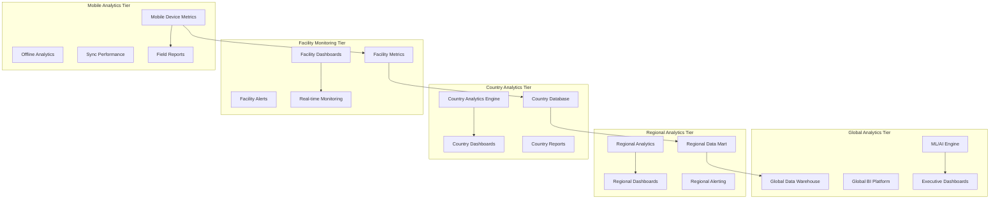

# ZarishHealthcare System - Monitoring and Analytics Framework

## Executive Summary

The ZarishHealthcare System Monitoring and Analytics Framework provides comprehensive visibility, insights, and decision support capabilities for humanitarian healthcare operations across all operational tiers. This framework combines real-time operational monitoring, population health analytics, performance optimization, and predictive intelligence to enable data-driven decision-making, improve patient outcomes, and enhance operational efficiency in complex humanitarian environments.

## 1. Monitoring and Analytics Architecture Overview

### 1.1 Multi-Tier Monitoring Architecture



### 1.2 Humanitarian Healthcare Analytics Principles

```typescript
// Core principles for humanitarian healthcare monitoring and analytics
interface HumanitarianAnalyticsPrinciples {
  // Beneficiary-centered analytics
  beneficiaryCentric: {
    principle: 'analytics-serve-beneficiary-outcomes-and-safety';
    implementation: 'patient-outcome-focused-metrics-privacy-protected';
    priority: 'health-outcomes-quality-care-delivery-measurement';
    protection: 'beneficiary-privacy-dignity-respected-all-analytics';
  };

  // Real-time operational intelligence
  realTimeIntelligence: {
    principle: 'timely-actionable-insights-operational-decisions';
    implementation: 'real-time-dashboards-automated-alerting-systems';
    priority: 'critical-situations-immediate-visibility-response';
    reliability: 'monitoring-systems-high-availability-resilience';
  };

  // Multi-stakeholder transparency
  stakeholderTransparency: {
    principle: 'transparent-accountable-reporting-all-stakeholders';
    implementation: 'role-appropriate-dashboards-reporting-mechanisms';
    priority: 'donor-accountability-program-transparency-beneficiary-feedback';
    balance: 'transparency-privacy-protection-appropriate-balance';
  };

  // Evidence-based decision support
  evidenceBasedDecisions: {
    principle: 'data-driven-evidence-based-decision-making';
    implementation: 'analytics-decision-support-tools-predictive-insights';
    priority: 'clinical-operational-strategic-decision-support';
    quality: 'high-quality-accurate-timely-relevant-data';
  };

  // Humanitarian accountability
  humanitarianAccountability: {
    principle: 'accountability-humanitarian-principles-standards';
    implementation: 'sphere-standards-compliance-monitoring-chs-indicators';
    priority: 'do-no-harm-monitoring-conflict-sensitivity-assessment';
    improvement: 'continuous-improvement-feedback-learning-cycles';
  };
}
```

## 2. Healthcare Analytics and Population Health Intelligence

### 2.1 Clinical Analytics and Patient Outcomes

```typescript
// Comprehensive clinical analytics for humanitarian healthcare
class ClinicalAnalyticsFramework {
  
  async implementClinicalAnalytics(): Promise<ClinicalAnalyticsSystem> {
    return {
      // Patient outcome analytics
      patientOutcomeAnalytics: {
        clinicalOutcomes: {
          mortalityMetrics: {
            overallMortality: 'facility-specific-overall-mortality-rates';
            diseaseMortality: 'disease-specific-mortality-rates-tracking';
            maternalMortality: 'maternal-mortality-ratio-reproductive-health';
            childMortality: 'under-5-mortality-rate-pediatric-care';
            preventableMortality: 'preventable-mortality-analysis-root-causes';
          };
          
          morbidityAnalytics: {
            diseaseIncidence: 'disease-incidence-prevalence-tracking';
            chronicDiseaseManagement: 'ncd-management-outcome-tracking';
            communicableDiseases: 'infectious-disease-surveillance-analytics';
            maternalHealth: 'maternal-health-outcome-indicators';
            childHealth: 'pediatric-health-outcome-metrics';
          };
        },

        treatmentEffectiveness: {
          treatmentOutcomes: {
            therapeuticResponse: 'treatment-response-rate-measurement';
            adherenceTracking: 'medication-adherence-monitoring-analytics';
            treatmentCompletion: 'treatment-completion-rate-tracking';
            adverseEvents: 'adverse-event-monitoring-analysis';
            qualityOfLife: 'patient-reported-outcome-measures-proms';
          };
        }
      },

      // Disease surveillance and epidemiology
      diseaseSurveillance: {
        outbreakDetection: {
          earlyWarning: {
            algorithmicDetection: 'algorithmic-outbreak-detection-statistical-methods';
            syndromeScanning: 'syndromic-surveillance-early-detection';
            spatialAnalysis: 'spatial-clustering-analysis-disease-hotspots';
            temporalTrends: 'temporal-trend-analysis-disease-patterns';
          };
        }
      }
    };
  }
}
```

## 3. Real-Time Monitoring and Alerting

### 3.1 System Performance Monitoring

```typescript
// Real-time system performance monitoring for humanitarian healthcare operations
class RealTimeMonitoringSystem {
  
  async implementRealTimeMonitoring(): Promise<RealTimeMonitoringFramework> {
    return {
      // System health monitoring
      systemHealthMonitoring: {
        applicationPerformance: {
          responseTimeMonitoring: {
            webApplicationResponse: 'web-application-response-time-real-time-monitoring';
            apiResponseTime: 'api-endpoint-response-time-performance-tracking';
            databaseQueryPerformance: 'database-query-performance-monitoring-optimization';
            userExperienceMetrics: 'user-experience-performance-measurement-analytics';
          };
          
          systemResourceMonitoring: {
            cpuUtilization: 'cpu-utilization-monitoring-performance-alerting';
            memoryUsage: 'memory-usage-monitoring-leak-detection';
            storageCapacity: 'storage-capacity-monitoring-space-alerting';
            networkBandwidth: 'network-bandwidth-utilization-monitoring-optimization';
          };
        }
      },

      // Operational alerting system
      operationalAlertingSystem: {
        clinicalAlerts: {
          patientSafetyAlerts: {
            criticalValueAlerts: 'critical-lab-value-automated-alerting-clinical-staff';
            medicationAlerts: 'medication-interaction-allergy-alerting-safety';
            deterioratingPatients: 'patient-condition-deterioration-early-warning-alerts';
            emergencyEvents: 'medical-emergency-event-automated-notification-response-team';
          };
        }
      }
    };
  }
}
```

## 4. Data Visualization and Dashboard Framework

### 4.1 Multi-Stakeholder Dashboard Architecture

```typescript
// Multi-stakeholder dashboard architecture for humanitarian healthcare
class DashboardArchitectureFramework {
  
  async implementDashboardArchitecture(): Promise<DashboardFramework> {
    return {
      // Executive and leadership dashboards
      executiveLeadershipDashboards: {
        globalExecutiveDashboard: {
          audience: 'global-humanitarian-leadership-executive-directors';
          updateFrequency: 'real-time-updates-daily-executive-briefings';
          keyMetrics: [
            'global-program-performance-impact-metrics',
            'beneficiary-outcome-indicators-health-improvements',
            'operational-efficiency-cost-effectiveness-metrics',
            'donor-accountability-funding-utilization-reporting',
            'emergency-response-readiness-capacity-assessment'
          ];
        };
      },

      // Operational dashboards
      operationalDashboards: {
        facilityOperationsDashboards: {
          audience: 'facility-managers-clinical-supervisors-operations-staff';
          updateFrequency: 'real-time-updates-continuous-operational-monitoring';
          keyMetrics: [
            'daily-patient-volume-service-utilization-metrics',
            'clinical-quality-indicators-patient-outcome-tracking',
            'resource-availability-inventory-management-metrics',
            'staff-performance-workload-distribution-analytics',
            'facility-efficiency-throughput-optimization-indicators'
          ];
        };
      }
    };
  }
}
```

## 5. Predictive Analytics and AI-Powered Insights

### 5.1 Machine Learning and AI Framework

```typescript
// Machine learning and AI framework for humanitarian healthcare analytics
class AIAnalyticsFramework {
  
  async implementAIAnalytics(): Promise<AIAnalyticsSystem> {
    return {
      // Predictive modeling for healthcare outcomes
      predictiveHealthcareModeling: {
        patientOutcomePrediction: {
          mortalityPrediction: {
            algorithms: [
              'random-forest-mortality-risk-classification',
              'neural-network-survival-analysis-deep-learning',
              'gradient-boosting-risk-stratification-ensemble-methods',
              'logistic-regression-interpretable-clinical-prediction'
            ];
            
            validation: {
              crossValidation: 'k-fold-cross-validation-model-performance-assessment';
              temporalValidation: 'temporal-validation-prospective-model-testing';
              externalValidation: 'external-validation-different-populations-settings';
              fairnessAssessment: 'algorithmic-fairness-assessment-bias-detection';
            };
          };
        }
      },

      // Natural language processing for healthcare data
      naturalLanguageProcessing: {
        clinicalNLP: {
          clinicalDocumentation: {
            medicalEntityExtraction: 'medical-entity-extraction-clinical-notes-structured-data';
            symptomExtraction: 'symptom-extraction-patient-complaint-analysis';
            medicationExtraction: 'medication-extraction-prescription-analysis-adherence';
            diagnosisExtraction: 'diagnosis-extraction-icd-coding-automation';
          };
        }
      }
    };
  }
}
```

## 6. Implementation Strategy and Technology Stack

### 6.1 Technology Stack Framework

```typescript
// Technology stack for monitoring and analytics implementation
class MonitoringAnalyticsTechnologyStack {
  
  async implementTechnologyStack(): Promise<TechnologyStackFramework> {
    return {
      // Data infrastructure
      dataInfrastructure: {
        dataWarehousing: {
          primaryDataWarehouse: {
            technology: 'postgresql-with-timescaledb-time-series-optimization';
            configuration: 'clustered-high-availability-read-replicas-global-distribution';
            capacity: 'petabyte-scale-storage-concurrent-analytical-queries';
            optimization: 'columnstore-indexing-query-optimization-partitioning';
          };
        },

        dataProcessingPipeline: {
          batchProcessing: {
            etlFramework: 'apache-airflow-workflow-orchestration-data-pipelines';
            dataTransformation: 'apache-spark-large-scale-data-transformation';
            dataQuality: 'great-expectations-data-quality-validation-monitoring';
            scheduleManagement: 'cron-based-scheduling-dependency-management';
          };
        }
      },

      // Analytics and business intelligence
      analyticsBusinessIntelligence: {
        businessIntelligence: {
          primaryBIPlatform: {
            technology: 'apache-superset-open-source-bi-platform';
            features: [
              'interactive-dashboards-real-time-data-visualization',
              'sql-lab-advanced-query-interface-data-exploration',
              'chart-gallery-comprehensive-visualization-options',
              'dashboard-sharing-collaboration-stakeholder-engagement'
            ];
            scalability: 'horizontally-scalable-load-balancer-multiple-instances';
          };
        },

        monitoringObservability: {
          applicationMonitoring: {
            technology: 'prometheus-grafana-monitoring-alerting-stack';
            features: [
              'metrics-collection-multi-dimensional-time-series',
              'alerting-rules-threshold-anomaly-based-notifications',
              'dashboard-creation-customizable-monitoring-dashboards',
              'service-discovery-dynamic-target-discovery-monitoring'
            ];
          };
        }
      }
    };
  }
}
```

## 7. Implementation Timeline and Success Metrics

### 7.1 Phased Implementation Strategy

```typescript
// Phased implementation strategy for monitoring and analytics framework
class MonitoringAnalyticsImplementation {
  
  async implementPhaseStrategy(): Promise<ImplementationPhaseFramework> {
    return {
      // Phase 1: Foundation monitoring (Months 1-6)
      phase1Foundation: {
        objectives: [
          'establish-basic-system-monitoring-infrastructure',
          'implement-core-clinical-operational-dashboards',
          'deploy-essential-alerting-notification-systems',
          'create-foundational-data-pipeline-architecture'
        ];
        
        successCriteria: [
          'system-monitoring-99-percent-uptime-visibility',
          'operational-dashboards-real-time-data-updates',
          'alerting-system-5-minute-response-critical-issues',
          'data-pipeline-processing-daily-batch-updates'
        ];
      },

      // Phase 2: Advanced analytics (Months 7-12)
      phase2AdvancedAnalytics: {
        objectives: [
          'implement-advanced-clinical-population-health-analytics',
          'deploy-predictive-analytics-machine-learning-models',
          'establish-multi-stakeholder-dashboard-framework',
          'integrate-cross-organizational-coordination-analytics'
        ];
        
        successCriteria: [
          'predictive-models-80-percent-accuracy-clinical-outcomes',
          'population-health-analytics-real-time-surveillance-capability',
          'stakeholder-dashboards-95-percent-user-satisfaction',
          'coordination-analytics-measurable-collaboration-improvement'
        ];
      },

      // Phase 3: AI and intelligence (Months 13-18)
      phase3AIIntelligence: {
        objectives: [
          'deploy-ai-powered-clinical-decision-support-systems',
          'implement-intelligent-resource-optimization-analytics',
          'establish-autonomous-monitoring-self-healing-systems',
          'create-comprehensive-predictive-intelligence-platform'
        ];
        
        successCriteria: [
          'ai-clinical-decision-support-90-percent-accuracy',
          'intelligent-resource-optimization-20-percent-efficiency-gain',
          'autonomous-monitoring-80-percent-automated-issue-resolution',
          'predictive-intelligence-platform-operational-all-stakeholders'
        ];
      }
    };
  }
}
```

### 7.2 Success Metrics and KPIs

```typescript
// Comprehensive success metrics for monitoring and analytics framework
interface MonitoringAnalyticsSuccessMetrics {
  // Technical performance metrics
  technicalPerformance: {
    systemReliability: {
      metric: 'monitoring-system-uptime-availability';
      target: '99.9-percent-uptime-monitoring-infrastructure';
      measurement: 'automated-uptime-monitoring-sla-tracking';
    };
    
    dataQuality: {
      metric: 'data-quality-completeness-accuracy';
      target: '95-percent-data-completeness-99-percent-accuracy';
      measurement: 'automated-data-quality-validation-reporting';
    };
    
    responseTime: {
      metric: 'dashboard-query-response-time';
      target: 'sub-3-second-response-95-percent-queries';
      measurement: 'query-performance-monitoring-percentile-analysis';
    };
  };

  // Operational effectiveness metrics
  operationalEffectiveness: {
    decisionSupport: {
      metric: 'data-driven-decision-making-rate';
      target: '80-percent-decisions-supported-analytics';
      measurement: 'decision-tracking-analytics-utilization-surveys';
    };
    
    alertEffectiveness: {
      metric: 'alert-response-time-resolution-rate';
      target: '95-percent-critical-alerts-resolved-within-sla';
      measurement: 'alert-response-tracking-resolution-time-analysis';
    };
    
    userAdoption: {
      metric: 'dashboard-analytics-user-adoption-rate';
      target: '90-percent-target-users-actively-using-analytics';
      measurement: 'user-activity-tracking-engagement-analytics';
    };
  };

  // Healthcare impact metrics
  healthcareImpact: {
    clinicalOutcomes: {
      metric: 'predictive-analytics-impact-patient-outcomes';
      target: '15-percent-improvement-clinical-outcome-prediction';
      measurement: 'before-after-analysis-predictive-model-impact';
    };
    
    operationalEfficiency: {
      metric: 'operational-efficiency-improvement-analytics-driven';
      target: '25-percent-improvement-operational-efficiency-metrics';
      measurement: 'operational-metrics-trend-analysis-efficiency-gains';
    };
    
    qualityImprovement: {
      metric: 'quality-improvement-initiatives-analytics-supported';
      target: '90-percent-quality-initiatives-data-driven';
      measurement: 'quality-initiative-tracking-analytics-contribution';
    };
  };

  // Humanitarian-specific metrics
  humanitarianImpact: {
    coordinationEffectiveness: {
      metric: 'inter-organization-coordination-effectiveness';
      target: '30-percent-improvement-coordination-response-time';
      measurement: 'coordination-activity-tracking-response-time-analysis';
    };
    
    donorAccountability: {
      metric: 'donor-reporting-efficiency-accuracy';
      target: '50-percent-reduction-donor-report-preparation-time';
      measurement: 'reporting-process-efficiency-accuracy-measurement';
    };
    
    emergencyResponseTime: {
      metric: 'emergency-response-decision-support-time';
      target: 'sub-30-minute-emergency-situation-assessment';
      measurement: 'emergency-response-timeline-analysis-decision-support-impact';
    };
  };
}
```

## 8. Future Evolution and Innovation

### 8.1 Emerging Technology Integration

```typescript
// Future technology integration roadmap
interface FutureAnalyticsEvolution {
  // Next 12 months: Enhanced intelligence
  enhancedIntelligence: [
    'advanced-nlp-multilingual-clinical-documentation-analysis',
    'computer-vision-medical-imaging-diagnostic-support',
    'iot-integration-medical-device-real-time-monitoring',
    'blockchain-analytics-data-provenance-integrity-verification'
  ];

  // Next 24 months: Autonomous systems
  autonomousSystems: [
    'fully-autonomous-anomaly-detection-resolution',
    'self-optimizing-predictive-models-continuous-learning',
    'automated-report-generation-natural-language-insights',
    'intelligent-resource-allocation-optimization-automation'
  ];

  // Next 36 months: Ecosystem integration
  ecosystemIntegration: [
    'global-humanitarian-analytics-federation',
    'ai-powered-policy-recommendation-evidence-synthesis',
    'virtual-reality-immersive-data-exploration-analysis',
    'quantum-computing-complex-epidemiological-modeling'
  ];
}
```

## 9. Conclusion and Strategic Impact

### 9.1 Transformative Benefits

The ZarishHealthcare System Monitoring and Analytics Framework delivers transformative capabilities that fundamentally enhance humanitarian healthcare operations:

**Clinical Excellence**:
- Real-time patient outcome monitoring enabling proactive interventions
- Predictive analytics supporting evidence-based clinical decisions
- Population health surveillance preventing disease outbreaks
- Quality improvement analytics ensuring continuous care enhancement

**Operational Efficiency**:
- Resource optimization analytics maximizing impact per dollar invested
- Performance monitoring identifying bottlenecks and improvement opportunities
- Automated alerting systems ensuring rapid response to critical issues
- Cross-organizational coordination analytics enhancing collaboration effectiveness

**Strategic Decision Making**:
- Executive dashboards providing strategic oversight and accountability
- Donor reporting automation demonstrating impact and value
- Predictive intelligence supporting long-term planning and sustainability
- Evidence generation informing policy and practice improvements

**Humanitarian Impact**:
- Beneficiary-centered analytics prioritizing patient outcomes and safety
- Emergency response analytics enabling rapid crisis coordination
- Cultural sensitivity monitoring ensuring appropriate care delivery
- Do-no-harm monitoring preventing unintended negative consequences

### 9.2 Success Foundation

This comprehensive Monitoring and Analytics Framework establishes the foundation for:

- **Data-Driven Healthcare Delivery** that continuously improves based on evidence and outcomes
- **Transparent Accountability** to all stakeholders including beneficiaries, donors, and partners
- **Intelligent Resource Optimization** maximizing impact in resource-constrained environments
- **Proactive Risk Management** through early warning systems and predictive analytics
- **Collaborative Excellence** through shared analytics and coordination metrics
- **Sustainable Impact** through evidence-based program design and continuous improvement

### 9.3 Long-Term Vision

The ZarishHealthcare System Monitoring and Analytics Framework positions humanitarian healthcare operations at the forefront of data-driven excellence. By combining real-time operational intelligence, predictive analytics, AI-powered insights, and transparent accountability mechanisms, this framework enables unprecedented levels of effectiveness, efficiency, and impact in serving vulnerable populations worldwide.

Through careful implementation and continuous evolution, this analytics framework will transform how humanitarian healthcare organizations understand, optimize, and demonstrate their impact, ultimately leading to better health outcomes for the world's most vulnerable populations while setting new standards for accountability, transparency, and evidence-based practice in the humanitarian sector.

The framework's emphasis on beneficiary-centered analytics, cultural sensitivity, and humanitarian principles ensures that advanced technology serves human dignity and contributes to the fundamental goal of alleviating human suffering wherever it is found.