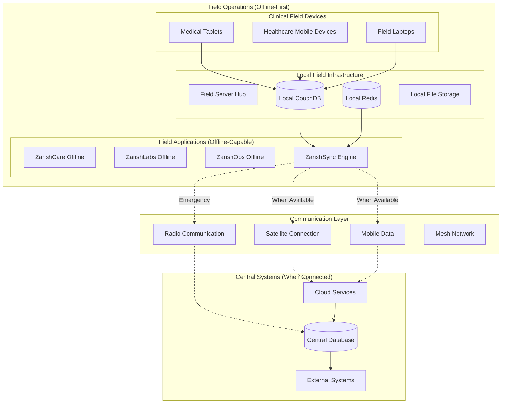

# ZarishHealthcare System - Offline-First Capabilities for Field Operations

## Executive Summary

The ZarishHealthcare System's offline-first capabilities are specifically designed to support humanitarian healthcare delivery in challenging field environments where internet connectivity is limited, intermittent, or completely unavailable. This comprehensive framework ensures that critical healthcare operations can continue uninterrupted, with seamless synchronization when connectivity is restored, making it ideal for refugee camps, emergency response situations, remote clinics, and disaster-affected areas.

## 1. Offline-First Architecture Overview

### 1.1 Design Principles for Humanitarian Field Operations

```typescript
// Core principles for humanitarian offline-first design
interface HumanitarianOfflineFirstPrinciples {
  // Complete functional independence from connectivity
  connectivityIndependence: {
    coreFeatures: 'fully-functional-offline';
    criticalWorkflows: 'zero-dependency-on-internet';
    emergencyOperations: 'completely-autonomous';
    dataIntegrity: 'maintained-during-disconnection';
  };

  // Optimized for resource-constrained environments  
  resourceOptimization: {
    storage: 'minimal-footprint-maximum-functionality';
    processing: 'efficient-algorithms-for-limited-cpu';
    memory: 'lean-memory-usage-patterns';
    battery: 'power-efficient-operations';
  };

  // Humanitarian-specific operational requirements
  humanitarianOptimization: {
    multiLanguage: 'offline-language-packs';
    culturalAdaptation: 'context-sensitive-interfaces';
    emergencyModes: 'rapid-response-capabilities';
    partnerCoordination: 'offline-inter-agency-workflows';
  };

  // Data synchronization and consistency
  dataManagement: {
    conflictResolution: 'humanitarian-priority-based';
    incrementalSync: 'bandwidth-efficient-updates';
    dataValidation: 'offline-integrity-checks';
    auditTrails: 'complete-offline-audit-logging';
  };
}
```

### 1.2 Humanitarian Field Architecture


## 2. Local Data Storage Strategy

### 2.1 Humanitarian-Optimized Local Storage Architecture
```typescript
// Local storage strategy for humanitarian field operations
class HumanitarianLocalStorage {
  private couchDB: CouchDBInstance;
  private sqlite: SQLiteInstance;
  private indexedDB: IndexedDBInstance;
  private localStorage: LocalStorageManager;

  // Multi-tier storage strategy optimized for field operations
  async initializeFieldStorage(): Promise<FieldStorageConfiguration> {
    return {
      // Primary transactional data (CouchDB for sync capabilities)
      primaryStorage: {
        engine: 'CouchDB',
        purpose: 'transactional-data-with-sync',
        databases: {
          patients: {
            name: 'field_patients',
            maxSize: '500MB',
            compaction: 'auto',
            indexes: ['mrn', 'name', 'dateOfBirth', 'camp_location']
          },
          
          consultations: {
            name: 'field_consultations', 
            maxSize: '1GB',
            compaction: 'auto',
            indexes: ['patientId', 'providerId', 'date', 'emergency_flag']
          },
          
          laboratory: {
            name: 'field_laboratory',
            maxSize: '200MB',
            compaction: 'auto',
            indexes: ['patientId', 'testType', 'status', 'priority']
          },
          
          operations: {
            name: 'field_operations',
            maxSize: '300MB', 
            compaction: 'auto',
            indexes: ['organizationId', 'resourceType', 'location']
          }
        }
      },

      // Performance data (SQLite for complex queries)
      performanceStorage: {
        engine: 'SQLite',
        purpose: 'analytics-and-reporting',
        databases: {
          analytics: {
            file: 'field_analytics.db',
            maxSize: '100MB',
            vacuum: 'weekly',
            tables: ['daily_metrics', 'weekly_reports', 'emergency_stats']
          },
          
          cache: {
            file: 'field_cache.db', 
            maxSize: '50MB',
            vacuum: 'daily',
            tables: ['reference_data', 'user_preferences', 'protocol_cache']
          }
        }
      },

      // Application data (IndexedDB for web applications)
      applicationStorage: {
        engine: 'IndexedDB',
        purpose: 'application-state-and-ui',
        stores: {
          userSessions: { maxSize: '10MB', ttl: '8h' },
          workflowState: { maxSize: '20MB', ttl: '24h' },
          offlineQueue: { maxSize: '100MB', ttl: 'indefinite' },
          mediaFiles: { maxSize: '200MB', ttl: '30d' }
        }
      },

      // Configuration and settings (localStorage)
      configurationStorage: {
        engine: 'localStorage',
        purpose: 'settings-and-configuration',
        data: {
          userPreferences: { maxSize: '1MB' },
          applicationSettings: { maxSize: '1MB' },
          offlineConfig: { maxSize: '500KB' },
          languagePacks: { maxSize: '10MB' }
        }
      }
    };
  }

  // Humanitarian patient data optimization
  async optimizePatientStorage(patientData: HumanitarianPatientData): Promise<OptimizedPatientRecord> {
    // Compress and optimize patient data for field storage
    const optimizedRecord = {
      // Essential data always stored locally
      essential: {
        id: patientData.id,
        mrn: patientData.mrn,
        demographics: this.compressDemographics(patientData.demographics),
        medicalHistory: this.compressMedicalHistory(patientData.medicalHistory),
        currentPrograms: patientData.programs.filter(p => p.active),
        emergencyContacts: patientData.contacts.slice(0, 2), // Limit for space
        vulnerabilityFlags: patientData.vulnerabilityFlags
      },
      
      // Detailed data stored with compression
      detailed: {
        consultations: await this.compressConsultations(patientData.consultations),
        labResults: await this.compressLabResults(patientData.labResults),
        medications: patientData.medications.filter(m => m.active),
        attachments: await this.optimizeAttachments(patientData.attachments)
      },
      
      // Sync metadata
      sync: {
        lastModified: patientData.lastModified,
        syncVersion: patientData.syncVersion,
        conflictState: patientData.conflictState || 'resolved',
        fieldModified: false
      }
    };

    return optimizedRecord;
  }

  // Emergency data prioritization for limited storage
  async prioritizeEmergencyData(availableStorage: number): Promise<EmergencyDataPriority> {
    const priorities = {
      critical: [
        'active-emergency-cases',
        'critical-patient-data',
        'essential-medical-protocols',
        'emergency-contact-information'
      ],
      
      high: [
        'recent-consultations',
        'active-medications',
        'ongoing-treatments',
        'staff-schedules'
      ],
      
      medium: [
        'historical-patient-data',
        'completed-consultations',
        'supply-inventory',
        'reporting-data'
      ],
      
      low: [
        'archived-records',
        'media-attachments',
        'detailed-analytics',
        'training-materials'
      ]
    };

    // Calculate storage allocation based on available space
    const allocationStrategy = await this.calculateStorageAllocation(
      availableStorage,
      priorities
    );

    return allocationStrategy;
  }
}
```

### 2.2 Intelligent Data Caching Strategy
```typescript
// Intelligent caching for humanitarian field operations
class HumanitarianDataCache {
  private cacheStrategy: CacheStrategy;
  private priorityManager: PriorityManager;

  // Multi-level caching strategy optimized for humanitarian contexts
  async initializeHumanitarianCache(): Promise<CacheConfiguration> {
    return {
      // Level 1: Critical operational data (always cached)
      level1Cache: {
        type: 'persistent',
        maxSize: '200MB',
        ttl: 'indefinite',
        evictionPolicy: 'never',
        
        data: [
          'active-emergency-protocols',
          'essential-medical-guidelines',
          'critical-patient-list',
          'emergency-contact-directory',
          'medication-formulary',
          'vaccination-schedules',
          'referral-pathways'
        ]
      },

      // Level 2: Frequently accessed data (smart caching)
      level2Cache: {
        type: 'adaptive',
        maxSize: '500MB', 
        ttl: '24h',
        evictionPolicy: 'lfu-with-humanitarian-priority',
        
        data: [
          'recent-patient-records',
          'current-program-enrollments',
          'active-staff-schedules',
          'supply-inventory-status',
          'facility-capacity-data',
          'partner-coordination-info'
        ]
      },

      // Level 3: Historical and analytical data (as-needed caching)
      level3Cache: {
        type: 'opportunistic',
        maxSize: '300MB',
        ttl: '7d',
        evictionPolicy: 'lru',
        
        data: [
          'historical-consultations',
          'completed-lab-results',
          'reporting-metrics',
          'training-materials',
          'archived-communications'
        ]
      },

      // Special cache: Emergency response data (priority caching)
      emergencyCache: {
        type: 'priority-persistent',
        maxSize: '100MB',
        ttl: 'until-emergency-resolved',
        evictionPolicy: 'emergency-priority',
        
        data: [
          'mass-casualty-protocols',
          'triage-guidelines',
          'emergency-medication-stocks',
          'evacuation-procedures',
          'external-referral-contacts'
        ]
      }
    };
  }

  // Context-aware cache management
  async manageCacheBasedOnContext(context: OperationalContext): Promise<CacheManagementResult> {
    switch (context.operationType) {
      case 'emergency_response':
        return await this.optimizeForEmergency(context);
      
      case 'routine_operations':
        return await this.optimizeForRoutineOps(context);
        
      case 'mass_casualty':
        return await this.optimizeForMassCasualty(context);
        
      case 'outbreak_response':
        return await this.optimizeForOutbreak(context);
        
      default:
        return await this.optimizeForGeneral(context);
    }
  }

  // Emergency response cache optimization
  private async optimizeForEmergency(context: OperationalContext): Promise<CacheManagementResult> {
    // Prioritize emergency-relevant data
    const emergencyOptimization = {
      // Clear non-essential cache to make room for emergency data
      clearNonEssential: true,
      
      // Preload critical emergency data
      preloadData: [
        'emergency-triage-protocols',
        'critical-medication-guidelines',
        'emergency-referral-contacts',
        'mass-casualty-procedures'
      ],
      
      // Adjust cache policies for emergency context
      temporaryPolicies: {
        ttl: '72h', // Extended TTL during emergency
        maxSize: '800MB', // Increased cache size
        priorityBoost: 'emergency-data-only'
      }
    };

    return await this.applyCacheOptimization(emergencyOptimization);
  }

  // Bandwidth-aware cache synchronization
  async synchronizeCacheWithBandwidthAwareness(
    availableBandwidth: number,
    connectionStability: number
  ): Promise<CacheSyncResult> {
    
    // Determine sync strategy based on connection quality
    const syncStrategy = this.determineSyncStrategy(availableBandwidth, connectionStability);
    
    const syncPlan = {
      // High priority data synced first
      highPriority: {
        maxSize: Math.min(availableBandwidth * 0.6, 50_000_000), // 60% bandwidth, max 50MB
        data: ['critical-updates', 'emergency-protocols', 'essential-patient-data']
      },
      
      // Medium priority data if bandwidth allows
      mediumPriority: {
        maxSize: Math.min(availableBandwidth * 0.3, 20_000_000), // 30% bandwidth, max 20MB  
        data: ['routine-updates', 'recent-consultations', 'inventory-updates']
      },
      
      // Low priority data only with stable, high-bandwidth connection
      lowPriority: {
        maxSize: Math.min(availableBandwidth * 0.1, 10_000_000), // 10% bandwidth, max 10MB
        data: ['historical-data', 'media-files', 'detailed-reports'],
        requiresStableConnection: true
      }
    };

    return await this.executeCacheSync(syncPlan);
  }
}
```

## 3. Offline Synchronization Engine

### 3.1 Humanitarian-Specific Sync Architecture
```typescript
// Advanced synchronization engine for humanitarian field operations
class HumanitarianSyncEngine {
  private syncQueue: PriorityQueue<SyncOperation>;
  private conflictResolver: ConflictResolver;
  private bandwidthOptimizer: BandwidthOptimizer;
  private emergencySync: EmergencySyncManager;

  // Initialize humanitarian sync engine
  async initializeHumanitarianSync(): Promise<HumanitarianSyncConfiguration> {
    return {
      // Multi-priority sync queues
      syncQueues: {
        emergency: {
          priority: 1,
          maxRetries: 10,
          retryBackoff: 'immediate',
          timeout: 30000,
          bandwidthAllocation: 0.8 // 80% of available bandwidth
        },
        
        clinical: {
          priority: 2, 
          maxRetries: 5,
          retryBackoff: 'exponential',
          timeout: 60000,
          bandwidthAllocation: 0.15 // 15% of available bandwidth
        },
        
        operational: {
          priority: 3,
          maxRetries: 3,
          retryBackoff: 'linear',
          timeout: 120000,
          bandwidthAllocation: 0.05 // 5% of available bandwidth
        }
      },

      // Conflict resolution strategies
      conflictResolution: {
        patientData: {
          strategy: 'clinical-priority-wins',
          autoResolve: ['timestamps', 'vital-signs'],
          manualReview: ['diagnoses', 'treatments', 'medications'],
          emergencyOverride: true
        },
        
        operationalData: {
          strategy: 'field-priority',
          autoResolve: ['inventory-counts', 'schedules'],
          manualReview: ['resource-allocation', 'staff-assignments']
        },
        
        systemData: {
          strategy: 'central-wins',
          autoResolve: ['configurations', 'protocols'],
          manualReview: ['custom-workflows']
        }
      },

      // Bandwidth optimization strategies
      bandwidthOptimization: {
        compression: {
          algorithm: 'zstd',
          level: 'adaptive-based-on-bandwidth',
          threshold: 1024 // Compress data > 1KB
        },
        
        deltaSync: {
          enabled: true,
          granularity: 'field-level',
          changeTracking: 'comprehensive'
        },
        
        adaptiveSync: {
          enabled: true,
          bandwidthMonitoring: 'continuous',
          qualityAdjustment: 'automatic'
        }
      }
    };
  }

  // Execute humanitarian-priority synchronization
  async executeHumanitarianSync(context: HumanitarianSyncContext): Promise<HumanitarianSyncResult> {
    // Assess current operational context
    const syncPriorities = await this.assessSyncPriorities(context);
    
    // Emergency data sync (highest priority)
    const emergencySync = await this.syncEmergencyData(syncPriorities.emergency);
    
    // Patient care data sync
    const clinicalSync = await this.syncClinicalData(syncPriorities.clinical);
    
    // Operational coordination data sync
    const operationalSync = await this.syncOperationalData(syncPriorities.operational);
    
    // Analytics and reporting data sync (lowest priority)
    const analyticsSync = await this.syncAnalyticsData(syncPriorities.analytics);
    
    // Compile sync results
    const overallResult = {
      syncId: this.generateSyncId(),
      startTime: context.startTime,
      endTime: new Date(),
      context: context,
      
      results: {
        emergency: emergencySync,
        clinical: clinicalSync, 
        operational: operationalSync,
        analytics: analyticsSync
      },
      
      summary: {
        totalRecordsSynced: emergencySync.recordCount + clinicalSync.recordCount + 
                            operationalSync.recordCount + analyticsSync.recordCount,
        totalDataSynced: emergencySync.dataSize + clinicalSync.dataSize + 
                        operationalSync.dataSize + analyticsSync.dataSize,
        syncDuration: Date.now() - context.startTime.getTime(),
        conflictsDetected: emergencySync.conflicts + clinicalSync.conflicts + 
                          operationalSync.conflicts + analyticsSync.conflicts,
        conflictsResolved: emergencySync.conflictsResolved + clinicalSync.conflictsResolved + 
                          operationalSync.conflictsResolved + analyticsSync.conflictsResolved
      }
    };

    // Log comprehensive sync event
    await this.logSyncEvent(overallResult);
    
    return overallResult;
  }

  // Emergency data synchronization with absolute priority
  async syncEmergencyData(emergencyData: EmergencyDataSync): Promise<EmergencySyncResult> {
    // Emergency sync bypasses normal queuing and bandwidth limitations
    const emergencyResult = await this.emergencySync.executeImmediateSync({
      data: emergencyData,
      priority: 'absolute',
      timeout: 30000, // 30-second timeout for emergency sync
      retries: 'unlimited', // Keep trying until success or manual intervention
      fallbackMethods: ['satellite', 'radio', 'mesh-network']
    });

    // If primary sync fails, attempt emergency communication protocols
    if (!emergencyResult.success) {
      await this.attemptEmergencyCommunication(emergencyData);
    }

    return emergencyResult;
  }

  // Intelligent conflict resolution for humanitarian contexts
  async resolveHumanitarianConflicts(conflicts: DataConflict[]): Promise<ConflictResolutionResult> {
    const resolutionResults = [];
    
    for (const conflict of conflicts) {
      let resolution: ConflictResolution;
      
      switch (conflict.dataType) {
        case 'patient-clinical-data':
          resolution = await this.resolveClinicalConflict(conflict);
          break;
          
        case 'emergency-case-data':
          resolution = await this.resolveEmergencyConflict(conflict);
          break;
          
        case 'resource-allocation':
          resolution = await this.resolveResourceConflict(conflict);
          break;
          
        case 'staff-scheduling':
          resolution = await this.resolveSchedulingConflict(conflict);
          break;
          
        default:
          resolution = await this.resolveGenericConflict(conflict);
      }
      
      resolutionResults.push(resolution);
    }
    
    return {
      totalConflicts: conflicts.length,
      autoResolved: resolutionResults.filter(r => r.method === 'automatic').length,
      manualReviewRequired: resolutionResults.filter(r => r.method === 'manual-review').length,
      resolutions: resolutionResults,
      timestamp: new Date()
    };
  }

  // Clinical data conflict resolution (life-critical priority)
  private async resolveClinicalConflict(conflict: DataConflict): Promise<ConflictResolution> {
    const clinicalRules = {
      // Life-threatening information always takes priority
      vitalSigns: {
        strategy: 'most-recent-wins',
        validation: 'physiologically-plausible',
        escalation: 'immediate-if-critical'
      },
      
      // Diagnoses require clinical review
      diagnoses: {
        strategy: 'manual-clinical-review',
        priority: 'field-clinician-preference',
        escalation: 'senior-medical-officer'
      },
      
      // Medications require careful review due to safety
      medications: {
        strategy: 'conservative-approach',
        priority: 'safest-option',
        escalation: 'pharmacist-review'
      },
      
      // Treatment plans need coordination
      treatmentPlans: {
        strategy: 'collaborative-merge',
        priority: 'continuity-of-care',
        escalation: 'case-management-team'
      }
    };

    return await this.applyClinicalResolutionRules(conflict, clinicalRules);
  }
}
```

### 3.2 Progressive Synchronization Strategy
```typescript
// Progressive sync strategy optimized for humanitarian field conditions
class ProgressiveSyncStrategy {
  
  // Multi-stage progressive synchronization
  async executeProgressiveSync(context: SyncContext): Promise<ProgressiveSyncResult> {
    const syncStages = [
      {
        stage: 'critical-emergency-data',
        priority: 1,
        maxDuration: 30000, // 30 seconds
        maxData: 5_000_000, // 5MB
        fallback: 'emergency-radio-sync'
      },
      
      {
        stage: 'essential-patient-data',
        priority: 2,
        maxDuration: 120000, // 2 minutes
        maxData: 20_000_000, // 20MB
        fallback: 'queue-for-next-window'
      },
      
      {
        stage: 'operational-coordination',
        priority: 3,
        maxDuration: 300000, // 5 minutes  
        maxData: 50_000_000, // 50MB
        fallback: 'compress-and-queue'
      },
      
      {
        stage: 'analytics-and-reporting',
        priority: 4,
        maxDuration: 600000, // 10 minutes
        maxData: 100_000_000, // 100MB
        fallback: 'defer-to-off-peak'
      }
    ];

    const stageResults = [];
    let remainingBandwidth = context.availableBandwidth;
    let remainingTime = context.maxSyncTime;
    
    for (const stage of syncStages) {
      // Check if we have sufficient resources for this stage
      if (remainingTime < stage.maxDuration || remainingBandwidth < stage.maxData) {
        await this.handleInsufficientResources(stage, { remainingTime, remainingBandwidth });
        continue;
      }
      
      const stageStart = Date.now();
      const stageResult = await this.executeSyncStage(stage, {
        maxBandwidth: Math.min(remainingBandwidth, stage.maxData),
        maxTime: Math.min(remainingTime, stage.maxDuration)
      });
      
      stageResults.push(stageResult);
      
      // Update remaining resources
      const stageTime = Date.now() - stageStart;
      remainingTime -= stageTime;
      remainingBandwidth -= stageResult.dataTransferred;
      
      // Early exit if connection is lost or resources exhausted
      if (!context.connectionAvailable || remainingTime <= 0) {
        await this.handleEarlyExit(syncStages.slice(stageResults.length), stageResults);
        break;
      }
    }
    
    return {
      stages: stageResults,
      totalDuration: Date.now() - context.startTime.getTime(),
      totalDataTransferred: stageResults.reduce((sum, stage) => sum + stage.dataTransferred, 0),
      completionPercentage: (stageResults.length / syncStages.length) * 100,
      nextSyncRecommendation: await this.calculateNextSyncWindow(stageResults)
    };
  }

  // Adaptive sync based on connection quality
  async adaptSyncToConnectionQuality(
    connectionMetrics: ConnectionMetrics
  ): Promise<AdaptiveSyncStrategy> {
    
    const connectionQuality = this.assessConnectionQuality(connectionMetrics);
    
    switch (connectionQuality.grade) {
      case 'excellent':
        return {
          strategy: 'full-sync',
          compression: 'minimal',
          concurrency: 'high',
          chunkSize: 'large',
          retryPolicy: 'aggressive'
        };
        
      case 'good':
        return {
          strategy: 'prioritized-sync',
          compression: 'standard',
          concurrency: 'medium',
          chunkSize: 'medium',
          retryPolicy: 'standard'
        };
        
      case 'fair':
        return {
          strategy: 'essential-only',
          compression: 'high',
          concurrency: 'low',
          chunkSize: 'small',
          retryPolicy: 'conservative'
        };
        
      case 'poor':
        return {
          strategy: 'emergency-only',
          compression: 'maximum',
          concurrency: 'single',
          chunkSize: 'minimal',
          retryPolicy: 'patient'
        };
        
      default:
        return {
          strategy: 'offline-mode',
          compression: 'none',
          concurrency: 'none',
          chunkSize: 'none',
          retryPolicy: 'defer'
        };
    }
  }
}
```

## 4. Offline-Capable Application Architecture

### 4.1 Service Worker Strategy for Healthcare PWAs
```typescript
// Advanced service worker for humanitarian healthcare PWAs
class HumanitarianHealthcareServiceWorker {
  private cacheName = 'zarish-healthcare-v1';
  private emergencyCacheName = 'zarish-emergency-v1';
  private dataCacheName = 'zarish-data-v1';

  // Initialize service worker with humanitarian-specific caching
  async initialize(): Promise<void> {
    // Install event - cache critical healthcare resources
    self.addEventListener('install', (event: ExtendableEvent) => {
      event.waitUntil(this.cacheEssentialResources());
    });

    // Activate event - cleanup old caches and migrate data
    self.addEventListener('activate', (event: ExtendableEvent) => {
      event.waitUntil(this.activateServiceWorker());
    });

    // Fetch event - handle offline-first requests
    self.addEventListener('fetch', (event: FetchEvent) => {
      event.respondWith(this.handleHumanitarianFetch(event.request));
    });

    // Background sync for humanitarian data
    self.addEventListener('sync', (event: SyncEvent) => {
      event.waitUntil(this.handleBackgroundSync(event.tag));
    });
  }

  // Cache essential resources for humanitarian healthcare
  private async cacheEssentialResources(): Promise<void> {
    const essentialResources = [
      // Core application shell
      '/',
      '/offline.html',
      '/manifest.json',
      
      // Critical JavaScript bundles
      '/js/core.bundle.js',
      '/js/offline.bundle.js',
      '/js/emergency.bundle.js',
      
      // Essential CSS
      '/css/main.css',
      '/css/offline.css',
      '/css/print.css',
      
      // Critical images and icons
      '/icons/icon-192x192.png',
      '/icons/icon-512x512.png',
      '/images/emergency-protocols/',
      
      // Language packs for humanitarian contexts
      '/i18n/en.json',
      '/i18n/bn.json',
      '/i18n/ar.json',
      '/i18n/fr.json',
      
      // Medical reference data
      '/data/medical-protocols.json',
      '/data/medication-formulary.json',
      '/data/emergency-procedures.json',
      '/data/referral-pathways.json',
      
      // Offline-capable fonts
      '/fonts/roboto-v20-latin-regular.woff2',
      '/fonts/noto-sans-bengali-v20-latin-regular.woff2'
    ];

    const cache = await caches.open(this.cacheName);
    await cache.addAll(essentialResources);

    // Cache emergency-specific resources separately
    const emergencyCache = await caches.open(this.emergencyCacheName);
    const emergencyResources = [
      '/emergency/triage-protocols.json',
      '/emergency/mass-casualty-procedures.json',
      '/emergency/medication-dosages.json',
      '/emergency/contact-directory.json'
    ];
    
    await emergencyCache.addAll(emergencyResources);
  }

  // Humanitarian-optimized fetch handling
  private async handleHumanitarianFetch(request: Request): Promise<Response> {
    const url = new URL(request.url);
    
    // Handle different types of requests with humanitarian priorities
    if (this.isEmergencyRequest(request)) {
      return this.handleEmergencyRequest(request);
    }
    
    if (this.isClinicalDataRequest(request)) {
      return this.handleClinicalDataRequest(request);
    }
    
    if (this.isOperationalRequest(request)) {
      return this.handleOperationalRequest(request);
    }
    
    if (this.isStaticResourceRequest(request)) {
      return this.handleStaticResourceRequest(request);
    }
    
    // Default offline-first strategy
    return this.handleDefaultRequest(request);
  }

  // Emergency request handling (highest priority)
  private async handleEmergencyRequest(request: Request): Promise<Response> {
    try {
      // Always try network first for emergency data
      const response = await fetch(request, { 
        timeout: 10000 // 10-second timeout for emergency requests
      });
      
      if (response.ok) {
        // Cache successful emergency responses
        const cache = await caches.open(this.emergencyCacheName);
        cache.put(request, response.clone());
      }
      
      return response;
    } catch (error) {
      // Fallback to cached emergency data
      const cachedResponse = await caches.match(request);
      if (cachedResponse) {
        return cachedResponse;
      }
      
      // Return emergency offline response
      return this.createEmergencyOfflineResponse(request);
    }
  }

  // Clinical data request handling
  private async handleClinicalDataRequest(request: Request): Promise<Response> {
    try {
      // Network first with timeout for clinical data
      const response = await fetch(request, { timeout: 5000 });
      
      if (response.ok) {
        // Update cache with fresh clinical data
        const cache = await caches.open(this.dataCacheName);
        cache.put(request, response.clone());
        
        // Queue for background sync if it's a write operation
        if (request.method !== 'GET') {
          await this.queueForBackgroundSync(request);
        }
      }
      
      return response;
    } catch (error) {
      // For read operations, try cache
      if (request.method === 'GET') {
        const cachedResponse = await caches.match(request);
        if (cachedResponse) {
          return cachedResponse;
        }
      }
      
      // For write operations, queue for sync
      if (request.method !== 'GET') {
        await this.queueForBackgroundSync(request);
        return new Response(JSON.stringify({ 
          success: true, 
          message: 'Queued for synchronization when online',
          offline: true 
        }), {
          status: 202,
          headers: { 'Content-Type': 'application/json' }
        });
      }
      
      // Return offline response for failed reads
      return this.createOfflineResponse(request);
    }
  }

  // Background synchronization for humanitarian data
  private async handleBackgroundSync(tag: string): Promise<void> {
    switch (tag) {
      case 'emergency-sync':
        await this.syncEmergencyData();
        break;
        
      case 'clinical-sync':
        await this.syncClinicalData();
        break;
        
      case 'operational-sync':
        await this.syncOperationalData();
        break;
        
      default:
        await this.syncGeneralData(tag);
    }
  }

  // Queue operations for background sync
  private async queueForBackgroundSync(request: Request): Promise<void> {
    const syncData = {
      url: request.url,
      method: request.method,
      headers: Object.fromEntries(request.headers.entries()),
      body: request.method !== 'GET' ? await request.clone().text() : null,
      timestamp: Date.now(),
      priority: this.determineSyncPriority(request)
    };

    // Store in IndexedDB for background sync
    await this.storeForSync(syncData);
    
    // Register background sync
    const syncTag = this.getSyncTag(request);
    await (self as any).registration.sync.register(syncTag);
  }

  // Emergency offline response creation
  private createEmergencyOfflineResponse(request: Request): Response {
    const offlineEmergencyData = {
      status: 'offline',
      message: 'Emergency protocols available offline',
      data: {
        triageProtocols: '/cache/emergency/triage-protocols.json',
        emergencyContacts: '/cache/emergency/contacts.json',
        medicationGuidelines: '/cache/emergency/medications.json'
      },
      instructions: 'Use cached emergency protocols. Sync when connection available.'
    };

    return new Response(JSON.stringify(offlineEmergencyData), {
      status: 200,
      headers: {
        'Content-Type': 'application/json',
        'X-Offline-Response': 'true',
        'X-Emergency-Mode': 'true'
      }
    });
  }
}
```

### 4.2 Offline-First React Components for Healthcare
```typescript
// React hooks and components optimized for humanitarian healthcare offline operations
import { useState, useEffect, useCallback } from 'react';
import { useOfflineSync, useEmergencyMode, useDataPersistence } from './humanitarian-hooks';

// Humanitarian patient registration component with offline capabilities
export const OfflinePatientRegistration: React.FC<PatientRegistrationProps> = ({
  onPatientRegistered,
  emergencyMode = false
}) => {
  const [patient, setPatient] = useState<PatientRegistrationData>({});
  const [isOffline, setIsOffline] = useState(!navigator.onLine);
  const [syncStatus, setSyncStatus] = useState<SyncStatus>('synced');
  
  const { queueForSync, syncQueue } = useOfflineSync();
  const { isEmergencyActive, emergencyProtocols } = useEmergencyMode();
  const { persistData, loadPersistedData } = useDataPersistence('patient-registration');

  // Monitor online/offline status
  useEffect(() => {
    const handleOnline = () => setIsOffline(false);
    const handleOffline = () => setIsOffline(true);
    
    window.addEventListener('online', handleOnline);
    window.addEventListener('offline', handleOffline);
    
    return () => {
      window.removeEventListener('online', handleOnline);
      window.removeEventListener('offline', handleOffline);
    };
  }, []);

  // Load persisted data on component mount
  useEffect(() => {
    const loadPersistedRegistration = async () => {
      const persistedData = await loadPersistedData();
      if (persistedData) {
        setPatient(persistedData);
        setSyncStatus('pending');
      }
    };
    
    loadPersistedRegistration();
  }, [loadPersistedData]);

  // Handle patient registration with offline support
  const handlePatientRegistration = useCallback(async (patientData: PatientRegistrationData) => {
    try {
      if (isOffline) {
        // Offline mode: persist locally and queue for sync
        await persistData(patientData);
        await queueForSync('patient-registration', {
          type: 'CREATE_PATIENT',
          data: patientData,
          timestamp: new Date(),
          priority: isEmergencyActive ? 'emergency' : 'high'
        });
        
        setSyncStatus('queued');
        
        // Generate temporary local ID
        const tempPatient = {
          ...patientData,
          id: `temp_${Date.now()}`,
          mrn: await generateOfflineMRN(),
          status: 'offline-registered',
          syncRequired: true
        };
        
        onPatientRegistered(tempPatient);
        
        // Show offline success message
        showOfflineSuccessNotification('Patient registered offline. Will sync when connection is restored.');
        
      } else {
        // Online mode: direct registration
        setSyncStatus('syncing');
        
        const registeredPatient = await registerPatientOnline(patientData);
        setSyncStatus('synced');
        
        onPatientRegistered(registeredPatient);
        
        // Clear persisted data after successful online registration
        await persistData(null);
      }
    } catch (error) {
      setSyncStatus('error');
      
      if (isOffline) {
        // Even if there's an error, save offline for later sync
        await persistData(patientData);
        showOfflineErrorNotification('Saved locally. Will attempt sync when online.');
      } else {
        showErrorNotification('Registration failed. Please try again.');
      }
    }
  }, [isOffline, isEmergencyActive, persistData, queueForSync, onPatientRegistered]);

  // Emergency registration with minimal required fields
  const handleEmergencyRegistration = useCallback(async (emergencyData: EmergencyPatientData) => {
    const minimalPatientData = {
      firstName: emergencyData.firstName || 'Unknown',
      lastName: emergencyData.lastName || 'Patient',
      dateOfBirth: emergencyData.dateOfBirth || estimateAgeFromAppearance(emergencyData.estimatedAge),
      gender: emergencyData.gender || 'unknown',
      emergencyContact: emergencyData.emergencyContact,
      
      // Emergency-specific fields
      emergencyData: {
        triageLevel: emergencyData.triageLevel,
        chiefComplaint: emergencyData.chiefComplaint,
        vitalSigns: emergencyData.vitalSigns,
        allergies: emergencyData.knownAllergies,
        medications: emergencyData.currentMedications
      },
      
      // Humanitarian context
      camp: emergencyData.camp || getCurrentCamp(),
      vulnerabilityFlags: emergencyData.vulnerabilityFlags || [],
      
      // Metadata
      registrationType: 'emergency',
      registrationContext: 'field-emergency-response'
    };

    await handlePatientRegistration(minimalPatientData);
  }, [handlePatientRegistration]);

  return (
    <div className="offline-patient-registration">
      {/* Offline/Online Status Indicator */}
      <ConnectionStatusIndicator 
        isOffline={isOffline}
        syncStatus={syncStatus}
        queueLength={syncQueue.length}
      />
      
      {/* Emergency Mode Banner */}
      {isEmergencyActive && (
        <EmergencyModeBanner 
          onEmergencyRegistration={handleEmergencyRegistration}
        />
      )}
      
      {/* Patient Registration Form */}
      <PatientRegistrationForm
        patient={patient}
        onPatientChange={setPatient}
        onSubmit={handlePatientRegistration}
        offlineMode={isOffline}
        emergencyMode={isEmergencyActive}
        requiredFields={getRequiredFields(isEmergencyActive, isOffline)}
      />
      
      {/* Offline Data Preview */}
      {isOffline && (
        <OfflineDataPreview
          data={patient}
          syncStatus={syncStatus}
          onClearOfflineData={() => persistData(null)}
        />
      )}
    </div>
  );
};

// Custom hook for offline synchronization
export const useOfflineSync = () => {
  const [syncQueue, setSyncQueue] = useState<SyncItem[]>([]);
  const [syncStatus, setSyncStatus] = useState<'idle' | 'syncing' | 'error'>('idle');

  const queueForSync = useCallback(async (type: string, data: any) => {
    const syncItem: SyncItem = {
      id: `sync_${Date.now()}`,
      type,
      data,
      timestamp: new Date(),
      priority: data.priority || 'normal',
      retries: 0,
      maxRetries: 3
    };

    // Add to local queue
    setSyncQueue(prev => [...prev, syncItem]);
    
    // Persist queue to IndexedDB
    await persistSyncQueue([...syncQueue, syncItem]);
    
    // Register background sync if supported
    if ('serviceWorker' in navigator && 'sync' in window.ServiceWorkerRegistration.prototype) {
      const registration = await navigator.serviceWorker.ready;
      await registration.sync.register(`sync-${type}`);
    }
  }, [syncQueue]);

  const processSyncQueue = useCallback(async () => {
    if (syncQueue.length === 0 || syncStatus === 'syncing') return;
    
    setSyncStatus('syncing');
    
    try {
      const sortedQueue = [...syncQueue].sort((a, b) => {
        const priorityOrder = { emergency: 0, high: 1, normal: 2, low: 3 };
        return priorityOrder[a.priority] - priorityOrder[b.priority];
      });
      
      for (const item of sortedQueue) {
        try {
          await processSyncItem(item);
          
          // Remove successfully synced item from queue
          setSyncQueue(prev => prev.filter(queued => queued.id !== item.id));
          
        } catch (error) {
          // Increment retry count
          item.retries++;
          
          if (item.retries >= item.maxRetries) {
            // Move to failed queue or remove
            setSyncQueue(prev => prev.filter(queued => queued.id !== item.id));
            console.error(`Failed to sync item after ${item.maxRetries} retries:`, error);
          }
        }
      }
      
      setSyncStatus('idle');
      
    } catch (error) {
      setSyncStatus('error');
      console.error('Error processing sync queue:', error);
    }
  }, [syncQueue, syncStatus]);

  // Auto-process queue when online
  useEffect(() => {
    if (navigator.onLine && syncQueue.length > 0) {
      processSyncQueue();
    }
  }, [navigator.onLine, syncQueue, processSyncQueue]);

  return {
    syncQueue,
    syncStatus,
    queueForSync,
    processSyncQueue
  };
};

// Emergency mode hook for humanitarian contexts
export const useEmergencyMode = () => {
  const [isEmergencyActive, setIsEmergencyActive] = useState(false);
  const [emergencyType, setEmergencyType] = useState<EmergencyType | null>(null);
  const [emergencyProtocols, setEmergencyProtocols] = useState<EmergencyProtocol[]>([]);

  const activateEmergencyMode = useCallback(async (type: EmergencyType) => {
    setIsEmergencyActive(true);
    setEmergencyType(type);
    
    // Load emergency protocols from cache/offline storage
    const protocols = await loadEmergencyProtocols(type);
    setEmergencyProtocols(protocols);
    
    // Notify service worker of emergency mode activation
    if ('serviceWorker' in navigator) {
      const registration = await navigator.serviceWorker.ready;
      registration.active?.postMessage({
        type: 'EMERGENCY_MODE_ACTIVATED',
        emergencyType: type
      });
    }
    
    // Switch to emergency-optimized caching strategy
    await optimizeCacheForEmergency(type);
    
  }, []);

  const deactivateEmergencyMode = useCallback(async () => {
    setIsEmergencyActive(false);
    setEmergencyType(null);
    setEmergencyProtocols([]);
    
    // Notify service worker of emergency mode deactivation
    if ('serviceWorker' in navigator) {
      const registration = await navigator.serviceWorker.ready;
      registration.active?.postMessage({
        type: 'EMERGENCY_MODE_DEACTIVATED'
      });
    }
    
    // Revert to normal caching strategy
    await revertToNormalCache();
    
  }, []);

  return {
    isEmergencyActive,
    emergencyType,
    emergencyProtocols,
    activateEmergencyMode,
    deactivateEmergencyMode
  };
};
```

## 5. Field Device Management

### 5.1 Device Configuration and Management
```typescript
// Humanitarian field device management system
class HumanitarianDeviceManager {
  private deviceRegistry: Map<string, FieldDevice> = new Map();
  private syncCoordinator: SyncCoordinator;
  private securityManager: DeviceSecurityManager;

  // Initialize field device for humanitarian operations
  async initializeFieldDevice(deviceConfig: FieldDeviceConfiguration): Promise<FieldDevice> {
    const device: FieldDevice = {
      id: deviceConfig.id || this.generateDeviceId(),
      type: deviceConfig.type, // tablet, mobile, laptop, field-server
      
      // Humanitarian context
      deployment: {
        project: deviceConfig.project,
        organization: deviceConfig.organization,
        location: deviceConfig.location, // camp, facility, mobile-unit
        role: deviceConfig.role, // clinical, laboratory, operations, coordination
      },
      
      // Technical specifications  
      capabilities: {
        storage: await this.assessStorageCapability(deviceConfig),
        connectivity: await this.assessConnectivityOptions(deviceConfig),
        processing: await this.assessProcessingPower(deviceConfig),
        battery: await this.assessBatteryLife(deviceConfig)
      },
      
      // Offline-first configuration
      offlineConfiguration: {
        dataRetention: this.calculateDataRetention(deviceConfig),
        syncPriorities: this.defineSyncPriorities(deviceConfig),
        cacheStrategy: this.defineCacheStrategy(deviceConfig),
        conflictResolution: this.defineConflictResolution(deviceConfig)
      },
      
      // Security configuration
      security: {
        encryption: await this.setupDeviceEncryption(deviceConfig),
        authentication: await this.setupDeviceAuthentication(deviceConfig),
        authorization: await this.setupDeviceAuthorization(deviceConfig),
        audit: await this.setupDeviceAuditing(deviceConfig)
      },
      
      // Monitoring and health
      health: {
        lastSync: null,
        batteryLevel: await this.getBatteryLevel(),
        storageUsage: await this.getStorageUsage(),
        connectivityStatus: await this.getConnectivityStatus(),
        performanceMetrics: await this.getPerformanceMetrics()
      }
    };

    // Register device in system
    this.deviceRegistry.set(device.id, device);
    
    // Setup device-specific sync schedules
    await this.setupDeviceSyncSchedule(device);
    
    // Initialize device security
    await this.securityManager.secureDevice(device);
    
    return device;
  }

  // Optimize device configuration for humanitarian field conditions
  async optimizeForFieldConditions(device: FieldDevice): Promise<OptimizationResult> {
    const fieldConditions = await this.assessFieldConditions(device.deployment.location);
    
    const optimizations = {
      // Storage optimization
      storage: await this.optimizeStorage(device, fieldConditions),
      
      // Power management optimization  
      power: await this.optimizePowerManagement(device, fieldConditions),
      
      // Connectivity optimization
      connectivity: await this.optimizeConnectivity(device, fieldConditions),
      
      // Performance optimization
      performance: await this.optimizePerformance(device, fieldConditions),
      
      // Security optimization for field conditions
      security: await this.optimizeFieldSecurity(device, fieldConditions)
    };

    return {
      device: device.id,
      optimizations,
      expectedImprovements: {
        batteryLife: optimizations.power.batteryLifeImprovement,
        syncEfficiency: optimizations.connectivity.syncEfficiencyImprovement,
        storageEfficiency: optimizations.storage.storageEfficiencyImprovement,
        securityLevel: optimizations.security.securityLevelImprovement
      },
      implementationDate: new Date()
    };
  }

  // Device health monitoring for field operations
  async monitorDeviceHealth(deviceId: string): Promise<DeviceHealthReport> {
    const device = this.deviceRegistry.get(deviceId);
    if (!device) throw new Error(`Device ${deviceId} not found`);

    const healthMetrics = {
      // Storage health
      storage: {
        totalCapacity: await this.getStorageCapacity(device),
        usedSpace: await this.getUsedStorage(device),
        availableSpace: await this.getAvailableStorage(device),
        fragmentationLevel: await this.getStorageFragmentation(device),
        criticalData: await this.getCriticalDataSize(device)
      },
      
      // Connectivity health
      connectivity: {
        currentStatus: await this.getConnectivityStatus(device),
        signalStrength: await this.getSignalStrength(device),
        bandwidthAvailable: await this.getAvailableBandwidth(device),
        lastSuccessfulSync: device.health.lastSync,
        pendingSyncItems: await this.getPendingSyncCount(device)
      },
      
      // Performance health
      performance: {
        cpuUsage: await this.getCpuUsage(device),
        memoryUsage: await this.getMemoryUsage(device),
        responseTime: await this.getAverageResponseTime(device),
        errorRate: await this.getErrorRate(device),
        crashCount: await this.getCrashCount(device)
      },
      
      // Battery health (for mobile devices)
      battery: {
        currentLevel: await this.getBatteryLevel(device),
        chargingStatus: await this.getChargingStatus(device),
        estimatedRemainingTime: await this.getEstimatedBatteryTime(device),
        batteryHealth: await this.getBatteryHealth(device)
      },
      
      // Security health
      security: {
        encryptionStatus: await this.getEncryptionStatus(device),
        certificateStatus: await this.getCertificateStatus(device),
        lastSecurityUpdate: await this.getLastSecurityUpdate(device),
        threatLevel: await this.getThreatLevel(device)
      }
    };

    // Generate health recommendations
    const recommendations = await this.generateHealthRecommendations(healthMetrics);
    
    // Check for critical issues requiring immediate attention
    const criticalIssues = await this.identifyCriticalIssues(healthMetrics);

    return {
      deviceId,
      timestamp: new Date(),
      healthScore: this.calculateHealthScore(healthMetrics),
      metrics: healthMetrics,
      recommendations,
      criticalIssues,
      nextCheckRecommended: this.calculateNextHealthCheck(healthMetrics)
    };
  }

  // Emergency device recovery procedures
  async emergencyDeviceRecovery(deviceId: string, recoveryType: EmergencyRecoveryType): Promise<RecoveryResult> {
    const device = this.deviceRegistry.get(deviceId);
    if (!device) throw new Error(`Device ${deviceId} not found`);

    switch (recoveryType) {
      case 'data-corruption':
        return await this.recoverFromDataCorruption(device);
        
      case 'sync-failure':
        return await this.recoverFromSyncFailure(device);
        
      case 'storage-full':
        return await this.recoverFromStorageFull(device);
        
      case 'security-breach':
        return await this.recoverFromSecurityBreach(device);
        
      case 'performance-degradation':
        return await this.recoverFromPerformanceDegradation(device);
        
      default:
        return await this.performGeneralRecovery(device);
    }
  }

  // Data corruption recovery
  private async recoverFromDataCorruption(device: FieldDevice): Promise<RecoveryResult> {
    const recoverySteps = [
      {
        step: 'identify-corrupted-data',
        action: async () => {
          return await this.identifyCorruptedData(device);
        }
      },
      {
        step: 'backup-recoverable-data',
        action: async () => {
          return await this.backupRecoverableData(device);
        }
      },
      {
        step: 'restore-from-last-known-good',
        action: async () => {
          return await this.restoreFromLastKnownGood(device);
        }
      },
      {
        step: 'verify-data-integrity',
        action: async () => {
          return await this.verifyDataIntegrity(device);
        }
      },
      {
        step: 'resume-normal-operations',
        action: async () => {
          return await this.resumeNormalOperations(device);
        }
      }
    ];

    const recoveryResults = [];
    
    for (const step of recoverySteps) {
      try {
        const result = await step.action();
        recoveryResults.push({
          step: step.step,
          status: 'success',
          result
        });
      } catch (error) {
        recoveryResults.push({
          step: step.step,
          status: 'failed',
          error: error.message
        });
        
        // Some steps are critical - stop recovery if they fail
        if (['backup-recoverable-data', 'restore-from-last-known-good'].includes(step.step)) {
          break;
        }
      }
    }

    return {
      deviceId: device.id,
      recoveryType: 'data-corruption',
      startTime: new Date(),
      steps: recoveryResults,
      overallStatus: recoveryResults.every(r => r.status === 'success') ? 'success' : 'partial',
      recommendations: await this.generateRecoveryRecommendations(recoveryResults)
    };
  }
}
```

### 5.2 Field Deployment and Configuration
```typescript
// Field deployment manager for humanitarian healthcare devices
class FieldDeploymentManager {
  
  // Prepare device for humanitarian field deployment
  async prepareFieldDeployment(deploymentConfig: FieldDeploymentConfig): Promise<DeploymentResult> {
    const deployment = {
      // Deployment metadata
      id: deploymentConfig.id || this.generateDeploymentId(),
      project: deploymentConfig.project,
      location: deploymentConfig.location,
      devices: deploymentConfig.devices,
      
      // Humanitarian context
      context: {
        operationType: deploymentConfig.operationType, // emergency, development, protracted
        duration: deploymentConfig.expectedDuration,
        teamSize: deploymentConfig.teamSize,
        beneficiaryPopulation: deploymentConfig.beneficiaryPopulation,
        partnerOrganizations: deploymentConfig.partners
      },
      
      // Technical requirements
      requirements: {
        connectivity: deploymentConfig.connectivityExpectation,
        power: deploymentConfig.powerAvailability,
        security: deploymentConfig.securityLevel,
        storage: deploymentConfig.storageRequirements,
        performance: deploymentConfig.performanceRequirements
      }
    };

    // Prepare each device for deployment
    const devicePreparationResults = await Promise.all(
      deployment.devices.map(deviceConfig => this.prepareDevice(deviceConfig, deployment))
    );

    // Configure field network and infrastructure
    const infrastructureSetup = await this.setupFieldInfrastructure(deployment);
    
    // Pre-load essential data for offline operations
    const dataPreparationResults = await this.preloadEssentialData(deployment);
    
    // Setup security and monitoring
    const securitySetup = await this.setupFieldSecurity(deployment);
    
    // Create deployment package
    const deploymentPackage = await this.createDeploymentPackage(deployment, {
      devicePreparation: devicePreparationResults,
      infrastructure: infrastructureSetup,
      dataPreparation: dataPreparationResults,
      security: securitySetup
    });

    return {
      deployment,
      devicePreparation: devicePreparationResults,
      infrastructure: infrastructureSetup,
      dataPreparation: dataPreparationResults,
      security: securitySetup,
      package: deploymentPackage,
      deploymentTime: new Date(),
      estimatedReadyTime: this.calculateReadyTime(deploymentPackage)
    };
  }

  // Pre-load essential data for offline field operations
  private async preloadEssentialData(deployment: FieldDeployment): Promise<DataPreloadResult> {
    const essentialDataCategories = {
      // Critical medical reference data
      medicalReference: {
        protocols: await this.loadMedicalProtocols(deployment.context),
        medications: await this.loadMedicationFormulary(deployment.context),
        procedures: await this.loadMedicalProcedures(deployment.context),
        guidelines: await this.loadClinicalGuidelines(deployment.context)
      },
      
      // Emergency response data
      emergencyReference: {
        triageProtocols: await this.loadTriageProtocols(deployment.context),
        emergencyContacts: await this.loadEmergencyContacts(deployment.location),
        evacuationProcedures: await this.loadEvacuationProcedures(deployment.location),
        massCasualtyProcedures: await this.loadMassCasualtyProcedures()
      },
      
      // Operational reference data
      operationalReference: {
        partnerDirectory: await this.loadPartnerDirectory(deployment.context.partnerOrganizations),
        resourceInventory: await this.loadResourceInventory(deployment.location),
        supplyChainInfo: await this.loadSupplyChainInfo(deployment.location),
        communicationProtocols: await this.loadCommunicationProtocols(deployment.context)
      },
      
      // Reporting and analytics templates
      reportingTemplates: {
        dailyReports: await this.loadDailyReportTemplates(deployment.context),
        weeklyReports: await this.loadWeeklyReportTemplates(deployment.context),
        incidentReports: await this.loadIncidentReportTemplates(),
        fourWReports: await this.load4WReportTemplates(deployment.context)
      },
      
      // Language and cultural adaptation data
      localizationData: {
        languagePacks: await this.loadLanguagePacks(deployment.location),
        culturalGuidelines: await this.loadCulturalGuidelines(deployment.location),
        localProtocols: await this.loadLocalProtocols(deployment.location)
      }
    };

    // Calculate total data size and optimize if necessary
    const totalSize = this.calculateTotalDataSize(essentialDataCategories);
    const optimizedData = await this.optimizeDataForField(essentialDataCategories, deployment.requirements.storage);

    return {
      categories: optimizedData,
      totalSize,
      optimizationApplied: totalSize !== this.calculateTotalDataSize(optimizedData),
      preloadTime: Date.now() - Date.now(), // Will be calculated during actual preload
      devicesConfigured: deployment.devices.length
    };
  }

  // Setup field infrastructure for humanitarian operations
  private async setupFieldInfrastructure(deployment: FieldDeployment): Promise<InfrastructureSetupResult> {
    const infrastructure = {
      // Local server setup (if required)
      localServer: deployment.requirements.connectivity === 'intermittent' || 
                    deployment.requirements.connectivity === 'offline' ? {
        setup: await this.setupLocalServer(deployment),
        services: ['local-database', 'local-cache', 'file-storage', 'sync-coordinator'],
        redundancy: 'backup-device-configured'
      }