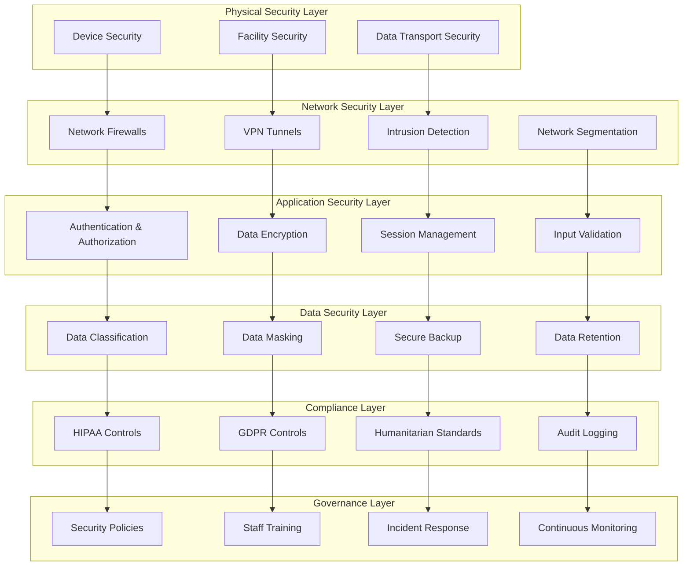

# ZarishHealthcare System - Security and Compliance Framework

## Executive Summary

The ZarishHealthcare System Security and Compliance Framework is specifically designed to address the unique challenges of securing healthcare information systems in humanitarian contexts while maintaining full compliance with international healthcare data protection regulations (HIPAA, GDPR) and humanitarian standards. This comprehensive framework ensures that sensitive healthcare data is protected across all operational environments, from stable clinical facilities to challenging field conditions, while enabling effective humanitarian healthcare delivery.

## 1. Security Architecture Overview

### 1.1 Multi-Layered Security Model for Humanitarian Healthcare



### 1.2 Humanitarian Security Principles

```typescript
// Core security principles for humanitarian healthcare operations
interface HumanitarianSecurityPrinciples {
  // Security must not impede humanitarian mission
  missionFirst: {
    principle: 'security-enables-not-prevents-humanitarian-action';
    implementation: 'adaptive-security-based-on-operational-context';
    examples: ['emergency-override-procedures', 'rapid-deployment-security', 'crisis-response-access'];
  };

  // Multi-jurisdictional compliance
  crossBorderCompliance: {
    principle: 'comply-with-highest-standard-across-jurisdictions';
    implementation: 'unified-compliance-framework';
    standards: ['hipaa-usa', 'gdpr-eu', 'humanitarian-sector-standards'];
  };

  // Field-appropriate security
  contextualSecurity: {
    principle: 'security-measures-appropriate-for-field-conditions';
    implementation: 'adaptive-security-controls';
    contexts: ['refugee-camps', 'conflict-zones', 'disaster-areas', 'remote-locations'];
  };

  // Beneficiary protection priority
  beneficiaryFirst: {
    principle: 'beneficiary-safety-and-privacy-paramount';
    implementation: 'privacy-by-design-humanitarian-context';
    protections: ['data-minimization', 'consent-management', 'cultural-sensitivity'];
  };

  // Organizational transparency
  accountability: {
    principle: 'transparent-security-practices-with-stakeholders';
    implementation: 'open-security-framework-with-confidential-implementation';
    stakeholders: ['beneficiaries', 'partners', 'donors', 'regulators'];
  };
}
```

## 2. HIPAA Compliance Framework

### 2.1 HIPAA Implementation for Humanitarian Healthcare

```typescript
// Comprehensive HIPAA compliance framework for humanitarian operations
class HumanitarianHIPAACompliance {
  private hipaaControls: Map<string, HIPAAControl>;
  private auditLogger: HIPAAAuditLogger;
  private accessManager: HIPAAAccessManager;

  // Initialize HIPAA compliance framework
  async initializeHIPAAFramework(): Promise<HIPAAComplianceFramework> {
    return {
      // Administrative Safeguards
      administrativeSafeguards: {
        securityOfficer: {
          requirement: 'designated-security-officer-for-humanitarian-operations',
          implementation: await this.designateHumanitarianSecurityOfficer(),
          documentation: 'security-officer-responsibilities-humanitarian.md',
          review: 'annual-security-officer-effectiveness-review'
        },

        workforceTraining: {
          requirement: 'comprehensive-hipaa-training-for-humanitarian-staff',
          implementation: await this.developHumanitarianHIPAATraining(),
          topics: [
            'hipaa-fundamentals-humanitarian-context',
            'phi-handling-field-conditions',
            'emergency-access-procedures',
            'cross-border-data-considerations',
            'cultural-sensitivity-privacy'
          ],
          frequency: 'initial-plus-annual-plus-situational',
          tracking: 'comprehensive-training-records-system'
        },

        informationAccessManagement: {
          requirement: 'role-based-access-controls-humanitarian-context',
          implementation: await this.implementHumanitarianAccessControls(),
          roles: [
            'humanitarian-medical-director',
            'field-clinician',
            'community-health-worker',
            'data-manager',
            'program-coordinator',
            'emergency-responder'
          ],
          accessReview: 'quarterly-access-review-with-role-changes',
          emergencyAccess: 'break-glass-emergency-access-procedures'
        },

        contingencyPlan: {
          requirement: 'disaster-recovery-plan-humanitarian-specific',
          implementation: await this.developHumanitarianContingencyPlan(),
          scenarios: [
            'natural-disaster-affecting-operations',
            'conflict-related-evacuation',
            'cyber-attack-on-systems',
            'massive-data-corruption',
            'loss-of-primary-facility'
          ],
          testing: 'semi-annual-disaster-recovery-exercises',
          updates: 'annual-plan-updates-post-incident-updates'
        }
      },

      // Physical Safeguards
      physicalSafeguards: {
        facilityAccessControls: {
          requirement: 'secure-physical-access-humanitarian-facilities',
          implementation: await this.implementFacilityAccessControls(),
          controls: [
            'badge-based-access-system',
            'visitor-management-system',
            'secure-server-room-access',
            'after-hours-access-monitoring'
          ],
          specialConsiderations: [
            'refugee-camp-facility-security',
            'mobile-clinic-physical-security',
            'emergency-response-temporary-facilities'
          ]
        },

        workstationUse: {
          requirement: 'secure-workstation-access-and-usage',
          implementation: await this.implementWorkstationSecurity(),
          controls: [
            'automatic-screen-locks',
            'workstation-location-restrictions',
            'shared-workstation-procedures',
            'mobile-device-security'
          ],
          fieldConsiderations: [
            'tablet-security-in-field-conditions',
            'shared-device-sanitation-procedures',
            'power-management-security-implications'
          ]
        },

        deviceMediaControls: {
          requirement: 'secure-handling-electronic-media',
          implementation: await this.implementMediaControls(),
          controls: [
            'media-encryption-requirements',
            'secure-disposal-procedures',
            'backup-media-security',
            'portable-media-restrictions'
          ],
          tracking: 'complete-media-lifecycle-tracking',
          disposal: 'certified-secure-disposal-procedures'
        }
      },

      // Technical Safeguards
      technicalSafeguards: {
        accessControl: {
          requirement: 'technical-access-control-systems',
          implementation: await this.implementTechnicalAccessControls(),
          uniqueUserIdentification: 'individual-user-accounts-all-systems',
          automaticLogoff: 'configurable-session-timeouts-based-on-risk',
          encryptionDecryption: 'end-to-end-encryption-all-phi-data',
          emergencyProcedures: 'break-glass-emergency-access-technical-controls'
        },

        auditControls: {
          requirement: 'comprehensive-audit-logging-all-phi-access',
          implementation: await this.implementAuditControls(),
          logging: [
            'all-phi-access-create-read-update-delete',
            'authentication-authorization-events',
            'system-administration-activities',
            'emergency-access-usage'
          ],
          retention: 'minimum-6-years-audit-log-retention',
          monitoring: 'real-time-audit-log-monitoring-alerting',
          reporting: 'automated-audit-reports-suspicious-activity'
        },

        integrity: {
          requirement: 'phi-data-integrity-protection',
          implementation: await this.implementIntegrityControls(),
          controls: [
            'cryptographic-hashing-data-integrity',
            'digital-signatures-critical-data',
            'version-control-audit-trails',
            'backup-integrity-verification'
          ],
          monitoring: 'continuous-integrity-monitoring',
          alerting: 'immediate-alerts-integrity-violations'
        },

        transmission: {
          requirement: 'secure-phi-transmission-all-communications',
          implementation: await this.implementTransmissionSecurity(),
          encryption: 'tls-1.3-minimum-all-transmissions',
          networkSecurity: 'vpn-tunnels-untrusted-networks',
          endToEndEncryption: 'application-level-encryption-sensitive-data',
          fieldCommunications: 'satellite-radio-encryption-procedures'
        }
      }
    };
  }
}
```

## 3. GDPR Compliance Framework

### 3.1 GDPR Implementation for Global Humanitarian Operations

```typescript
// Comprehensive GDPR compliance framework for humanitarian healthcare
class HumanitarianGDPRCompliance {
  private gdprControls: Map<string, GDPRControl>;
  private consentManager: GDPRConsentManager;
  private dataProcessor: GDPRDataProcessor;

  // Initialize GDPR compliance framework for humanitarian context
  async initializeGDPRFramework(): Promise<GDPRComplianceFramework> {
    return {
      // Lawful Basis for Processing
      lawfulBasis: {
        // Primary lawful bases for humanitarian healthcare
        vitalInterests: {
          description: 'processing-necessary-protect-vital-interests-data-subject',
          application: 'emergency-healthcare-life-threatening-situations',
          documentation: 'vital-interests-assessment-procedures',
          examples: [
            'emergency-medical-treatment',
            'mass-casualty-response',
            'outbreak-disease-control',
            'emergency-evacuation-medical-needs'
          ],
          limitations: 'not-applicable-routine-healthcare-delivery'
        },

        publicTask: {
          description: 'processing-necessary-performance-public-interest-task',
          application: 'humanitarian-healthcare-delivery-public-health',
          documentation: 'public-task-basis-humanitarian-mandate',
          examples: [
            'refugee-healthcare-provision',
            'public-health-surveillance',
            'humanitarian-needs-assessment',
            'coordination-humanitarian-response'
          ],
          authorization: 'un-mandate-government-authorization-required'
        },

        legitimateInterests: {
          description: 'processing-necessary-legitimate-interests-controller',
          application: 'operational-humanitarian-healthcare-needs',
          documentation: 'legitimate-interests-assessment-lia',
          examples: [
            'healthcare-program-monitoring',
            'beneficiary-outcome-evaluation',
            'operational-efficiency-improvement',
            'fraud-prevention-donor-accountability'
          ],
          balancingTest: 'comprehensive-balancing-test-required'
        },

        consent: {
          description: 'freely-given-specific-informed-unambiguous-consent',
          application: 'non-essential-humanitarian-healthcare-processing',
          documentation: 'consent-management-procedures',
          examples: [
            'research-participation',
            'case-study-documentation',
            'testimonial-collection',
            'marketing-communication'
          ],
          challenges: 'power-imbalance-humanitarian-context-consent-validity'
        }
      },

      // Data Subject Rights in Humanitarian Context
      dataSubjectRights: {
        rightToInformation: {
          implementation: await this.implementRightToInformation(),
          challenges: [
            'language-barriers-refugee-populations',
            'literacy-levels-varied-educational-backgrounds',
            'cultural-adaptation-privacy-concepts',
            'information-delivery-resource-constrained-environments'
          ],
          solutions: [
            'multilingual-privacy-notices',
            'pictorial-visual-privacy-information',
            'community-leader-engagement',
            'simplified-language-privacy-notices'
          ]
        },

        rightOfAccess: {
          implementation: await this.implementRightOfAccess(),
          procedures: [
            'beneficiary-data-access-request-process',
            'identity-verification-humanitarian-context',
            'data-compilation-multiple-systems',
            'secure-data-delivery-field-conditions'
          ],
          timeline: '30-days-with-humanitarian-context-extensions',
          considerations: [
            'illiterate-beneficiaries-verbal-requests',
            'proxy-requests-family-members',
            'deceased-beneficiary-data-requests'
          ]
        },

        rightToRectification: {
          implementation: await this.implementRightToRectification(),
          procedures: [
            'beneficiary-data-correction-request',
            'data-accuracy-verification-process',
            'cross-system-data-correction-propagation',
            'correction-notification-relevant-parties'
          ],
          specialConsiderations: [
            'medical-record-correction-clinical-oversight',
            'historical-data-correction-audit-trail',
            'third-party-data-correction-coordination'
          ]
        },

        rightToErasure: {
          implementation: await this.implementRightToErasure(),
          limitations: [
            'medical-record-retention-legal-requirements',
            'audit-trail-integrity-preservation',
            'public-health-surveillance-obligations',
            'donor-accountability-documentation-needs'
          ],
          procedures: [
            'erasure-request-assessment-process',
            'legal-basis-evaluation-continued-processing',
            'data-anonymization-alternative-erasure',
            'third-party-erasure-notification'
          ]
        }
      }
    };
  }
}
```

## 4. Humanitarian Sector Security Standards

### 4.1 Core Humanitarian Principles Integration

```typescript
// Humanitarian sector-specific security standards implementation
class HumanitarianSectorSecurity {
  
  // Core humanitarian principles in data protection
  async implementHumanitarianPrinciples(): Promise<HumanitarianDataProtectionFramework> {
    return {
      // Humanitarian principles integration
      coreHumanitarianPrinciples: {
        humanity: {
          principle: 'human-suffering-addressed-wherever-found',
          dataProtectionApplication: 'beneficiary-dignity-privacy-protection-paramount',
          implementation: [
            'beneficiary-centered-data-practices',
            'trauma-informed-data-collection',
            'dignity-preserving-data-handling',
            'respectful-data-subject-interaction'
          ]
        },

        neutrality: {
          principle: 'no-political-religious-ideological-sides-hostilities',
          dataProtectionApplication: 'impartial-data-processing-no-discrimination',
          implementation: [
            'non-discriminatory-data-collection',
            'equal-privacy-protection-all-beneficiaries',
            'impartial-data-analysis-reporting',
            'neutral-data-sharing-policies'
          ]
        },

        impartiality: {
          principle: 'assistance-provided-need-priority-urgent-cases',
          dataProtectionApplication: 'data-processing-based-humanitarian-need-only',
          implementation: [
            'need-based-data-collection-prioritization',
            'vulnerability-focused-data-protection',
            'equitable-data-access-service-delivery',
            'priority-protection-most-vulnerable-data'
          ]
        },

        independence: {
          principle: 'autonomous-from-political-economic-military-objectives',
          dataProtectionApplication: 'independent-data-governance-external-pressure',
          implementation: [
            'independent-data-protection-oversight',
            'autonomous-data-processing-decisions',
            'free-from-political-data-manipulation',
            'objective-data-collection-analysis'
          ]
        }
      },

      // Do No Harm principles in data protection
      doNoHarmDataProtection: {
        conflictSensitivity: {
          assessment: 'conflict-sensitivity-analysis-data-activities',
          considerations: [
            'data-collection-community-tensions',
            'data-sharing-conflict-dynamics',
            'data-analysis-bias-conflict-parties',
            'data-publication-conflict-escalation-risk'
          ],
          mitigations: [
            'conflict-sensitive-data-collection-methods',
            'neutral-data-aggregation-reporting',
            'secure-data-handling-conflict-zones',
            'community-consultation-data-activities'
          ]
        },

        beneficiarySafety: {
          assessment: 'beneficiary-safety-impact-assessment-data-processing',
          protections: [
            'anonymization-identifying-information',
            'secure-transmission-hostile-environments',
            'access-control-sensitive-beneficiary-data',
            'location-data-protection-displacement-context'
          ],
          monitoring: 'ongoing-safety-impact-monitoring-data-activities'
        }
      }
    };
  }
}
```

## 5. Multi-Layered Security Architecture

### 5.1 Defense in Depth Strategy

```typescript
// Comprehensive defense-in-depth security architecture
class DefenseInDepthArchitecture {
  
  // Implement comprehensive security layers
  async implementSecurityLayers(): Promise<SecurityLayerArchitecture> {
    return {
      // Layer 1: Physical Security
      physicalSecurity: {
        facilityControls: {
          accessControl: [
            'biometric-access-control-systems',
            'badge-based-facility-access',
            'visitor-management-escort-procedures',
            'after-hours-access-monitoring-logging'
          ],
          environmental: [
            'server-room-environmental-monitoring',
            'fire-suppression-data-center-protection',
            'uninterruptible-power-supply-systems',
            'backup-generator-power-continuity'
          ],
          surveillance: [
            'cctv-monitoring-critical-areas',
            'motion-detection-after-hours-security',
            'access-logging-comprehensive-audit-trail',
            'security-guard-physical-presence-required-areas'
          ]
        },

        deviceSecurity: {
          workstationSecurity: [
            'cable-lock-workstation-physical-security',
            'automatic-screen-lock-inactivity',
            'workstation-positioning-screen-privacy',
            'clean-desk-policy-sensitive-information'
          ],
          mobileDeviceSecurity: [
            'mobile-device-management-mdm-systems',
            'device-encryption-full-disk-encryption',
            'remote-wipe-capability-lost-stolen-devices',
            'strong-authentication-biometric-pin'
          ],
          storageMediaSecurity: [
            'encrypted-usb-drives-approved-only',
            'secure-disposal-electronic-media',
            'media-tracking-lifecycle-management',
            'prohibition-unauthorized-media-usage'
          ]
        }
      },

      // Layer 2: Network Security
      networkSecurity: {
        perimeterDefense: {
          firewalls: [
            'next-generation-firewalls-deep-packet-inspection',
            'web-application-firewalls-waf-protection',
            'network-segmentation-micro-segmentation',
            'intrusion-detection-prevention-systems-idps'
          ],
          vpnSecurity: [
            'multi-factor-authentication-vpn-access',
            'certificate-based-vpn-authentication',
            'split-tunneling-restrictions-security',
            'vpn-connection-monitoring-logging'
          ],
          wirelessSecurity: [
            'wpa3-enterprise-wireless-encryption',
            'certificate-based-wireless-authentication',
            'wireless-intrusion-detection-systems',
            'guest-network-isolation-segmentation'
          ]
        },

        internalNetworkSecurity: {
          segmentation: [
            'vlan-segmentation-network-isolation',
            'zero-trust-network-architecture',
            'micro-segmentation-application-flows',
            'network-access-control-nac-systems'
          ],
          monitoring: [
            'network-traffic-analysis-monitoring',
            'anomaly-detection-network-behavior',
            'security-information-event-management-siem',
            'network-forensics-incident-investigation'
          ]
        }
      },

      // Layer 3: Application Security
      applicationSecurity: {
        authenticationAuthorization: {
          multiFactorAuthentication: [
            'hardware-security-keys-fido2',
            'mobile-authenticator-apps-totp',
            'biometric-authentication-fingerprint-face',
            'risk-based-adaptive-authentication'
          ],
          accessControl: [
            'role-based-access-control-rbac',
            'attribute-based-access-control-abac',
            'principle-least-privilege-enforcement',
            'regular-access-review-certification'
          ],
          sessionManagement: [
            'secure-session-token-generation',
            'session-timeout-inactivity-management',
            'concurrent-session-limits-control',
            'session-fixation-hijacking-protection'
          ]
        },

        applicationHardening: {
          secureCodePractices: [
            'static-application-security-testing-sast',
            'dynamic-application-security-testing-dast',
            'interactive-application-security-testing-iast',
            'software-composition-analysis-sca'
          ],
          inputValidation: [
            'server-side-input-validation-sanitization',
            'parameterized-queries-sql-injection-prevention',
            'cross-site-scripting-xss-prevention',
            'command-injection-prevention-controls'
          ],
          outputEncoding: [
            'context-appropriate-output-encoding',
            'content-security-policy-csp-headers',
            'x-frame-options-clickjacking-protection',
            'secure-http-headers-implementation'
          ]
        }
      },

      // Layer 4: Data Security
      dataSecurity: {
        dataClassification: {
          classificationSchema: [
            'public-data-no-restrictions',
            'internal-data-organization-only',
            'confidential-data-restricted-access',
            'restricted-data-highest-protection'
          ],
          labelingTechnology: [
            'automated-data-classification-tools',
            'data-loss-prevention-dlp-systems',
            'rights-management-systems-rms',
            'data-discovery-classification-engines'
          ]
        },

        dataProtection: {
          encryption: [
            'data-at-rest-encryption-aes-256',
            'data-in-transit-encryption-tls-1.3',
            'data-in-use-encryption-homomorphic',
            'key-management-hardware-security-modules'
          ],
          anonymizationPseudonymization: [
            'statistical-disclosure-control-techniques',
            'k-anonymity-l-diversity-t-closeness',
            'differential-privacy-noise-addition',
            'tokenization-format-preserving-encryption'
          ],
          backupSecurity: [
            'encrypted-backup-storage-systems',
            'offsite-backup-secure-transportation',
            'backup-integrity-verification-testing',
            'backup-restoration-testing-procedures'
          ]
        }
      },

      // Layer 5: Monitoring and Response
      monitoringResponse: {
        securityMonitoring: {
          logManagement: [
            'centralized-log-collection-correlation',
            'security-event-correlation-analysis',
            'anomaly-detection-machine-learning',
            'threat-intelligence-integration-feeds'
          ],
          incidentResponse: [
            'automated-incident-detection-alerting',
            'incident-response-team-procedures',
            'forensic-investigation-capabilities',
            'business-continuity-disaster-recovery'
          ]
        },

        continuousImprovement: {
          vulnerabilityManagement: [
            'automated-vulnerability-scanning-systems',
            'penetration-testing-regular-assessments',
            'patch-management-automated-deployment',
            'configuration-management-security-baselines'
          ],
          securityAssessment: [
            'annual-security-risk-assessments',
            'third-party-security-audits',
            'compliance-assessment-certification',
            'security-metrics-reporting-dashboards'
          ]
        }
      }
    };
  }
}
```

## 6. Incident Response and Business Continuity

### 6.1 Humanitarian-Specific Incident Response

```typescript
// Comprehensive incident response framework for humanitarian operations
class HumanitarianIncidentResponse {
  
  // Implement incident response procedures
  async implementIncidentResponse(): Promise<IncidentResponseFramework> {
    return {
      // Incident classification and response
      incidentClassification: {
        securityIncidentTypes: {
          dataBreaches: [
            'unauthorized-access-beneficiary-data',
            'data-theft-malicious-insider',
            'accidental-data-disclosure-external',
            'system-compromise-data-exfiltration'
          ],
          systemCompromise: [
            'malware-infection-critical-systems',
            'ransomware-attack-data-encryption',
            'advanced-persistent-threat-apt',
            'denial-of-service-attack-availability'
          ],
          physicalSecurity: [
            'unauthorized-facility-access',
            'device-theft-mobile-equipment',
            'social-engineering-staff-manipulation',
            'surveillance-espionage-activities'
          ],
          humanitarianSpecific: [
            'beneficiary-safety-compromise-data-exposure',
            'humanitarian-access-restriction-security',
            'cross-border-data-seizure-authorities',
            'partner-organization-security-breach'
          ]
        },

        severityLevels: {
          critical: {
            definition: 'immediate-threat-life-safety-mission-critical',
            responseTime: 'immediate-response-within-1-hour',
            escalation: 'executive-leadership-external-authorities',
            examples: [
              'beneficiary-location-data-exposed-hostile-actors',
              'medical-records-compromised-persecution-risk',
              'critical-infrastructure-complete-compromise',
              'mass-data-breach-entire-beneficiary-database'
            ]
          },
          high: {
            definition: 'significant-impact-operations-compliance-risk',
            responseTime: 'urgent-response-within-4-hours',
            escalation: 'senior-management-key-stakeholders',
            examples: [
              'financial-data-breach-donor-information',
              'system-outage-critical-healthcare-services',
              'unauthorized-access-sensitive-program-data',
              'malware-infection-multiple-systems'
            ]
          },
          medium: {
            definition: 'moderate-impact-limited-scope-containable',
            responseTime: 'standard-response-within-24-hours',
            escalation: 'incident-response-team-department-heads',
            examples: [
              'single-user-account-compromise',
              'minor-data-quality-integrity-issues',
              'non-critical-system-temporary-outage',
              'policy-violation-staff-member'
            ]
          },
          low: {
            definition: 'minimal-impact-routine-handling-sufficient',
            responseTime: 'routine-response-within-72-hours',
            escalation: 'local-it-support-supervisor-notification',
            examples: [
              'minor-configuration-error-no-data-impact',
              'failed-login-attempts-legitimate-user',
              'routine-security-alert-false-positive',
              'minor-policy-clarification-needed'
            ]
          }
        }
      },

      // Response procedures
      responseProcedures: {
        immediateResponse: {
          detection: [
            'automated-security-monitoring-alerting',
            'user-reported-incident-hotline',
            'partner-organization-incident-notification',
            'routine-audit-anomaly-discovery'
          ],
          containment: [
            'isolate-affected-systems-network-segmentation',
            'disable-compromised-user-accounts',
            'preserve-evidence-forensic-investigation',
            'implement-emergency-access-controls'
          ],
          notification: [
            'internal-incident-response-team-activation',
            'senior-management-immediate-briefing',
            'legal-compliance-team-notification',
            'external-stakeholder-notification-assessment'
          ]
        },

        investigation: {
          forensicProcedures: [
            'evidence-collection-chain-of-custody',
            'system-imaging-memory-dumps',
            'log-analysis-correlation-timeline',
            'malware-analysis-reverse-engineering'
          ],
          rootCauseAnalysis: [
            'technical-analysis-vulnerability-exploitation',
            'process-analysis-control-failures',
            'human-factor-analysis-social-engineering',
            'environmental-factor-analysis-external-threats'
          ]
        },

        remediation: {
          immediateRemediation: [
            'patch-vulnerability-exploited-attack',
            'update-security-controls-prevent-recurrence',
            'restore-systems-clean-backup-images',
            'implement-additional-monitoring-controls'
          ],
          longTermImprovement: [
            'security-architecture-enhancement-lessons-learned',
            'staff-training-awareness-improvement',
            'process-procedure-updates-gaps-identified',
            'third-party-security-assessment-validation'
          ]
        }
      },

      // Humanitarian-specific considerations
      humanitarianConsiderations: {
        beneficiaryProtection: {
          assessment: 'immediate-beneficiary-safety-risk-assessment',
          measures: [
            'enhanced-anonymization-exposed-data',
            'alternative-service-delivery-compromised-systems',
            'community-notification-security-measures',
            'coordination-protection-agencies-high-risk-cases'
          ]
        },

        operationalContinuity: {
          essentialServices: [
            'healthcare-service-continuity-planning',
            'emergency-response-capability-maintenance',
            'coordination-communication-backup-systems',
            'data-recovery-critical-operations'
          ],
          partnerCoordination: [
            'partner-notification-incident-impact',
            'coordinated-response-shared-systems',
            'resource-sharing-incident-response',
            'joint-communication-affected-communities'
          ]
        },

        complianceObligations: {
          regulatoryNotification: [
            'data-protection-authority-breach-notification',
            'healthcare-regulatory-body-notification',
            'donor-contractual-notification-requirements',
            'government-authority-cross-border-incidents'
          ],
          documentation: [
            'comprehensive-incident-documentation',
            'compliance-impact-assessment-reporting',
            'corrective-action-plan-timeline',
            'lessons-learned-best-practice-sharing'
          ]
        }
      }
    };
  }

  // Business continuity for humanitarian operations
  async implementBusinessContinuity(): Promise<BusinessContinuityFramework> {
    return {
      businessImpactAnalysis: {
        criticalProcesses: {
          patientCare: {
            priority: 'highest-priority-life-safety',
            rto: 'recovery-time-objective-1-hour',
            rpo: 'recovery-point-objective-15-minutes',
            dependencies: [
              'electronic-medical-records-access',
              'laboratory-results-reporting',
              'medication-management-systems',
              'emergency-alert-communication'
            ]
          },
          emergencyResponse: {
            priority: 'highest-priority-crisis-management',
            rto: 'recovery-time-objective-30-minutes',
            rpo: 'recovery-point-objective-5-minutes',
            dependencies: [
              'incident-command-communication-systems',
              'resource-allocation-tracking',
              'evacuation-planning-coordination',
              'external-agency-communication'
            ]
          },
          beneficiaryServices: {
            priority: 'high-priority-service-delivery',
            rto: 'recovery-time-objective-4-hours',
            rpo: 'recovery-point-objective-1-hour',
            dependencies: [
              'beneficiary-registration-systems',
              'service-delivery-tracking',
              'needs-assessment-data',
              'referral-coordination-systems'
            ]
          }
        }
      },

      continuityStrategies: {
        technologyResilience: {
          systemRedundancy: [
            'active-active-data-center-configuration',
            'real-time-data-replication-geographically-distributed',
            'automated-failover-systems-minimal-downtime',
            'cloud-based-disaster-recovery-services'
          ],
          dataProtection: [
            'continuous-data-backup-multiple-locations',
            'point-in-time-recovery-granular-restoration',
            'data-integrity-verification-automated-testing',
            'secure-offsite-backup-storage'
          ]
        },

        operationalResilience: {
          alternativeProcesses: [
            'manual-backup-procedures-system-outages',
            'paper-based-emergency-forms',
            'alternative-communication-methods',
            'mobile-service-delivery-capabilities'
          ],
          staffContingency: [
            'cross-training-critical-functions',
            'emergency-staffing-procedures',
            'remote-work-capabilities',
            'third-party-support-agreements'
          ]
        }
      }
    };
  }
}
```

## 7. Security Governance and Compliance Monitoring

### 7.1 Governance Framework

```typescript
// Security governance framework for humanitarian operations
class SecurityGovernance {
  
  // Implement comprehensive security governance
  async implementSecurityGovernance(): Promise<SecurityGovernanceFramework> {
    return {
      // Governance structure
      governanceStructure: {
        securityCommittee: {
          composition: [
            'chief-information-security-officer-ciso',
            'humanitarian-program-director',
            'data-protection-officer-dpo',
            'legal-counsel-compliance',
            'field-operations-representative',
            'beneficiary-representative-community-liaison'
          ],
          responsibilities: [
            'security-policy-approval-updates',
            'security-investment-prioritization',
            'incident-response-oversight-lessons-learned',
            'compliance-monitoring-reporting-board'
          ],
          meetings: 'monthly-meetings-quarterly-strategic-reviews'
        },

        securityRoles: {
          ciso: {
            responsibilities: [
              'overall-security-program-leadership',
              'security-strategy-development-implementation',
              'security-risk-management-oversight',
              'board-executive-security-reporting'
            ]
          },
          dpo: {
            responsibilities: [
              'data-protection-compliance-oversight',
              'privacy-impact-assessment-coordination',
              'data-subject-rights-request-management',
              'privacy-training-awareness-programs'
            ]
          },
          fieldSecurityOfficers: {
            responsibilities: [
              'local-security-implementation-monitoring',
              'cultural-adaptation-security-measures',
              'community-engagement-security-awareness',
              'incident-response-field-level-coordination'
            ]
          }
        }
      },

      // Policy framework
      policyFramework: {
        corePolicies: [
          'information-security-policy-comprehensive',
          'data-protection-privacy-policy-gdpr-compliant',
          'incident-response-policy-humanitarian-specific',
          'business-continuity-policy-field-operations',
          'third-party-security-policy-vendor-management',
          'acceptable-use-policy-staff-contractors'
        ],

        policyManagement: {
          development: 'collaborative-policy-development-stakeholder-input',
          approval: 'formal-approval-process-security-committee',
          distribution: 'multi-language-policy-distribution-all-staff',
          training: 'mandatory-policy-training-acknowledgment',
          review: 'annual-policy-review-update-cycle',
          compliance: 'regular-policy-compliance-monitoring'
        }
      },

      // Risk management
      riskManagement: {
        riskAssessment: {
          methodology: 'iso-27005-risk-assessment-methodology',
          frequency: 'annual-comprehensive-quarterly-updates',
          scope: 'enterprise-wide-including-field-operations',
          stakeholders: 'cross-functional-risk-assessment-teams'
        },

        riskTreatment: {
          options: [
            'risk-mitigation-security-controls-implementation',
            'risk-acceptance-formal-acceptance-documentation',
            'risk-transfer-insurance-third-party-contracts',
            'risk-avoidance-process-technology-changes'
          ],
          prioritization: 'risk-based-prioritization-business-impact',
          monitoring: 'continuous-risk-monitoring-key-indicators'
        }
      }
    };
  }

  // Compliance monitoring and reporting
  async implementComplianceMonitoring(): Promise<ComplianceMonitoringFramework> {
    return {
      complianceProgram: {
        complianceFrameworks: [
          'hipaa-healthcare-data-protection',
          'gdpr-personal-data-protection',
          'iso-27001-information-security-management',
          'humanitarian-sector-standards-sphere-chs',
          'donor-specific-compliance-requirements'
        ],

        monitoringActivities: {
          continuousMonitoring: [
            'automated-compliance-monitoring-tools',
            'real-time-policy-violation-detection',
            'security-control-effectiveness-monitoring',
            'key-performance-indicator-tracking'
          ],
          periodicAssessments: [
            'quarterly-compliance-self-assessments',
            'annual-third-party-compliance-audits',
            'vulnerability-assessments-penetration-testing',
            'business-process-compliance-reviews'
          ]
        }
      },

      reportingFramework: {
        internalReporting: {
          executiveReporting: [
            'monthly-security-dashboard-metrics',
            'quarterly-compliance-status-reports',
            'annual-security-program-effectiveness-review',
            'incident-response-lessons-learned-reports'
          ],
          operationalReporting: [
            'daily-security-operations-center-reports',
            'weekly-vulnerability-management-status',
            'monthly-access-review-certification-reports',
            'quarterly-training-completion-status'
          ]
        },

        externalReporting: {
          regulatoryReporting: [
            'hipaa-compliance-annual-reports',
            'gdpr-breach-notification-requirements',
            'data-protection-authority-annual-reports',
            'healthcare-regulatory-compliance-reports'
          ],
          stakeholderReporting: [
            'donor-compliance-reports-funding-requirements',
            'partner-organization-security-status-reports',
            'beneficiary-community-privacy-protection-updates',
            'board-governance-security-oversight-reports'
          ]
        }
      }
    };
  }
}
```

## 8. Training and Awareness Program

### 8.1 Security Training Framework

```typescript
// Comprehensive security training program for humanitarian staff
class SecurityTrainingProgram {
  
  // Implement security awareness and training
  async implementSecurityTraining(): Promise<SecurityTrainingFramework> {
    return {
      trainingProgram: {
        coreTrainingModules: {
          generalSecurityAwareness: {
            target: 'all-staff-contractors-volunteers',
            duration: '2-hours-initial-1-hour-annual-refresher',
            delivery: 'online-interactive-multilingual-modules',
            topics: [
              'security-fundamentals-humanitarian-context',
              'password-security-multi-factor-authentication',
              'phishing-social-engineering-recognition',
              'physical-security-device-protection',
              'incident-reporting-procedures'
            ],
            assessment: 'mandatory-assessment-80-percent-pass-rate'
          },

          dataProtectionPrivacy: {
            target: 'staff-with-personal-data-access',
            duration: '4-hours-initial-2-hours-annual-refresher',
            delivery: 'instructor-led-case-study-based-training',
            topics: [
              'gdpr-hipaa-requirements-humanitarian-context',
              'data-subject-rights-request-handling',
              'consent-management-power-imbalance-considerations',
              'data-sharing-third-party-agreements',
              'breach-notification-requirements-procedures'
            ],
            certification: 'data-protection-certification-required'
          },

          fieldSecurityOperations: {
            target: 'field-staff-mobile-operations',
            duration: '6-hours-initial-3-hours-annual-refresher',
            delivery: 'hands-on-practical-field-simulation',
            topics: [
              'mobile-device-security-field-conditions',
              'secure-communication-hostile-environments',
              'data-collection-security-vulnerable-populations',
              'emergency-data-protection-procedures',
              'cultural-sensitivity-data-handling'
            ],
            practicalAssessment: 'field-simulation-practical-assessment'
          }
        },

        roleSpecificTraining: {
          clinicalStaff: {
            additionalTopics: [
              'patient-data-confidentiality-clinical-context',
              'electronic-health-record-security-best-practices',
              'telemedicine-security-remote-consultations',
              'medical-device-security-iot-healthcare'
            ]
          },
          dataAnalysts: {
            additionalTopics: [
              'statistical-disclosure-control-techniques',
              'data-anonymization-pseudonymization-methods',
              'secure-data-analysis-environments',
              'research-ethics-data-protection'
            ]
          },
          itStaff: {
            additionalTopics: [
              'secure-system-administration-practices',
              'vulnerability-management-patch-deployment',
              'incident-response-technical-procedures',
              'security-monitoring-threat-detection'
            ]
          }
        }
      },

      awarenessProgram: {
        campaigns: {
          monthlySecurityTips: [
            'password-security-best-practices',
            'phishing-email-identification',
            'social-media-security-privacy',
            'travel-security-data-protection'
          ],
          quarterlySecurityUpdates: [
            'emerging-threat-landscape-humanitarian-sector',
            'new-security-tools-technologies',
            'lessons-learned-security-incidents',
            'policy-updates-compliance-requirements'
          ],
          annualSecurityWeek: [
            'interactive-security-workshops',
            'tabletop-exercises-incident-response',
            'security-vendor-demonstrations',
            'beneficiary-privacy-protection-focus'
          ]
        },

        communicationChannels: [
          'internal-newsletter-security-section',
          'intranet-security-resource-center',
          'mobile-app-security-notifications',
          'field-office-security-bulletin-boards'
        ]
      }
    };
  }
}
```

## 9. Technology Implementation Guidelines

### 9.1 Security Technology Stack

```typescript
// Security technology implementation for humanitarian healthcare systems
class SecurityTechnologyImplementation {
  
  // Implement security technology stack
  async implementSecurityTechnology(): Promise<SecurityTechnologyStack> {
    return {
      // Core security technologies
      coreTechnologies: {
        identityAccessManagement: {
          platform: 'keycloak-open-source-iam-platform',
          features: [
            'single-sign-on-sso-all-applications',
            'multi-factor-authentication-hardware-tokens',
            'role-based-access-control-fine-grained',
            'identity-federation-partner-organizations'
          ],
          integration: 'ldap-active-directory-integration',
          scalability: 'horizontally-scalable-kubernetes-deployment'
        },

        encryptionKeyManagement: {
          platform: 'hashicorp-vault-key-management',
          features: [
            'centralized-key-management-rotation',
            'secrets-management-api-keys-certificates',
            'encryption-as-a-service-application-integration',
            'audit-logging-key-access-usage'
          ],
          deployment: 'high-availability-clustered-deployment',
          integration: 'application-database-integration-apis'
        },

        securityMonitoring: {
          siem: 'elastic-security-siem-solution',
          features: [
            'centralized-log-collection-analysis',
            'machine-learning-anomaly-detection',
            'threat-intelligence-integration-feeds',
            'automated-incident-response-orchestration'
          ],
          deployment: 'cloud-native-scalable-architecture',
          retention: '7-years-log-retention-compliance'
        }
      },

      // Data protection technologies
      dataProtectionTech: {
        databaseEncryption: {
          atRest: 'transparent-data-encryption-tde-postgresql',
          inTransit: 'ssl-tls-encrypted-connections',
          keyManagement: 'external-key-management-vault-integration',
          performance: 'minimal-performance-impact-optimization'
        },

        applicationEncryption: {
          fieldLevel: 'field-level-encryption-sensitive-data',
          searchable: 'searchable-encryption-encrypted-queries',
          tokenization: 'format-preserving-tokenization',
          clientSide: 'client-side-encryption-zero-knowledge'
        },

        dataMasking: {
          staticMasking: 'production-data-masking-testing-environments',
          dynamicMasking: 'real-time-data-masking-role-based',
          subsetting: 'data-subsetting-referential-integrity',
          synthetic: 'synthetic-data-generation-testing'
        }
      },

      // Network security technologies
      networkSecurityTech: {
        firewallSystems: {
          nextGenFirewalls: 'palo-alto-fortinet-enterprise-firewalls',
          webAppFirewalls: 'cloudflare-aws-waf-protection',
          microSegmentation: 'zero-trust-network-segmentation',
          threatPrevention: 'intrusion-prevention-anti-malware'
        },

        networkMonitoring: {
          networkDetectionResponse: 'darktrace-vectra-ndr-solutions',
          flowAnalysis: 'netflow-sflow-network-traffic-analysis',
          packetCapture: 'full-packet-capture-forensic-analysis',
          anomalyDetection: 'ml-based-network-anomaly-detection'
        }
      },

      // Endpoint security technologies
      endpointSecurityTech: {
        endpointProtection: {
          platform: 'crowdstrike-carbon-black-edr-platform',
          features: [
            'real-time-threat-detection-response',
            'behavioral-analysis-zero-day-protection',
            'memory-protection-exploit-prevention',
            'threat-hunting-proactive-investigation'
          ],
          management: 'centralized-management-console',
          automation: 'automated-response-threat-containment'
        },

        mobileDeviceManagement: {
          platform: 'microsoft-intune-vmware-workspace-one',
          features: [
            'device-enrollment-automatic-configuration',
            'application-management-app-wrapping',
            'conditional-access-risk-based-policies',
            'remote-wipe-selective-data-deletion'
          ],
          byod: 'bring-your-own-device-containerization',
          compliance: 'device-compliance-policy-enforcement'
        }
      }
    };
  }
}
```

## 10. Implementation Roadmap

### 10.1 Phased Security Implementation

The security and compliance framework implementation follows a structured, phased approach:

#### Phase 1: Foundation (Months 1-3)
- **Core Infrastructure Security**: Basic firewalls, VPN, and network segmentation
- **Identity and Access Management**: User authentication and role-based access controls
- **Policy Framework**: Development and approval of core security policies
- **Basic Training**: General security awareness training for all staff

#### Phase 2: Compliance (Months 4-6)
- **HIPAA Implementation**: Administrative, physical, and technical safeguards
- **GDPR Compliance**: Data protection controls and consent management
- **Audit Systems**: Comprehensive logging and monitoring implementation
- **Incident Response**: Basic incident response procedures and team establishment

#### Phase 3: Advanced Protection (Months 7-9)
- **Advanced Threat Detection**: SIEM implementation and threat intelligence integration
- **Data Protection**: Encryption, anonymization, and data loss prevention
- **Humanitarian Standards**: Sector-specific security measures and Do No Harm principles
- **Partner Integration**: Security requirements for humanitarian partners

#### Phase 4: Optimization (Months 10-12)
- **Continuous Monitoring**: Automated compliance monitoring and reporting
- **Advanced Analytics**: Security analytics and machine learning threat detection
- **Business Continuity**: Comprehensive disaster recovery and business continuity
- **Mature Governance**: Full security governance and risk management framework

### 10.2 Success Metrics and KPIs

```typescript
// Key performance indicators for security program effectiveness
interface SecurityKPIs {
  // Compliance metrics
  complianceMetrics: {
    hipaaCompliance: 'percentage-hipaa-controls-implemented';
    gdprCompliance: 'percentage-gdpr-requirements-met';
    auditFindings: 'number-critical-high-audit-findings';
    policyCompliance: 'percentage-staff-policy-compliance-training';
  };

  // Security metrics
  securityMetrics: {
    incidentResponseTime: 'average-time-incident-detection-containment';
    vulnerabilityRemediation: 'percentage-critical-vulnerabilities-patched-30-days';
    securityTraining: 'percentage-staff-completed-security-training';
    accessReview: 'percentage-user-access-reviewed-quarterly';
  };

  // Operational metrics
  operationalMetrics: {
    systemAvailability: 'percentage-system-uptime-availability';
    dataIntegrity: 'percentage-data-integrity-verification-passed';
    backupSuccess: 'percentage-successful-backup-operations';
    recoveryTesting: 'number-disaster-recovery-tests-conducted';
  };

  // Humanitarian-specific metrics
  humanitarianMetrics: {
    beneficiaryPrivacy: 'number-beneficiary-privacy-incidents';
    culturalSensitivity: 'percentage-culturally-appropriate-data-practices';
    fieldSecurity: 'number-field-security-incidents-reported';
    partnerCompliance: 'percentage-partners-meeting-security-requirements';
  };
}
```

This comprehensive Security and Compliance Framework provides the foundation for protecting sensitive healthcare data in humanitarian contexts while maintaining full compliance with international regulations and sector-specific standards. The framework balances robust security measures with the practical needs of humanitarian operations, ensuring that security enables rather than impedes the delivery of life-saving healthcare services to vulnerable populations.