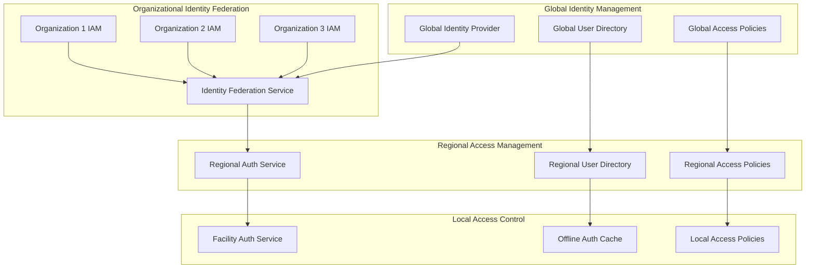

# ZarishHealthcare System - User Management and Role-Based Access Control

## Executive Summary

The ZarishHealthcare System User Management and Role-Based Access Control (RBAC) framework is specifically designed for the complex multi-organizational humanitarian healthcare environment. This comprehensive strategy addresses the unique challenges of managing user access across diverse stakeholders, from global coordinators to community health workers, while maintaining strict security, privacy, and compliance standards appropriate for humanitarian contexts.

## 1. User Management Architecture Overview

### 1.1 Multi-Tier User Management Model



### 1.2 Humanitarian User Categories

```typescript
// Comprehensive user categorization for humanitarian healthcare
interface HumanitarianUserCategories {
  // Global coordination users
  globalCoordination: {
    executiveLeadership: {
      roles: ['global-humanitarian-director', 'regional-program-director', 'donor-relations-director'];
      access: 'global-read-aggregate-data-strategic-reporting';
      restrictions: 'no-individual-patient-data-access';
      specialPrivileges: ['emergency-override-authorization', 'global-policy-management'];
    };
    
    technicalLeadership: {
      roles: ['global-technical-director', 'security-officer', 'compliance-officer'];
      access: 'system-administration-security-compliance-management';
      restrictions: 'audit-logged-administrative-access-only';
      specialPrivileges: ['system-configuration', 'security-incident-response', 'compliance-reporting'];
    };
  };

  // Regional coordination users
  regionalCoordination: {
    regionalManagers: {
      roles: ['regional-health-coordinator', 'regional-operations-manager', 'regional-data-manager'];
      access: 'regional-aggregated-data-cross-country-coordination';
      restrictions: 'region-specific-data-access-only';
      specialPrivileges: ['regional-policy-override', 'inter-country-coordination'];
    };
    
    technicalSupport: {
      roles: ['regional-system-administrator', 'regional-data-analyst', 'regional-trainer'];
      access: 'regional-system-administration-user-support';
      restrictions: 'technical-support-scope-only';
      specialPrivileges: ['user-account-management', 'training-coordination'];
    };
  };

  // Country-level users
  countryLevel: {
    countryManagement: {
      roles: ['country-director', 'health-program-manager', 'operations-manager'];
      access: 'country-wide-program-data-operational-oversight';
      restrictions: 'country-boundary-data-access';
      specialPrivileges: ['country-policy-adaptation', 'facility-coordination'];
    };
    
    healthSystemIntegration: {
      roles: ['ministry-of-health-liaison', 'national-health-coordinator', 'government-data-manager'];
      access: 'population-health-data-government-reporting';
      restrictions: 'anonymized-data-government-reporting-only';
      specialPrivileges: ['government-system-integration', 'regulatory-compliance'];
    };
  };

  // Healthcare delivery users
  healthcareDelivery: {
    medicalStaff: {
      roles: ['medical-director', 'physician', 'nurse', 'midwife', 'clinical-officer'];
      access: 'full-patient-clinical-data-care-delivery';
      restrictions: 'assigned-patient-care-scope-only';
      specialPrivileges: ['clinical-decision-support', 'emergency-access'];
    };
    
    supportStaff: {
      roles: ['pharmacist', 'laboratory-technician', 'radiology-technician', 'counselor'];
      access: 'specialty-specific-patient-data';
      restrictions: 'professional-scope-practice-only';
      specialPrivileges: ['specialty-clinical-protocols', 'quality-assurance'];
    };
    
    administrativeStaff: {
      roles: ['facility-manager', 'registration-clerk', 'data-clerk', 'logistics-coordinator'];
      access: 'administrative-operational-data-limited-clinical';
      restrictions: 'administrative-function-scope-only';
      specialPrivileges: ['facility-operations', 'resource-coordination'];
    };
  };

  // Community-level users
  communityLevel: {
    communityHealthWorkers: {
      roles: ['community-health-volunteer', 'peer-educator', 'community-mobilizer'];
      access: 'community-health-education-basic-screening-data';
      restrictions: 'community-assignment-geographic-scope';
      specialPrivileges: ['community-engagement', 'health-education'];
    };
    
    communityLeaders: {
      roles: ['community-leader-liaison', 'religious-leader-health', 'women-group-leader'];
      access: 'community-health-statistics-education-materials';
      restrictions: 'aggregated-community-data-no-individual-identifiers';
      specialPrivileges: ['community-coordination', 'cultural-consultation'];
    };
  };

  // Emergency response users
  emergencyResponse: {
    emergencyCoordinators: {
      roles: ['emergency-response-coordinator', 'incident-commander', 'emergency-medical-team-leader'];
      access: 'emergency-patient-data-coordination-information';
      restrictions: 'emergency-duration-scope-only';
      specialPrivileges: ['emergency-override', 'rapid-deployment', 'crisis-coordination'];
    };
    
    firstResponders: {
      roles: ['paramedic', 'emergency-nurse', 'search-rescue-medic'];
      access: 'emergency-medical-information-triage-data';
      restrictions: 'emergency-medical-scope-only';
      specialPrivileges: ['emergency-medical-protocols', 'rapid-assessment'];
    };
  };

  // Partner organization users
  partnerOrganizations: {
    partnerStaff: {
      roles: ['partner-program-manager', 'partner-medical-staff', 'partner-data-coordinator'];
      access: 'shared-program-data-coordination-information';
      restrictions: 'partnership-agreement-defined-scope';
      specialPrivileges: ['inter-organization-coordination', 'data-sharing'];
    };
    
    donorRepresentatives: {
      roles: ['donor-program-officer', 'donor-monitoring-evaluation-specialist'];
      access: 'program-performance-data-impact-metrics';
      restrictions: 'anonymized-aggregate-data-only';
      specialPrivileges: ['program-monitoring', 'impact-assessment'];
    };
  };
}
```

## 2. Role-Based Access Control Framework

### 2.1 Hierarchical Role Structure

```typescript
// Comprehensive RBAC framework for humanitarian healthcare
class HumanitarianRBACFramework {
  
  async implementHierarchicalRoles(): Promise<HierarchicalRoleFramework> {
    return {
      // Role hierarchy definition
      roleHierarchy: {
        // Executive tier roles
        executiveTier: {
          globalHumanitarianDirector: {
            level: 'executive-1-global';
            inheritsFrom: null;
            permissions: [
              'global-strategic-overview-access',
              'cross-organization-coordination-authority',
              'emergency-response-authorization',
              'policy-exception-approval'
            ];
            restrictions: [
              'no-individual-patient-data-access',
              'aggregated-data-only',
              'audit-logged-access-required'
            ];
            dataScope: 'global-aggregated-anonymized';
          };
          
          regionalProgramDirector: {
            level: 'executive-2-regional';
            inheritsFrom: null;
            permissions: [
              'regional-strategic-oversight',
              'cross-country-coordination',
              'regional-resource-allocation',
              'partnership-management'
            ];
            restrictions: [
              'regional-boundary-limitations',
              'no-individual-patient-data',
              'management-level-aggregation-only'
            ];
            dataScope: 'regional-aggregated-anonymized';
          };
        },

        // Management tier roles
        managementTier: {
          countryProgramManager: {
            level: 'management-1-country';
            inheritsFrom: ['regionalProgramDirector'];
            permissions: [
              'country-program-oversight',
              'facility-coordination',
              'staff-management',
              'government-liaison'
            ];
            restrictions: [
              'country-boundary-limitations',
              'facility-level-aggregation',
              'no-individual-clinical-details'
            ];
            dataScope: 'country-facility-aggregated';
          };
          
          facilityManager: {
            level: 'management-2-facility';
            inheritsFrom: ['countryProgramManager'];
            permissions: [
              'facility-operations-management',
              'staff-scheduling-coordination',
              'resource-inventory-management',
              'quality-assurance-oversight'
            ];
            restrictions: [
              'facility-boundary-limitations',
              'operational-data-focus',
              'limited-clinical-data-access'
            ];
            dataScope: 'facility-operational-limited-clinical';
          };
        },

        // Clinical tier roles
        clinicalTier: {
          medicalDirector: {
            level: 'clinical-1-senior';
            inheritsFrom: ['facilityManager'];
            permissions: [
              'clinical-protocol-management',
              'clinical-staff-supervision',
              'complex-case-consultation',
              'clinical-quality-assurance'
            ];
            restrictions: [
              'professional-medical-scope',
              'clinical-oversight-authority',
              'patient-safety-priority'
            ];
            dataScope: 'full-clinical-data-professional-scope';
          };
          
          physician: {
            level: 'clinical-2-attending';
            inheritsFrom: ['medicalDirector'];
            permissions: [
              'patient-diagnosis-treatment',
              'clinical-documentation',
              'medication-prescription',
              'clinical-decision-support'
            ];
            restrictions: [
              'assigned-patient-care-only',
              'clinical-scope-of-practice',
              'professional-medical-ethics'
            ];
            dataScope: 'assigned-patient-full-clinical-data';
          };
          
          nurse: {
            level: 'clinical-3-care-delivery';
            inheritsFrom: ['physician'];
            permissions: [
              'patient-assessment-monitoring',
              'medication-administration',
              'care-plan-implementation',
              'patient-education'
            ];
            restrictions: [
              'nursing-scope-of-practice',
              'assigned-patient-care',
              'physician-collaboration-required-advanced-procedures'
            ];
            dataScope: 'assigned-patient-nursing-relevant-data';
          };
        },

        // Support tier roles
        supportTier: {
          pharmacist: {
            level: 'support-1-specialist';
            inheritsFrom: null;
            permissions: [
              'medication-dispensing',
              'pharmaceutical-consultation',
              'drug-interaction-monitoring',
              'inventory-management'
            ];
            restrictions: [
              'pharmacy-scope-of-practice',
              'medication-related-data-only',
              'clinical-collaboration-required'
            ];
            dataScope: 'patient-medication-relevant-data';
          };
          
          laboratoryTechnician: {
            level: 'support-2-technical';
            inheritsFrom: null;
            permissions: [
              'laboratory-test-processing',
              'quality-control-procedures',
              'equipment-maintenance',
              'result-documentation'
            ];
            restrictions: [
              'laboratory-scope-only',
              'test-related-data-access',
              'quality-assurance-compliance'
            ];
            dataScope: 'patient-laboratory-relevant-data';
          };
        },

        // Community tier roles
        communityTier: {
          communityHealthWorker: {
            level: 'community-1-frontline';
            inheritsFrom: null;
            permissions: [
              'community-health-screening',
              'health-education-delivery',
              'basic-health-monitoring',
              'referral-coordination'
            ];
            restrictions: [
              'community-assignment-geographic',
              'basic-health-data-only',
              'referral-required-advanced-care'
            ];
            dataScope: 'community-basic-health-screening-data';
          };
        },

        // System administration tier roles
        systemAdminTier: {
          globalSystemAdministrator: {
            level: 'admin-1-global';
            inheritsFrom: null;
            permissions: [
              'global-system-administration',
              'security-configuration-management',
              'user-access-management',
              'system-monitoring-maintenance'
            ];
            restrictions: [
              'administrative-function-only',
              'no-clinical-data-access',
              'audit-logged-activities'
            ];
            dataScope: 'system-administrative-data-only';
          };
        }
      }
    };
  }

  // Permission-based access control
  async implementPermissionBasedAccess(): Promise<PermissionBasedAccessFramework> {
    return {
      // Core permission categories
      permissionCategories: {
        // Patient data permissions
        patientDataPermissions: {
          patientRead: {
            description: 'read-access-patient-demographic-information';
            granularity: ['basic-demographics', 'contact-information', 'emergency-contacts'];
            conditions: ['assigned-care-relationship', 'professional-need-to-know'];
            auditRequired: true;
          };
          
          patientWrite: {
            description: 'write-access-patient-demographic-information';
            granularity: ['demographic-updates', 'contact-updates', 'consent-management'];
            conditions: ['data-entry-authorization', 'patient-consent-verified'];
            auditRequired: true;
          };
          
          clinicalDataRead: {
            description: 'read-access-patient-clinical-information';
            granularity: ['medical-history', 'diagnoses', 'treatments', 'medications'];
            conditions: ['clinical-care-relationship', 'professional-scope-practice'];
            auditRequired: true;
          };
          
          clinicalDataWrite: {
            description: 'write-access-patient-clinical-information';
            granularity: ['clinical-assessments', 'diagnoses', 'treatment-plans', 'medications'];
            conditions: ['clinical-authority', 'professional-credentials', 'scope-practice'];
            auditRequired: true;
          };
          
          sensitiveDataAccess: {
            description: 'access-sensitive-patient-information';
            granularity: ['mental-health-data', 'reproductive-health', 'hiv-status', 'substance-abuse'];
            conditions: ['explicit-patient-consent', 'specialized-care-relationship', 'enhanced-authorization'];
            auditRequired: true;
            encryptionRequired: true;
          };
        },

        // System administration permissions
        systemAdminPermissions: {
          userManagement: {
            description: 'manage-user-accounts-access-permissions';
            granularity: ['user-creation', 'permission-assignment', 'account-deactivation'];
            conditions: ['administrative-authority', 'security-clearance'];
            auditRequired: true;
          };
          
          systemConfiguration: {
            description: 'configure-system-settings-parameters';
            granularity: ['application-configuration', 'security-settings', 'integration-parameters'];
            conditions: ['technical-authority', 'change-management-approval'];
            auditRequired: true;
          };
          
          securityManagement: {
            description: 'manage-security-policies-controls';
            granularity: ['access-policies', 'security-rules', 'encryption-keys'];
            conditions: ['security-officer-role', 'security-clearance'];
            auditRequired: true;
            encryptionRequired: true;
          };
        },

        // Operational permissions
        operationalPermissions: {
          facilityOperations: {
            description: 'manage-facility-operations-resources';
            granularity: ['resource-allocation', 'staff-scheduling', 'inventory-management'];
            conditions: ['facility-management-role', 'operational-authority'];
            auditRequired: false;
          };
          
          reportingAnalytics: {
            description: 'access-reporting-analytics-dashboards';
            granularity: ['operational-reports', 'clinical-statistics', 'performance-metrics'];
            conditions: ['reporting-authorization', 'data-access-agreement'];
            auditRequired: true;
          };
          
          coordinationCommunication: {
            description: 'coordinate-communicate-stakeholders';
            granularity: ['inter-facility-coordination', 'partner-communication', 'donor-reporting'];
            conditions: ['coordination-role', 'communication-authorization'];
            auditRequired: false;
          };
        },

        // Emergency response permissions
        emergencyPermissions: {
          emergencyOverride: {
            description: 'emergency-override-access-controls';
            granularity: ['emergency-patient-access', 'crisis-coordination', 'resource-override'];
            conditions: ['emergency-declaration', 'authorized-responder', 'life-safety-justification'];
            auditRequired: true;
            temporaryAccess: true;
            approvalRequired: true;
          };
          
          rapidDeployment: {
            description: 'rapid-deployment-emergency-response';
            granularity: ['emergency-setup', 'crisis-configuration', 'temporary-authorization'];
            conditions: ['emergency-response-team', 'deployment-authorization'];
            auditRequired: true;
            temporaryAccess: true;
          };
        }
      }
    };
  }
}
```

### 2.2 Attribute-Based Access Control (ABAC)

```typescript
// Attribute-based access control for complex humanitarian scenarios
class HumanitarianABACFramework {
  
  async implementABACPolicies(): Promise<ABACFramework> {
    return {
      // Attribute categories for access decisions
      attributeCategories: {
        // User attributes
        userAttributes: {
          identity: ['user-id', 'employee-id', 'professional-license-number'];
          organization: ['employing-organization', 'partner-organization', 'volunteer-status'];
          role: ['primary-role', 'secondary-roles', 'temporary-assignments'];
          location: ['current-location', 'assigned-facility', 'geographic-scope'];
          credentials: ['professional-certifications', 'security-clearance', 'training-completion'];
          temporal: ['employment-start-date', 'assignment-duration', 'access-expiry'];
        },

        // Resource attributes
        resourceAttributes: {
          dataType: ['patient-data', 'operational-data', 'system-configuration', 'reporting-data'];
          sensitivity: ['public', 'internal', 'confidential', 'restricted'];
          dataSubject: ['patient-id', 'facility-id', 'organization-id', 'program-id'];
          geographic: ['country', 'region', 'facility', 'community'];
          temporal: ['creation-date', 'last-modified', 'retention-period', 'access-window'];
          purpose: ['direct-care', 'coordination', 'reporting', 'research', 'quality-assurance'];
        },

        // Environment attributes
        environmentAttributes: {
          location: ['access-location', 'network-location', 'device-location'];
          time: ['access-time', 'business-hours', 'emergency-period'];
          network: ['network-security-level', 'connection-type', 'bandwidth-available'];
          device: ['device-type', 'device-security-status', 'device-compliance'];
          context: ['emergency-declared', 'crisis-mode', 'maintenance-window'];
        },

        // Contextual attributes
        contextualAttributes: {
          careRelationship: ['assigned-patient', 'consulting-physician', 'care-team-member'];
          operationalNeed: ['direct-care-provision', 'coordination-required', 'administrative-function'];
          emergencyContext: ['emergency-declared', 'mass-casualty-event', 'evacuation-in-progress'];
          culturalContext: ['cultural-sensitivity-required', 'gender-appropriate-access', 'religious-considerations'];
          legalContext: ['consent-obtained', 'legal-guardian-approval', 'court-order-present'];
        }
      },

      // ABAC policy engine
      policyEngine: {
        // Core access policies
        coreAccessPolicies: {
          clinicalDataAccess: {
            policy: `
              PERMIT IF (
                user.role IN ['physician', 'nurse', 'clinical-officer'] AND
                user.organization = resource.facility_organization AND
                resource.type = 'patient-clinical-data' AND
                (
                  careRelationship.assignedPatient = resource.patient_id OR
                  careRelationship.careTeamMember = resource.patient_id OR
                  context.emergencyDeclared = true
                ) AND
                user.credentials.contains('clinical-authorization') AND
                environment.location.facility = user.assignedFacility AND
                NOT resource.sensitivity = 'restricted-consent-required'
              )
            `;
            description: 'clinical-staff-access-patient-data-care-delivery';
          };
          
          sensitiveDataAccess: {
            policy: `
              PERMIT IF (
                user.role IN ['physician', 'specialized-counselor'] AND
                user.organization = resource.facility_organization AND
                resource.type = 'patient-sensitive-data' AND
                careRelationship.explicitConsentObtained = true AND
                user.credentials.contains('specialized-care-authorization') AND
                resource.consentStatus = 'explicit-consent-granted' AND
                environment.time WITHIN resource.consent_valid_period AND
                auditLog.recordAccess(user, resource, 'sensitive-data-access')
              )
            `;
            description: 'specialized-access-sensitive-patient-data-explicit-consent';
          };
          
          emergencyOverrideAccess: {
            policy: `
              PERMIT IF (
                user.role IN ['emergency-physician', 'emergency-coordinator'] AND
                context.emergencyDeclared = true AND
                context.emergencyType IN ['life-threatening', 'mass-casualty', 'disaster-response'] AND
                user.credentials.contains('emergency-response-authorization') AND
                emergencyDeclaration.authorizedBy IN ['medical-director', 'emergency-coordinator'] AND
                temporalAccess.duration <= '24-hours' AND
                auditLog.recordEmergencyAccess(user, resource, context.emergencyJustification)
              )
            `;
            description: 'emergency-override-access-life-safety-situations';
          };
          
          crossOrganizationDataSharing: {
            policy: `
              PERMIT IF (
                user.organization IN partnershipAgreement.authorizedOrganizations AND
                resource.sharingAgreement.includes(user.organization) AND
                resource.type IN ['aggregated-data', 'coordination-data'] AND
                resource.sensitivity NOT IN ['restricted', 'patient-identifiable'] AND
                dataGovernance.crossOrgSharingApproved = true AND
                user.credentials.contains('inter-org-coordination-authorization') AND
                auditLog.recordCrossOrgAccess(user, resource, 'partnership-coordination')
              )
            `;
            description: 'cross-organization-data-sharing-partnership-coordination';
          };
        },

        // Dynamic policy evaluation
        dynamicPolicyEvaluation: {
          riskBasedAccess: {
            description: 'risk-based-dynamic-access-control';
            factors: [
              'user-risk-score-behavioral-analysis',
              'resource-sensitivity-classification',
              'environment-risk-assessment-location-time',
              'contextual-risk-factors-emergency-routine'
            ];
            evaluation: 'real-time-risk-assessment-access-decision';
          };
          
          adaptiveAuthentication: {
            description: 'adaptive-authentication-risk-context';
            factors: [
              'user-normal-behavior-patterns',
              'access-location-usual-locations',
              'device-recognition-trusted-devices',
              'time-patterns-normal-access-hours'
            ];
            evaluation: 'dynamic-authentication-requirements-risk-level';
          };
        }
      }
    };
  }
}
```

## 3. Identity and Authentication Framework

### 3.1 Multi-Factor Authentication Strategy

```typescript
// Comprehensive multi-factor authentication for humanitarian environments
class HumanitarianMFAFramework {
  
  async implementMFAStrategy(): Promise<MFAFramework> {
    return {
      // Authentication factor categories
      authenticationFactors: {
        // Knowledge factors (something you know)
        knowledgeFactors: {
          passwords: {
            requirements: [
              'minimum-12-characters-complex-password',
              'passphrase-support-low-literacy-users',
              'multi-language-support-local-languages',
              'password-manager-integration-recommended'
            ];
            policies: [
              'password-expiry-90-days-sensitive-roles',
              'password-history-prevent-reuse-last-12',
              'account-lockout-5-failed-attempts',
              'password-complexity-cultural-appropriateness'
            ];
            recovery: [
              'secure-password-recovery-identity-verification',
              'temporary-password-generation-secure-delivery',
              'password-reset-administrative-approval-high-privilege'
            ];
          };
          
          securityQuestions: {
            culturalAdaptation: 'culturally-appropriate-security-questions';
            multilingual: 'security-questions-local-languages';
            customization: 'organization-specific-security-questions';
            backup: 'alternative-recovery-illiterate-users';
          };
        },

        // Possession factors (something you have)
        possessionFactors: {
          hardwareTokens: {
            deployment: [
              'fido2-hardware-security-keys-high-privilege-users',
              'smart-cards-government-integration-where-applicable',
              'usb-tokens-offline-capable-field-operations'
            ];
            management: [
              'token-lifecycle-management-provisioning-revocation',
              'backup-token-issuance-token-loss-scenarios',
              'bulk-token-management-large-deployments'
            ];
          };
          
          mobileDevices: {
            applications: [
              'mobile-authenticator-apps-totp-hotp',
              'push-notification-authentication-smartphone-users',
              'sms-authentication-backup-smartphone-unavailable'
            ];
            considerations: [
              'offline-capable-authenticator-intermittent-connectivity',
              'shared-device-scenarios-community-health-workers',
              'device-security-requirements-mobile-device-management'
            ];
          };
          
          certificateBasedAuthentication: {
            deployment: 'digital-certificates-high-security-environments';
            management: 'pki-infrastructure-certificate-lifecycle-management';
            devices: 'certificate-storage-secure-hardware-elements';
            backup: 'certificate-recovery-procedures-key-escrow';
          };
        },

        // Inherence factors (something you are)
        inherenceFactors: {
          biometricAuthentication: {
            fingerprint: {
              deployment: 'fingerprint-authentication-mobile-devices-where-available';
              fallback: 'alternative-authentication-fingerprint-unavailable';
              privacy: 'biometric-template-storage-local-device-only';
              cultural: 'cultural-acceptability-assessment-biometric-use';
            };
            
            faceRecognition: {
              deployment: 'facial-recognition-high-security-scenarios-limited';
              privacy: 'facial-template-local-processing-storage-only';
              accuracy: 'diverse-population-accuracy-testing-validation';
              lighting: 'variable-lighting-condition-performance-field-environments';
            };
            
            voiceRecognition: {
              deployment: 'voice-authentication-telephone-remote-access';
              multilingual: 'voice-recognition-local-language-support';
              environmental: 'noise-resistant-voice-recognition-field-conditions';
              accessibility: 'voice-authentication-literacy-independent';
            };
          };
        }
      },

      // Adaptive authentication based on risk
      adaptiveAuthentication: {
        riskAssessment: {
          userBehaviorAnalytics: {
            normalPatterns: 'establish-user-normal-behavior-patterns';
            anomalyDetection: 'detect-unusual-access-patterns-locations-times';
            riskScoring: 'calculate-real-time-user-risk-scores';
            adaptation: 'adapt-authentication-requirements-risk-level';
          };
          
          contextualFactors: {
            locationRisk: 'assess-access-location-risk-known-trusted-locations';
            timeRisk: 'evaluate-access-time-normal-working-patterns';
            deviceRisk: 'assess-device-trustworthiness-previous-usage';
            networkRisk: 'evaluate-network-security-trusted-networks';
          };
        },

        adaptiveRequirements: {
          lowRisk: {
            requirements: 'single-factor-authentication-password-only';
            conditions: [
              'trusted-device-known-location',
              'normal-business-hours-access',
              'established-behavior-pattern',
              'low-sensitivity-resource-access'
            ];
          };
          
          mediumRisk: {
            requirements: 'two-factor-authentication-password-plus-possession';
            conditions: [
              'new-device-unknown-location',
              'outside-normal-hours-access',
              'elevated-privilege-resource-access',
              'moderate-sensitivity-data-access'
            ];
          };
          
          highRisk: {
            requirements: 'multi-factor-authentication-plus-approval';
            conditions: [
              'high-risk-location-device',
              'administrative-privilege-access',
              'sensitive-data-resource-access',
              'emergency-override-requests'
            ];
            additionalControls: [
              'supervisor-approval-required',
              'enhanced-audit-logging',
              'session-recording-monitoring',
              'time-limited-access-grants'
            ];
          };
        }
      },

      // Field-appropriate authentication
      fieldAuthentication: {
        offlineAuthentication: {
          cachedCredentials: 'secure-credential-caching-offline-authentication';
          tokenValidation: 'offline-token-validation-limited-duration';
          biometricLocal: 'local-biometric-authentication-network-independent';
          emergencyAccess: 'emergency-access-procedures-connectivity-loss';
        },
        
        sharedDeviceAuthentication: {
          fastUserSwitching: 'rapid-user-switching-shared-devices';
          sessionIsolation: 'user-session-isolation-shared-device-security';
          dataProtection: 'user-data-protection-shared-device-environments';
          deviceSanitization: 'device-sanitization-user-session-end';
        },
        
        lowConnectivityOptimization: {
          bandwidthOptimization: 'low-bandwidth-authentication-protocols';
          offlineFriendly: 'offline-friendly-authentication-methods';
          intermittentConnectivity: 'authentication-resumption-connectivity-restoration';
          fallbackMethods: 'fallback-authentication-connectivity-unavailable';
        }
      }
    };
  }
}
```

### 3.2 Single Sign-On (SSO) and Identity Federation

```typescript
// SSO and identity federation for humanitarian organizations
class HumanitarianSSOFederation {
  
  async implementSSOFederation(): Promise<SSOFederationFramework> {
    return {
      // Identity federation architecture
      federationArchitecture: {
        federationModels: {
          // Hub-and-spoke federation
          hubAndSpokeFederation: {
            centralHub: 'zarish-identity-provider-central-authentication-hub';
            spokeOrganizations: [
              'un-agencies-unhcr-unicef-who-wfp',
              'international-ngos-msf-oxfam-save-children',
              'local-ngos-national-organizations',
              'government-agencies-ministry-health-partners'
            ];
            benefits: [
              'centralized-user-management-single-point-control',
              'consistent-security-policies-all-organizations',
              'simplified-user-experience-single-login',
              'centralized-audit-compliance-reporting'
            ];
            challenges: [
              'single-point-failure-risk-central-hub',
              'organizational-autonomy-concerns-central-control',
              'scalability-concerns-large-deployments'
            ];
          };
          
          // Mesh federation
          meshFederation: {
            architecture: 'peer-to-peer-federation-direct-trust-relationships';
            participants: 'humanitarian-organizations-bilateral-federation-agreements';
            benefits: [
              'organizational-autonomy-maintained',
              'no-single-point-failure-distributed',
              'flexible-partnership-arrangements'
            ];
            challenges: [
              'complex-trust-relationship-management',
              'inconsistent-security-policies-organizations',
              'difficult-centralized-audit-compliance'
            ];
          };
          
          // Hybrid federation
          hybridFederation: {
            architecture: 'combination-hub-spoke-mesh-federation';
            implementation: [
              'core-zarish-organizations-hub-spoke-model',
              'external-partners-mesh-federation-agreements',
              'flexible-federation-based-partnership-requirements'
            ];
            benefits: [
              'balanced-autonomy-central-control',
              'flexible-partnership-accommodation',
              'resilient-distributed-architecture'
            ];
          };
        },

        // Federation protocols and standards
        federationProtocols: {
          saml2Federation: {
            implementation: 'saml-2.0-security-assertion-markup-language';
            use_cases: [
              'web-based-application-sso',
              'cross-organization-authentication',
              'government-system-integration'
            ];
            benefits: [
              'mature-standard-wide-support',
              'strong-security-xml-signatures',
              'flexible-attribute-exchange'
            ];
          };
          
          oidcFederation: {
            implementation: 'openid-connect-oauth-2.0-based';
            use_cases: [
              'modern-web-mobile-applications',
              'api-access-authorization',
              'lightweight-authentication'
            ];
            benefits: [
              'modern-json-based-protocol',
              'mobile-friendly-implementation',
              'simplified-development-integration'
            ];
          };
          
          scimUserProvisioning: {
            implementation: 'scim-2.0-cross-domain-identity-management';
            use_cases: [
              'automated-user-provisioning-deprovisioning',
              'user-attribute-synchronization',
              'organizational-directory-synchronization'
            ];
            benefits: [
              'automated-user-lifecycle-management',
              'consistent-user-attributes-systems',
              'reduced-administrative-overhead'
            ];
          };
        }
      },

      // Multi-organization user management
      multiOrgUserManagement: {
        userAccountLinking: {
          identityLinking: 'link-user-identities-across-organizations';
          attributeMapping: 'map-user-attributes-organizational-contexts';
          roleTranslation: 'translate-roles-permissions-organization-contexts';
          accountMerging: 'merge-duplicate-accounts-identity-resolution';
        },
        
        organizationalBoundaries: {
          dataIsolation: 'maintain-organizational-data-isolation-boundaries';
          permissionInheritance: 'inherit-permissions-organizational-hierarchy';
          crossOrgAccess: 'manage-cross-organizational-access-permissions';
          auditSegregation: 'segregate-audit-logs-organizational-boundaries';
        },
        
        partnershipLifecycle: {
          onboarding: 'partner-organization-onboarding-federation-setup';
          management: 'ongoing-partnership-management-trust-updates';
          offboarding: 'partner-organization-offboarding-access-revocation';
          migration: 'user-data-migration-partnership-changes';
        }
      },

      // Offline SSO capabilities
      offlineSSO: {
        tokenCaching: {
          secureTokenStorage: 'secure-local-token-storage-offline-access';
          tokenRefresh: 'offline-token-refresh-limited-duration';
          tokenValidation: 'local-token-validation-offline-scenarios';
          tokenExpiry: 'graceful-token-expiry-handling-offline';
        },
        
        offlineAuthentication: {
          cachedCredentials: 'secure-credential-caching-offline-sso';
          localValidation: 'local-authentication-validation-network-unavailable';
          synchronization: 'credential-synchronization-connectivity-restoration';
          fallbackMethods: 'fallback-authentication-sso-unavailable';
        }
      }
    };
  }
}
```

## 4. Privacy and Data Protection

### 4.1 Privacy-Preserving User Management

```typescript
// Privacy-preserving user management for humanitarian contexts
class PrivacyPreservingUserManagement {
  
  async implementPrivacyFramework(): Promise<PrivacyUserManagementFramework> {
    return {
      // User privacy protection
      userPrivacyProtection: {
        personalDataMinimization: {
          dataCollection: 'collect-minimum-personal-data-user-management';
          purposeLimitation: 'limit-data-use-user-management-purposes-only';
          retentionMinimization: 'minimize-user-data-retention-periods';
          sharingLimitation: 'limit-user-data-sharing-authorized-purposes-only';
        },
        
        userConsentManagement: {
          informedConsent: {
            consentProcess: 'clear-informed-consent-user-data-processing';
            consentGranularity: 'granular-consent-specific-data-processing-purposes';
            consentWithdrawal: 'easy-consent-withdrawal-data-processing-cessation';
            consentDocumentation: 'comprehensive-consent-documentation-audit-trail';
          };
          
          consentChallenges: {
            powerImbalance: 'address-power-imbalance-humanitarian-context-consent';
            culturalSensitivity: 'culturally-appropriate-consent-processes';
            literacyConsiderations: 'consent-processes-low-literacy-populations';
            vulnerablePopulations: 'special-consent-procedures-vulnerable-populations';
          };
        },
        
        pseudonymizationAnonymization: {
          userIdentifiers: {
            pseudonymization: 'pseudonymize-user-identifiers-privacy-protection';
            keyManagement: 'secure-pseudonymization-key-management';
            reversibility: 'controlled-reversibility-authorized-purposes';
            linkabilityControl: 'control-user-data-linkability-systems';
          };
          
          behavioralData: {
            anonymization: 'anonymize-user-behavioral-data-analytics';
            aggregation: 'aggregate-user-data-individual-privacy-protection';
            differentialPrivacy: 'differential-privacy-user-analytics';
            kAnonymity: 'k-anonymity-user-data-reporting';
          };
        }
      },

      // Cross-border privacy compliance
      crossBorderPrivacyCompliance: {
        dataLocalization: {
          residencyRequirements: 'comply-data-residency-requirements-jurisdictions';
          dataMapping: 'comprehensive-data-mapping-location-tracking';
          transferRestrictions: 'enforce-data-transfer-restrictions-regulations';
          sovereigntyRespect: 'respect-national-data-sovereignty-requirements';
        },
        
        legalBasisValidation: {
          gdprCompliance: {
            lawfulBasis: 'establish-lawful-basis-user-data-processing-gdpr';
            dataSubjectRights: 'implement-data-subject-rights-gdpr-compliance';
            dpiaRequirements: 'conduct-dpia-high-risk-user-data-processing';
            recordsKeeping: 'maintain-processing-records-gdpr-compliance';
          };
          
          localPrivacyLaws: {
            lawCompliance: 'comply-local-privacy-data-protection-laws';
            regulatoryConsultation: 'consult-local-data-protection-authorities';
            adaptationRequired: 'adapt-user-management-local-requirements';
            ongoingCompliance: 'maintain-ongoing-compliance-law-changes';
          };
        }
      },

      // Humanitarian-specific privacy considerations
      humanitarianPrivacyConsiderations: {
        beneficiaryProtection: {
          identityProtection: 'protect-beneficiary-identity-persecution-risk';
          locationPrivacy: 'protect-location-information-safety-concerns';
          familyPrivacy: 'protect-family-relationship-data-safety';
          vulnerabilityProtection: 'protect-vulnerability-information-exploitation-risk';
        },
        
        culturalPrivacyRespect: {
          culturalNorms: 'respect-cultural-privacy-norms-expectations';
          genderConsiderations: 'gender-appropriate-privacy-protection';
          religiousConsiderations: 'religious-sensitivity-privacy-protection';
          communityConsensus: 'community-consensus-privacy-practices';
        },
        
        conflictSensitivePrivacy: {
          neutralityProtection: 'protect-user-neutrality-political-affiliation-data';
          impartialityMaintenance: 'maintain-impartiality-user-data-processing';
          independencePreservation: 'preserve-independence-external-data-pressures';
          doNoHarmPrivacy: 'ensure-privacy-practices-do-no-harm';
        }
      }
    };
  }
}
```

## 5. Audit and Compliance

### 5.1 Comprehensive Audit Framework

```typescript
// Comprehensive audit framework for user management and access control
class UserManagementAuditFramework {
  
  async implementAuditFramework(): Promise<AuditFramework> {
    return {
      // Audit event categories
      auditEventCategories: {
        // Authentication events
        authenticationEvents: {
          loginEvents: {
            successfulLogin: 'log-successful-user-authentication-details';
            failedLogin: 'log-failed-authentication-attempts-analysis';
            accountLockout: 'log-account-lockout-events-security-analysis';
            passwordChanges: 'log-password-changes-security-monitoring';
            mfaEvents: 'log-multi-factor-authentication-events';
          };
          
          sessionEvents: {
            sessionStart: 'log-user-session-initiation-context';
            sessionEnd: 'log-session-termination-normal-timeout';
            sessionTimeout: 'log-session-timeout-events-security';
            concurrentSessions: 'log-concurrent-session-attempts-monitoring';
          };
        },

        // Authorization events
        authorizationEvents: {
          accessGranted: {
            dataAccess: 'log-granted-data-access-user-resource-purpose';
            functionAccess: 'log-granted-function-access-user-activity';
            privilegeEscalation: 'log-privilege-escalation-events-security';
            emergencyAccess: 'log-emergency-access-grants-justification';
          };
          
          accessDenied: {
            unauthorizedAccess: 'log-denied-access-attempts-security-analysis';
            insufficientPrivileges: 'log-insufficient-privilege-access-attempts';
            resourceRestrictions: 'log-resource-restriction-access-denials';
            policyViolations: 'log-policy-violation-access-denials';
          };
        },

        // Administrative events
        administrativeEvents: {
          userManagement: {
            accountCreation: 'log-user-account-creation-administrative-actions';
            accountModification: 'log-user-account-modifications-changes';
            accountDeactivation: 'log-user-account-deactivation-reasons';
            roleAssignment: 'log-role-permission-assignments-changes';
          };
          
          systemConfiguration: {
            policyChanges: 'log-security-policy-configuration-changes';
            permissionChanges: 'log-permission-structure-modifications';
            systemSettings: 'log-system-configuration-changes-security-impact';
            integrationChanges: 'log-integration-configuration-changes';
          };
        },

        // Data access events
        dataAccessEvents: {
          patientDataAccess: {
            viewAccess: 'log-patient-data-view-access-clinical-staff';
            modifyAccess: 'log-patient-data-modification-clinical-updates';
            bulkAccess: 'log-bulk-data-access-reporting-analytics';
            exportAccess: 'log-data-export-activities-security-monitoring';
          };
          
          sensitiveDataAccess: {
            mentalHealthAccess: 'log-mental-health-data-access-specialized-staff';
            reproductiveHealthAccess: 'log-reproductive-health-data-access-consent';
            hivDataAccess: 'log-hiv-status-data-access-confidentiality';
            substanceAbuseAccess: 'log-substance-abuse-data-access-privacy';
          };
        }
      },

      // Audit data management
      auditDataManagement: {
        auditLogStructure: {
          standardFields: {
            timestamp: 'iso-8601-utc-timestamp-event-occurrence';
            userId: 'unique-user-identifier-event-actor';
            sessionId: 'session-identifier-event-correlation';
            eventType: 'categorized-event-type-classification';
            eventResult: 'success-failure-event-outcome';
            resourceAccessed: 'accessed-resource-identifier-details';
            sourceIpAddress: 'source-ip-address-geolocation-context';
            userAgent: 'user-agent-device-browser-information';
            additionalContext: 'contextual-information-event-specific-details';
          };
          
          humanitarianFields: {
            organizationContext: 'user-organization-partnership-context';
            facilityContext: 'facility-location-geographic-context';
            emergencyContext: 'emergency-crisis-context-if-applicable';
            culturalContext: 'cultural-sensitivity-context-considerations';
            beneficiaryImpact: 'potential-beneficiary-impact-data-access';
          };
        },

        auditLogSecurity: {
          integrity: {
            digitalSignatures: 'digital-signatures-audit-log-integrity';
            hashChaining: 'cryptographic-hash-chaining-tamper-detection';
            writeOnceStorage: 'write-once-read-many-audit-log-storage';
            backupValidation: 'audit-log-backup-integrity-validation';
          };
          
          confidentiality: {
            encryptionAtRest: 'audit-log-encryption-at-rest-protection';
            accessControl: 'strict-access-control-audit-log-access';
            dataMinimization: 'minimize-sensitive-data-audit-logs';
            pseudonymization: 'pseudonymize-personal-identifiers-audit-logs';
          };
        },

        auditLogRetention: {
          retentionPolicies: {
            standardEvents: '7-years-minimum-retention-standard-audit-events';
            securityEvents: '10-years-retention-security-incident-events';
            complianceEvents: 'regulatory-requirement-based-retention-periods';
            emergencyEvents: 'permanent-retention-emergency-response-events';
          };
          
          archivalProcedures: {
            activeStorage: '2-years-active-storage-immediate-access';
            nearlineStorage: '5-years-nearline-storage-retrieval-available';
            archiveStorage: 'long-term-archive-storage-compliance-retrieval';
            disposalProcedures: 'secure-disposal-expired-audit-logs';
          };
        }
      },

      // Compliance reporting
      complianceReporting: {
        regulatoryReporting: {
          hipaaReporting: {
            accessReports: 'hipaa-required-phi-access-reporting';
            breachReporting: 'hipaa-breach-notification-reporting';
            auditLogReports: 'hipaa-audit-log-compliance-reports';
            riskAssessments: 'hipaa-risk-assessment-audit-findings';
          };
          
          gdprReporting: {
            dataProcessingReports: 'gdpr-data-processing-activity-reports';
            dataSubjectRequests: 'gdpr-data-subject-request-processing-reports';
            breachNotifications: 'gdpr-breach-notification-reporting';
            dpiaReports: 'gdpr-data-protection-impact-assessment-reports';
          };
        },

        operationalReporting: {
          accessAnalytics: {
            userActivityReports: 'user-activity-pattern-analysis-reports';
            accessTrendAnalysis: 'access-pattern-trend-analysis-security';
            privilegeUtilization: 'privilege-utilization-analysis-right-sizing';
            anomalyReports: 'access-anomaly-detection-investigation-reports';
          };
          
          securityMetrics: {
            authenticationMetrics: 'authentication-success-failure-rate-metrics';
            authorizationMetrics: 'authorization-grant-denial-rate-metrics';
            privilegeEscalationMetrics: 'privilege-escalation-frequency-analysis';
            emergencyAccessMetrics: 'emergency-access-utilization-metrics';
          };
        },

        humanitarianReporting: {
          beneficiaryProtectionReports: 'beneficiary-data-protection-compliance-reports';
          culturalSensitivityReports: 'cultural-sensitivity-compliance-audit-reports';
          doNoHarmReports: 'do-no-harm-principle-compliance-assessment';
          partnershipAccountability: 'partnership-accountability-access-control-reports';
        }
      }
    };
  }
}
```

## 6. Emergency Access and Crisis Management

### 6.1 Emergency Override Procedures

```typescript
// Emergency access and crisis management for humanitarian operations
class EmergencyAccessManagement {
  
  async implementEmergencyAccess(): Promise<EmergencyAccessFramework> {
    return {
      // Emergency access categories
      emergencyAccessCategories: {
        // Medical emergency access
        medicalEmergencyAccess: {
          triggers: [
            'life-threatening-patient-condition',
            'mass-casualty-event-response',
            'emergency-surgery-critical-patient-information',
            'medical-emergency-outside-normal-hours'
          ];
          
          authorizedUsers: [
            'emergency-physicians-24-7-authorization',
            'senior-nurses-critical-care-experience',
            'emergency-coordinators-medical-background',
            'medical-directors-override-authority'
          ];
          
          accessScope: [
            'critical-patient-medical-information',
            'emergency-contact-information-family-notification',
            'medical-history-allergies-contraindications',
            'current-medications-drug-interactions'
          ];
          
          procedureRequirements: {
            justificationRequired: 'medical-emergency-justification-documentation';
            supervisorNotification: 'immediate-supervisor-notification-emergency-access';
            timeLimit: 'emergency-access-limited-24-hour-duration';
            postEventReview: 'post-emergency-access-review-within-48-hours';
          };
        },

        // Operational crisis access
        operationalCrisisAccess: {
          triggers: [
            'natural-disaster-response-coordination',
            'conflict-evacuation-emergency-coordination',
            'disease-outbreak-response-coordination',
            'supply-chain-emergency-critical-shortages'
          ];
          
          authorizedUsers: [
            'emergency-response-coordinators',
            'operations-directors-crisis-authority',
            'country-directors-operational-oversight',
            'regional-directors-multi-country-crises'
          ];
          
          accessScope: [
            'facility-operational-status-information',
            'staff-safety-security-information',
            'resource-inventory-emergency-supplies',
            'coordination-communication-channels'
          ];
        },

        // Security emergency access
        securityEmergencyAccess: {
          triggers: [
            'security-incident-staff-safety-risk',
            'evacuation-procedures-security-threat',
            'data-breach-incident-response',
            'cyber-attack-system-compromise'
          ];
          
          authorizedUsers: [
            'security-officers-incident-response',
            'system-administrators-security-clearance',
            'country-directors-security-authority',
            'global-security-coordinator'
          ];
          
          accessScope: [
            'security-incident-information',
            'staff-location-safety-information',
            'system-security-logs-incident-investigation',
            'emergency-communication-systems'
          ];
        }
      },

      // Break-glass procedures
      breakGlassProcedures: {
        activationProcess: {
          emergencyDeclaration: {
            declarationAuthority: [
              'medical-director-medical-emergencies',
              'operations-director-operational-crises',
              'country-director-country-level-emergencies',
              'regional-director-multi-country-emergencies'
            ];
            
            declarationProcess: [
              'emergency-situation-assessment-documentation',
              'emergency-type-classification-severity',
              'authorized-personnel-notification',
              'break-glass-system-activation'
            ];
          };
          
          accessActivation: {
            identityVerification: 'enhanced-identity-verification-emergency-requestor';
            authorizationValidation: 'real-time-authorization-validation-emergency-personnel';
            accessGranting: 'immediate-access-granting-verified-emergency-personnel';
            auditLogging: 'comprehensive-audit-logging-emergency-access-activities';
          };
          
          accessMonitoring: {
            realTimeMonitoring: 'real-time-monitoring-emergency-access-activities';
            alertGeneration: 'automatic-alert-generation-emergency-access-usage';
            supervisorNotification: 'immediate-supervisor-notification-emergency-access';
            securityTeamAlert: 'security-team-notification-emergency-access-activation';
          };
        },

        accessControl: {
          temporaryAccessGrants: {
            durationLimits: 'emergency-access-time-limits-24-hour-maximum';
            scopeLimits: 'emergency-access-scope-limits-necessity-principle';
            extensionProcedures: 'emergency-access-extension-procedures-additional-authorization';
            automaticRevocation: 'automatic-access-revocation-time-expiry';
          };
          
          privilegeEscalation: {
            temporaryEscalation: 'temporary-privilege-escalation-emergency-needs';
            escalationApproval: 'escalation-approval-senior-authority-emergency';
            escalationAudit: 'comprehensive-audit-privilege-escalation-emergency';
            escalationRollback: 'automatic-privilege-rollback-emergency-conclusion';
          };
        },

        postEmergencyReview: {
          accessReview: {
            reviewTimeline: 'emergency-access-review-within-48-hours-completion';
            reviewParticipants: [
              'emergency-access-user',
              'authorizing-supervisor',
              'security-officer',
              'compliance-officer'
            ];
            
            reviewProcess: [
              'emergency-justification-validation',
              'access-scope-appropriateness-assessment',
              'duration-necessity-evaluation',
              'compliance-adherence-verification'
            ];
          };
          
          lessonLearned: {
            processImprovement: 'emergency-access-process-improvement-recommendations';
            trainingNeeds: 'emergency-access-training-needs-identification';
            policyUpdates: 'emergency-access-policy-updates-lessons-learned';
            systemEnhancements: 'system-enhancement-recommendations-emergency-response';
          };
        }
      }
    };
  }
}
```

## 7. Implementation Strategy and Timeline

### 7.1 Phased Implementation Approach

```typescript
// Phased implementation strategy for user management and RBAC
class UserManagementImplementationStrategy {
  
  async implementPhaseStrategy(): Promise<ImplementationPhaseStrategy> {
    return {
      // Phase 1: Foundation (Months 1-6)
      phase1Foundation: {
        objectives: [
          'establish-basic-user-authentication-authorization',
          'implement-core-rbac-framework-essential-roles',
          'deploy-basic-audit-logging-compliance',
          'establish-user-registration-provisioning-processes'
        ];
        
        deliverables: {
          authenticationSystem: {
            basicAuthentication: 'username-password-authentication-system';
            mfaIntegration: 'basic-multi-factor-authentication-implementation';
            ssoCapability: 'single-sign-on-pilot-implementation';
            offlineAuth: 'offline-authentication-basic-capability';
          };
          
          rbacImplementation: {
            coreRoles: 'essential-humanitarian-healthcare-roles-defined';
            basicPermissions: 'core-permissions-structure-patient-operational-data';
            roleAssignment: 'role-assignment-management-interface';
            accessControl: 'basic-access-control-enforcement';
          };
          
          auditFramework: {
            basicLogging: 'basic-audit-logging-authentication-authorization';
            logStorage: 'secure-audit-log-storage-system';
            basicReporting: 'basic-compliance-reporting-capabilities';
            alerting: 'basic-security-alerting-suspicious-activities';
          };
        };
        
        successCriteria: [
          'user-authentication-99-percent-availability',
          'role-based-access-control-functioning-core-roles',
          'audit-logging-capturing-all-authentication-events',
          'user-provisioning-process-operational-tested'
        ];
      },

      // Phase 2: Enhancement (Months 7-12)
      phase2Enhancement: {
        objectives: [
          'implement-advanced-rbac-abac-capabilities',
          'deploy-identity-federation-multi-organization',
          'enhance-audit-compliance-reporting',
          'implement-emergency-access-procedures'
        ];
        
        deliverables: {
          advancedRBAC: {
            hierarchicalRoles: 'hierarchical-role-structure-inheritance';
            attributeBasedAccess: 'abac-implementation-contextual-access-control';
            dynamicPermissions: 'dynamic-permission-assignment-context-based';
            finegrainedControl: 'fine-grained-access-control-data-field-level';
          };
          
          identityFederation: {
            ssoFederation: 'sso-federation-partner-organizations';
            userProvisioning: 'automated-user-provisioning-scim-integration';
            attributeMapping: 'user-attribute-mapping-organizations';
            trustManagement: 'federation-trust-relationship-management';
          };
          
          emergencyAccess: {
            breakGlassImplementation: 'break-glass-emergency-access-procedures';
            emergencyWorkflows: 'emergency-workflow-automation';
            crisisCoordination: 'crisis-coordination-access-management';
            postEmergencyReview: 'post-emergency-access-review-automation';
          };
        };
        
        successCriteria: [
          'abac-policies-operational-contextual-access-decisions',
          'identity-federation-3-partner-organizations-operational',
          'emergency-access-procedures-tested-validated',
          'advanced-audit-reporting-compliance-requirements-met'
        ];
      },

      // Phase 3: Scaling (Months 13-18)
      phase3Scaling: {
        objectives: [
          'scale-user-management-200-facilities-10000-users',
          'implement-advanced-privacy-protection-features',
          'deploy-intelligent-access-management-ai-powered',
          'establish-comprehensive-compliance-automation'
        ];
        
        deliverables: {
          scalabilityImplementation: {
            distributedArchitecture: 'distributed-user-management-architecture';
            performanceOptimization: 'performance-optimization-large-scale-deployment';
            loadBalancing: 'load-balancing-authentication-authorization-services';
            caching: 'intelligent-caching-user-permission-data';
          };
          
          privacyEnhancement: {
            privacyPreservingAuth: 'privacy-preserving-authentication-mechanisms';
            dataMinimization: 'automated-data-minimization-user-management';
            consentManagement: 'granular-consent-management-user-data';
            crossBorderCompliance: 'cross-border-data-protection-compliance';
          };
          
          intelligentManagement: {
            behaviorAnalytics: 'user-behavior-analytics-anomaly-detection';
            adaptiveAuthentication: 'adaptive-authentication-risk-based';
            predictiveAccess: 'predictive-access-management-usage-patterns';
            automatedProvisioning: 'ai-powered-automated-user-provisioning';
          };
        };
        
        successCriteria: [
          'system-supporting-10000-concurrent-users-sub-2-second-response',
          'privacy-protection-100-percent-gdpr-compliance',
          'intelligent-features-20-percent-administrative-overhead-reduction',
          'comprehensive-compliance-automation-95-percent-automated-reporting'
        ];
      }
    };
  }
}
```

## 8. Conclusion and Strategic Benefits

### 8.1 Transformative Impact

The ZarishHealthcare System User Management and RBAC framework delivers unprecedented capabilities for humanitarian